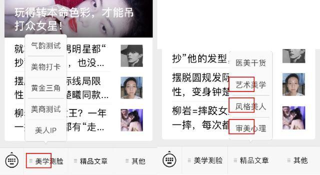
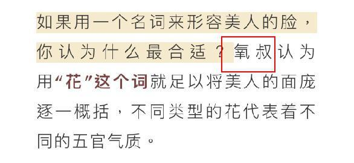
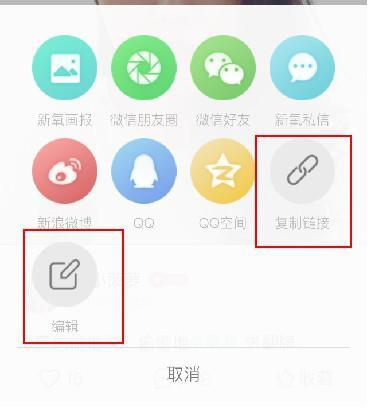
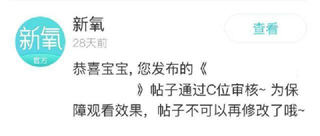
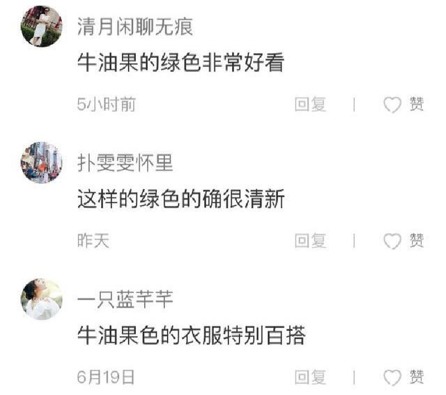

## 体验报告：看百万IP如何进行用户分层运营？

人人都是产品经理

06-2118:16

本文主要是聊聊百万IP是如何靠IP吸引粉丝入群，又如何进行精细化运营，保证用户的活跃度。

背景

新氧是国内火热的医美独角兽平台，于2019年5月在纳斯达克上市，俗称“互联网医美第一股”。

创业6年，新氧的业务覆盖超过300个城市，吸引近4000家认证医美机构供用户选择，活跃用户超过1000万（数据来源：凤凰网财经）。

为什么新氧能得到如此广泛的信赖呢？

最根本的原因是——优质的内容生态&良好的社区氛围。新氧在内容上拓展得相当广泛，包括医美、美学、健身、化妆、娱乐八卦等，创建了众多社区KOL和新媒体账号，力求从各个维度触及用户。

“新氧美学院”是旗下的一个微信公众号。5月，笔者通过参加一个活动混进了粉丝群，对新氧美学院的粉丝运营有了一些观察和发现。

一、基本信息

\1. 内容调性

“新氧美学院”致力于传播美学知识。在内容上，以明星为案例，分析面部结构和风格走向，引导读者进行多元化审美思考。最终目的是帮助读者探索自我风格、科学理性变美。

（从底部分栏可见一斑）

\2. 创作团队

创建人设：氧叔。时刻强调叔的形象：常在文章中自称——如“叔觉得、给叔点个赞吧”——拉近与读者的距离。所有的活动也是以叔的名义发起。人设性格：开放包容、睿智多识、温柔友善。

\3. 用户画像

综合发布的内容和留言来看，吸引到的用户可能具有以下特点：

20-30岁居多——大学生&刚踏入社会的女性对于找寻自我风格有强烈需求；学历层次较高（本科以上）——美学内容包含大量分析，需要较高的文化层次；自由主义&多元化思考——能接受不同风格，而不单纯追随当下潮流；有一定艺术审美——爱美，不仅仅局限于面部美学，还可能拓展至多个艺术领域。

百万IP自建粉丝群：如何精细化运营？

作为活跃粉丝数155W+的大号（数据来源：新榜），新氧美学院具有绝对的号召力。得益于不厌其烦地强调“氧叔”这一人设，粉丝们已经自动将此形象内化。毋庸置疑，氧叔是拥有百万粉丝的大IP。

下面，我们就来看看氧叔是如何靠IP吸引粉丝入群，又如何进行精细化运营，保证用户的活跃度。

\1. 通过活动任务进行粉丝分层

第一步：发布活动

发布在微信头条推文底部。内容是“美学+明星”相关，譬如“P图帮关晓彤改变风格”。粉丝需参与活动，并在新氧小程序发布；随后官方人员会进行筛选并通知入群。

这样的活动设置了门槛，一石三鸟：

保证粉丝素质：具有最基础的审美和写作能力；营造被认可感：进入这个群是不易的，能力被认可了；小程序的推广：先让用户学会用小程序，接下来就是导流到APP。第二步：进入备选群

主要是统一规范，如：改群名（地区+用户名）、发送进群暗号、分享活动帖子。

第三步：群中群（再选人）

目的在于粉丝分层运营，筛选出审美能力、写作能力、热情度都更高的核心粉丝。采取的形式是连续3天活动，通过3次的任务进行考察：

制造缓冲空间：任务难度是依次递增的，不会令人一开始就望而生畏；同时，防止有的用户因第一天漏看消息而错过机会；更全面的衡量指标：3次综合，更能全面体现能力。

\2. 备选层粉丝运营：制造上升通道

备选层是核心层与普通粉丝之间的缓冲区。

推文中会不定时发布活动，将更多普通粉丝纳入备选层。同时，备选层中也会发布活动，挑选成员进入核心层。

备选层中设有部分福利奖励&氧叔不定期参与讨论。

\3. 核心层粉丝运营：福利&压力&竞争并存

（1）任务+淘汰机制+补位机制

每人每周3篇阅后感（500+字，200+字，200+字）。一周统计一次，完成不了的会被降级到备选层。同时从备选层选取粉丝补位。

（2）曝光福利：内容C位出道

只有对于美学写作有热情的人才愿意长期完成任务。而对他们来说，能够让内容被更多人看到和认可，无疑是最开心和有动力的。C位的单篇内容平均阅读量能达到5000-10000，点赞数最多时候逼近1000。

（3）被指导福利：氧叔点评内容

被大咖点评当然是很开心的事情，通过交流还增进了自己的能力。

（4）奖品福利：各类资源优先倾斜

比如免费的医美体验项目、打卡赠送大牌口红和香水。

（5）交流福利：与氧叔的各类接触机会

氧叔在微信群出现频率的较高，大概一周3次，每次半小时左右。

（6）上升渠道：KOL培养之路

部分优秀粉丝会得到晋升KOL的机会，KOL意味着更高的曝光量和经济收入。

\4. 运营技巧

流程只是基础，更重要的是将流程串联起来的运营技巧。譬如，奖励的名额多少、C位的内容质量把控等。这些“灵活区域”才真正考验功力。

笔者认为，有以下值得分享的运营技巧：

（1）保证用户的参与热情：小成本的尝试，超大的诱惑

活动的难易程度决定了用户需要投入的时间和脑力成本。美学院的运营同学很聪明地将其卡在一个中间点——“跳一跳，够得着”；即用户需要花点心思，但又不会耽误太多时间（平均30分钟左右）。同时设置的诱惑又很大，比如有可能与氧叔共同开设栏目。面对这样的诱惑，不尝试下都感觉对不起自己。另一方面，有点难度的内容更容易勾起挑战欲望，增加用户的关注度。

（2）放权&集权间的平衡：氛围的宽松建设，内容的绝对把控

一个群一般有20%的活跃用户。美学院运营为我们实力上演如何既帮活跃用户找到存在感，又为自己节省时间。在核心群的日常运营中，官方选取了2位活跃同学作为临时群主（1个月）；除去有争议的问题，大多数问题都由群主代为解决。同时在资源上对群主进行倾斜照顾，保证他们的积极性。

那么官方运营在干什么呢？

人工审核每篇内容。所有核心粉丝产出的内容都要发布到新氧APP社区中。一旦有不合适的词汇，内容就会被驳回；并且内容一经发出，就不能自行删除，2-3天以后也不能再修改。严格的制度保障了内容产出的严肃性。

（无删除键）

（3）官方人设的亲近度&神秘度

一开始，大家都是冲着想一睹氧叔风采而参与的。因此氧叔就是群里最初的话题。在人设运营上，氧叔首先展示了亲近度：比如进群和大家聊天，回答美学相关问题。同时，又保持了神秘度，比如：从不暴露个人身份特点，也不通过私加请求。

所以，大家纷纷猜测氧叔到底“长什么样、是什么风格”，还引发了“写写你心中的风流氧叔”创作大赛，热烈的讨论也使得群成员间快速熟悉起来。

（4）榜样作用&以儆效尤

在进入核心粉丝群大概一周后，就有一位特别擅长内容创作的同学被破格提升为达人。这样好的榜样激励其他用户更努力地创作。

同时，也有一位同学屡次口出狂言、无视群规，群管也毫不犹豫地将其除名。

（5）新人的专属福利：站在C位的闪光感

在刚刚进入核心群的2周，笔者发现自己写的所有内容都会被推上C位。即官方会提供曝光渠道，带来大量的浏览与点赞量（最多达到1000赞）。每次打开APP，都有99+的点赞量，真是有种收获满满的感觉。

当然，其实核心群成员写的内容都会登上C位。通过超出预期的奖励给人以惊喜感和冲击感，让成员心甘情愿地继续付出。

（6）C位之争：促使用户产出更优质的内容

大概从第3周开始，核心群成员上C位的内容大大减少。这其实会产生很大的失落感：曾经站在人群中心，如今怎么默默无闻了呢？

在这时，运营团队拿出了早就准备好的“C位争霸赛”，即在月底累积C位最多的几位成员，除了收获曝光量，还将获得很高的物质奖励。尝到过C位甜头的成员都会不遗余力地争取。

（7）C位引导用户提升活跃度：打卡更容易赢得C位

发布优质内容帖子也许需要30分钟的写作时间；但打个卡只需要5分钟。新氧社区每天都会推出不同类型的活动以供打卡，这些活动往往具有很强的时效性（如“夏日美人”）或争议性（如“整形先整脑”），同时还兼具系列性（如“30天美人IP打卡”）。

核心粉丝们一开始是来发帖子完成每周任务的，这时新氧社区对她们来说只是交作业的工具。随着“C位争霸赛”的开启，粉丝对于争抢C 位有了好胜心。这时让他们发现打卡能够更容易地上C位，那么他们就愿意参与到社区各话题中（坚持打卡还会有物质奖励）。这时社区就不再只是个交作业工具，还集合了讨论与日常记录，用户活跃度大大提升。

（8）友好的官方水军团&丰厚的真实福利

即使是没有上C位的内容，官方也会友好地分一些曝光量；并且不定期会有真实用户&官方水军来友好评论，比如“牛油果绿超清新的，很适合你呢”。这就好像最近大火的“夸夸群”和“彩虹屁”，即使知道别人只是随口一说，但正向的话语就是能给人带来无限能量。

同时，运营团保证了核心粉丝坚持参与、精心创作就能有福利收获，正向反馈给得非常充分。

（9）从微信端导流至APP：小程序作为中间枢纽

小程系可以满足刚开始使用的用户，让他们快速尝到发帖子的新鲜感。但是并不能实现更高级的功能，如不同话题间的跳转、留言的回复、帖子的再次编辑等。为了更好地运营内容，粉丝们必然会去下载新氧APP。

这个设计非常精妙，通过小程序培养了用户的使用习惯，同时通过限制功能完成了导流（有时候，less is more）。

（10）设置足够多的缓冲区：让每个人都能找准位置

“备选层粉丝、核心粉丝、社区KOL”，越到上层，对用户的能力和精力要求越高。在运营设计上，新氧美学院让每层用户都有上升的空间；但并不强迫他们，允许粉丝根据自身情况自由选择位置。运营也会定期调整各群，拉入新成员、踢出未完成任务者、发布福利与活动，保证各群的新鲜度。

总结

通过在群里1个多月的观察，笔者发现所谓精细化运营并不等同于面面俱到，更重要的是找到运营重点，懂得收放自如。

最后，再简单总结下我学到的几点核心思路：

严守权威性：也就是在这个群里，用户必须贡献什么以及不能做什么。这应当是运营始终应该把控好的原则。对于美学院的群来说，就是内容的质量与数量。下放话语权：让活跃用户带动普通用户讨论，既轻松了氛围，又节省了团队人力。培养用户习惯：不管是哪个类型的活动&任务，都要先让用户从简单的上手，逐次增加难度。留有余地：参加活动的用户都是有一定积极性的，不要因为他们暂时能力或精力不足就一票否定。让用户待在舒适的位置上，并定时发布一些福利和机会，说不定他们都是潜力股呢？给别人机会，也是给自己机会。挑战与诱惑并存：用诱惑去刺激用户的占有欲，用挑战去激发用户的好胜心。够难的任务+够好的收获，才会让人有来之不易的感觉。用福利来引导用户行为：通过调控不同活动的福利，让用户跟着运营的脚步走。最终目的都是希望无限增加用户活跃度。未来，笔者将持续关注新氧的产品和运营，分享更多心得。

作者：LWX，“她经济”研究爱好者，种（ba）草专业户。

本文由@LWX 原创发布于人人都是产品经理，未经许可，禁止转载。

题图来自@Unsplash, 基于CC0协议