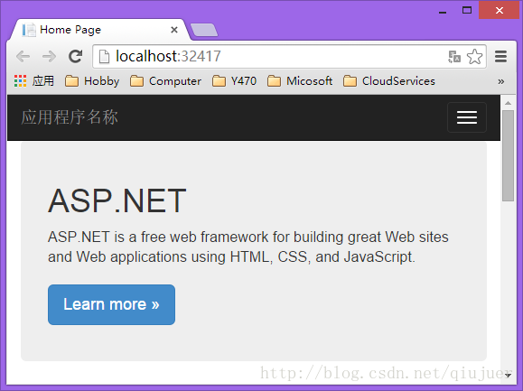
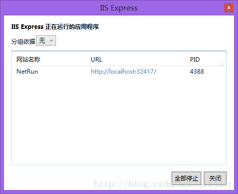
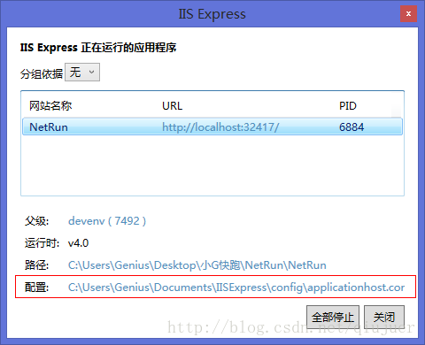
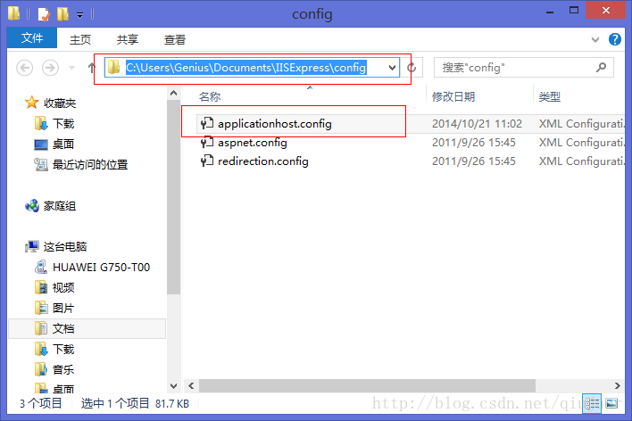
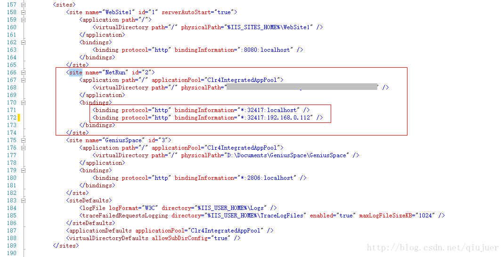
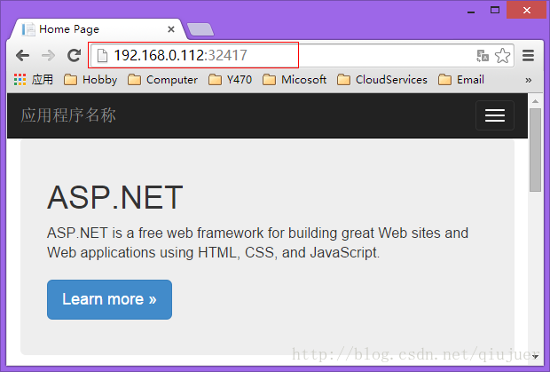

# [环境搭建] VS-Visual Studio-IIS Express 支持局域网访问

 																				2014年10月21日 20:40:11 					[Qiujuer](https://me.csdn.net/qiujuer) 						阅读数：14128 						 																															

 									

​                   					 							 					                   					 					版权声明：本文作者：Qiujuer https://github.com/qiujuer; 转载请注明出处，盗版必究！！！					 https://blog.csdn.net/qiujuer/article/details/40350385				

**原创作品，转载请注明出处：**<http://blog.csdn.net/qiujuer/article/details/40350385>

使用Visual  Studio开发Web网页的时候有这样的情况：想要在调试模式下让局域网的其他设备进行访问，以便进行测试。虽然可以部署到服务器中，但是却无法进行调试，就算是注入进程进行调试也是无法达到自己的需求；所以只能在Visual  Studio-IIS Express 中进行调试。

而于此将会出现一个问题，你会发现你的浏览器中的地址永远都是：http://localhost:32417/ 这样的；输入：127.0.0.1:32417 不行！输入：计算机名（或IP）:端口 同样无法访问。 这就奇葩了！

Visual Studio-IIS Express 中也似乎只有一个地址：

**要解决这个问题需要满足两个条件：**

**1.Visual Studio 必须使用管理员权限启动**

**2.配置你的 Visual Studio-IIS Express 服务器中的网站配置文件**

对于第二个步骤的实现方式如下：

启动网站情况下点击桌面右下角的 Visual Studio-IIS Express 的托盘图标，进入主界面，点击当前的网站地址，这时你会看见 其中有一项配置 点击配置进入配置文件：

也可以直接进入到此目录：

打开配置文件，找到“**sites**”节点 - 你的网站项目：

默认情况下只有 **LocalHost** 这一项，在此添加一个新的项：

如：“**<binding protocol="http" bindingInformation="\*:32417:192.168.0.112" />**”

端口后面是你的电脑的IP地址，当然IP地址你可以看看你的网卡中的状态：

保存好后，使用管理员重启你的 VS 程序，进入项目再次进入运行调试。

此时可以看见下面的网站有两个了：

现在试试：

**大功告成！**

**自己遇到了这样的问题，在国外的论坛上看见了一些解决办法，自己总结了一下，记录下来，希望对大家有帮助！**

**原创作品，转载请注明出处：**<http://blog.csdn.net/qiujuer/article/details/40350385>