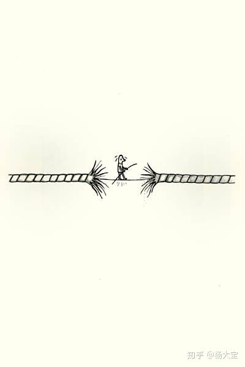
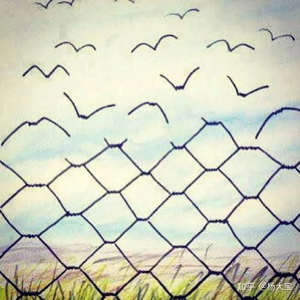

**抽象思维能力**

**一个人的抽象思维能力，决定一个人看到的世界大小。**

甚至或许，我们所说的聪明，就等于一个人的抽象思维能力。物理空间所承载的事物总是有限，能够去解读背后的信息，才是其美妙所在。其实这个结论是一个非常基础的结论。

如果你直接打开百度百科，搜索抽象思维，可以看到这样的解释：抽象思维以词为中介来反映现实，这是思维的最本质特征，也是人的思维和动物心理的根本区别。

人类对世界的大量探索都是基于人所拥有的，抽象的思维能力。

而好几年过去，这场随机发生的，我以为早就遗忘的谈话，这两天突然又冒出来，大约是因为那一刻，我真切地主动去打开另外一个视野，创造性地去看这个世界：我尝试着在探求它并不可见的规律，甚至去想，如何设计它。这个种子一旦发芽，便开始疯长，并且促使我去打开一个又一个解读世界的宝盒秘箱。此后我似乎不再是懵懵懂懂的个体，我开始明确地知道，前路是我们和这个世界

**基于互相理解的基础，建立起创造性的联系。**

我最喜欢的电影《教父》里，老教父说过一句话：

> 花半分钟就看透本质的人，和花一辈子都看不清事物本质的人，注定是截然不同的命运。所谓的看透本质，便是一个人**解读表面事物背后的信息的能力**。

### 解读表面事物背后的信息的能力**。

这真的是一个有趣的能力，设想一下那种只需一眼扫过就能读懂心思，一点线索就能知道来龙去脉，一个现象就能推测趋势，听起来是不是很fancy？并且绝大多数人都对这种能力着迷，我们看到的互联网上各种文章大都在做着**同样的事情：**试图向人们解释这个世界，并且极力维护自己语言的合理性，或者让受众相信其合理性。

### 相信其合理性

这种合理性，我们叫它「秩序」、「规律」或者「道」。

### 系统学领域

在系统学领域里，我们在识图设计这个合理性的时候，可以把它简单地拆解**为物理设计（physical design）**和**功能设计（functional design）**。这种秩序镶嵌在各个领域，无论是政治、经济、公司组织、还是一个产品、甚至是家庭关系、个体行为，无一不在构造着这种**「秩序」**。

### 仪式感-有序运营的系统

我前段时间围观了某个活动，组织者把一群人集结起来，通过一场仪式复杂的演讲活动让群体慷慨激昂，很有意思。事后，和组织者聊起时，他说：人们需要仪式感，即使是学习这件事情，他们也需要仪式感，这让他们觉得安全。我想，这便是人类对「无序」的一种恐慌，一个有序运营的系统，是保障个人生存的定心石。所以，如果你也能设计一个系统，具备了合理的物理结构和功能结构，并且能够有效地运营起来，这便是改变世界的开始。这个系统不一定是什么形式。它可能是一个宗教，一个公司，一个组织，一个产品。甚至是你把自己作为一个系统，让自己在社会里独立而合理的运转起来。

不过，去获得系统设计的能力并不是那么容易的事情。光是要打开审视系统的视角，就需要大量有效的信息输入作为基础。

### 审视系统的能力， 「洞见」 or智慧」

我们把这种审视系统的能力，叫做「洞见」，或者说是「智慧」。**一个人能够看到的信息越丰富，便是越有洞见。**但总有些原因，限制着我们去看到更多的信息。比如，在我从未见过毕加索的画之前，只在画册或者图片上看过毕加索的画，我很难读懂他的作品的伟大，只能借助他人的解读。但是，当我跑到欧洲的博物馆里，站在毕加索的画作前，在两米内的近距离观察它，却能直观地感受到笔触背后的情绪涌动，极具冲击力的美，另有乾坤世界。我想，艺术之于普通人的魅力便在于，为诠释世界，提供了额外的信息丰富的视角。所以，我们在评价一个作者的文笔的时候，有一个很重要的感受，便是ta的描写中，提供的信息量有多少。“园子仿佛是乱山中凭空擎出的一只金漆托盘。”—— 张爱玲，沉香屑第一炉香
“中午勖存姿在后院料理玫瑰花。居然有很好的阳光，但还是冷得足以使皮肤发紫。”——亦舒，喜宝亦舒的我在喜宝里翻了好久，才找到稍微丰富一点的描写。
张爱玲的那句话，寥寥几字，但是却勾勒出一个信息量极大的，层次分明的生动场景。相比起来，亦舒的描写，显得简陋而空白。这边是信息量在审美中的作用。一个天才作家，必然是极其聪明的人，能够捕捉和解读更多的信息。所以，即使张爱玲不做作家，比如去做研究，也必然能成为一个不错的学者。说到这里，是否是跑题了？倒也不算。

### 突破表象限制

让我来梳理清楚一下其中逻辑：事情的起源来自于，我们可以通过打开抽象的观察和思考能力，突破物理表象的限制，看到信息更丰富的抽象系统。这个系统可以是秩序、是体制、是规律，是道。而能否对这背后的抽象信息进行捕捉和解读，便是一个人的智慧和洞见，如果你能够基于这些丰富的信息设计并且运行一个系统，便是创造性的改变世界了。而在诠释和表达世界上，提供了额外的丰富的信息量，是优秀的文艺作品的共同特征。
而也许，审美的主观性便体现在对这些信息量的感知和诠释的差异上。

接下来你可能必然会问：**如何提高信息解读能力，甚至是设计系统的能力？**

### 「读万卷书，行万里路」

其实总结起来，核心还是「读万卷书，行万里路」。在这个过程中，洞察能力自然渐渐提升。只是读书和行路过程中，不同的人收获的成果差别巨大。这有部分天资使然，但更多的是看个人有没有「开窍」，其实也就是后天的学习。而个人的成长中，总有那几个「窍门」要被打开，这些便是我们要培养的基层能力。比如抽象思考和审美，然后让自己沿着信息量越来越高的道路上，一路飞奔成长，最终去创造那个属于自己的「道」**— END —**
**推荐阅读：**近期写得书单回答，都是底层方法论和操作的书籍。可以全方位的拔高你对这个世界的认知，即便于你在社会中找准自己的位置。