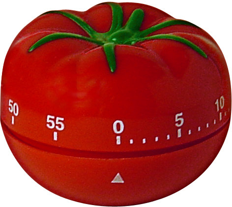
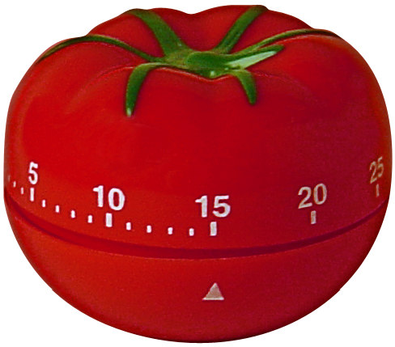

**分享一个****简单易行的时间管理方法—番茄工作法**

**更多优质学习/工作方法课程请联系小万哟!**

**微信号:wanmen1400**

​        

​               

The Pomodoro Technique 番茄工作法

​       By Francesco Cirillo 弗朗切斯科•齐立罗 著

作者：Francesco  Cirillo 弗朗切斯科•齐立罗 Email: francesco@pomodorotechnique.com

网址：[www.pomodorotechnique.com](http://www.pomodorotechnique.com/)

V1.0 版发行日期：2006 年 10 月 19 日

V1.3 版发行日期：2007 年 06 月 15 日英文版发行日期：2007 年 06 月 15 日V1.4 版发行日期：2009 年 10 月 27 日 V1.4.1 版发行日期：2009 年 11 月

此文章中的信息已经通过仔细考察和认证，并尽可能地仔细编写。本书作者及其他个人或团    体在参与发明、编写和发布本书内容时，都不应追究其法律责任。

《番茄工作法》一书受  “Creative  Commons  Attribution-Noncommercial-No  Derivative Works  3.0  License”  许可保护。番茄工作法及其标志是注册商标。许可证副本详见： http://creativecommons.org/licenses/by-ncnd/3.0/

或写信到认证机构查询获取，地址：Creative Commons, 171 Second Street, Suite 300, San Francisco,California,  94105,  USA

所有文章中的商标和品牌均属作者所有，未经许可不得转载。ISBN  978-1-4452-1994-3

[序言](http://\l "_TOC_250060")

第一次有了番茄工作法(The  Pomodoro  Technique)的想法是在上世纪 80 年代末，当我还在读大一的时候。

第一次成功来自那段失落的时期，由于大学第一年的考试落败，使我心情低落。那段时间里学习效率低下，更多的是迷茫。每天我带着悲伤的心情去学校，上课，学习，然后回家,我根本不知道我在做些什么事，我只是在浪费时间而已。考试的日期眼看就要来了，而我看起来根本没法在如此短的时间内得到提高。

有一天我在教室里学习，我发现我的同学在看我的眼神中都带着异样的神情，甚至我自己也在鄙视自己。最近几个月我是怎么过来的，我是怎么和同学交往的，我又是怎么学习的。重新审视自己后，我清楚地发现，我把大部分时间花在了娱乐和消遣上，做事和学习总是三心二意，这是我迷失的根源。

所以我就跟自己打赌：“我能不能真正地专心学习 10 分钟？”于是我需要一个计时器，我就找到了厨房里烧菜用的计时器，形状像一个番茄，于是就有了“番茄工作法(The Pomodoro Technique)”。

那一次我赌输了。之后，经过我反复的努力，最终成功了，也就是专心学习了10分钟。在我

迈出了小小的一步后，我发现有什么东西极大地激起了我对学习的兴趣，那就是番茄工作法。我总是带着那个番茄计时器，热衷于用它来指示我学习的时间，提高我的学习进度，后来就用于工作进度。我尝试着用它来解决越来越多复杂难办的事情，也把它用在团队    项目上。渐渐地，我完善了番茄工作法理论，并把它写成了这本书。

我曾给来自社会上的各种人士上过好多年的公开课，参加过很多次的团队合作，我把番    茄工作法传授给我身边的每个人，几年下来，喜欢这个工作法的人们越来越多。很多朋友问    我什么是番茄工作法，它又该怎么应用。我回答人们，这个工作法是我构思的，我希望它能    帮助人们更轻松地达成自己的目标，提高工作和学习效率，然后我的番茄工作法也能得到了    进一步的发展和完善。

注：Pomodoro 在意大利语中是番茄的意思

# [感谢	](http://\l "_TOC_250059")

第一个也是最需要感谢的是我的导师，也是我的朋友，乔凡尼·卡布诺(GiovanniCapuno),他

一直陪伴和支持着我对番茄工作法的构想。

同时也感谢所有已经应用番茄工作法的个人和团体，感谢他们帮助我一起传播番茄工作    法的理念，还鼓励着我写下这本书。

感谢那些在我的工作室里学习过番茄工作法的朋友，他们的反馈让我深入的理解这个工    作法和不断的完善它。特别是：Andrea Narduzzi, Bruno Bossola,Giannandrea Castaldi, 

RobertoCrivelli, Ernesto Di Blasio, Alberto Quario, Loris Ugolini, Silvano Trea, Alberico Gualfetti, Marco Dani, Luigi Mengoni, Leonardo Marinangeli, Nicola Canalini。

最后，感谢那些下一代的番茄工作法使用者,他们是通过我的文章学习，或者参与了已经

应用番茄工作法的团体，了解到这个工作法。我写这本书，特别是为了以下的朋友：Matteo Vaccari (还有其他在ESSAP 工作的朋友), Simone Genini, CarloBottiglieri, Gabriele Lana (以及其他在米兰 XPUG 工作的朋友), Alejandro Barrionuevo, and Stefano Castelvetri (和其他人)。

# [简介	](http://\l "_TOC_250058")

对很多人来说，时间就像是敌人。特别是在快要考试、快要截稿、工期快到时，当你身边的闹钟“滴答滴答”地提醒着你，时间已经很紧迫，那时焦躁的心情会导致你的工作和学习效率低下，这时你所想的可能不是怎样去完成任务，而是怎么去拖延工期。番茄工作法(The Pomodoro   Technique)就是针对灵活有效地利用时间而设计的，帮助你完成任务以及提高工作和学习效率。番茄工作法理论是作者在 1992 年发表并确定下来的，1998年起开始传授给个人，1999 年起开始传授给团体。

目录里罗列了一些跟提高时间利用率有关的常见问题：前两章讲的是番茄工作法的目的、基础与前提、工具与方法，详细解释了番茄工作法的原理和如何应用工作法。第三章《结果》中提到了在应用工作法的途中经常遇到的问题，都是尝试过番茄工作法的人们的经验总      结。第四章《结论》阐述了运用番茄工作法能够获得成功的几点理由。本书《番茄工作法》(《ThePomodoro Technique》)是番茄工作法的大众版，还有一本《番茄工作法在团队中的应用》(《applying the Pomodoro Technique in Teams》)详细说明了番茄工作法是如何在团队合作中应用的。

# [第一章	背景	](http://\l "_TOC_250057")

在工期快到的时候，谁能没有过焦急的心情？谁不想把工期再拖延几天呢，好让自己透气？又有谁喜欢夜以继日地追赶工期？

“请记住，时间是个贪婪的家伙，它不用任何手段就能轻松地击败你！”邦德莱尔

(Baudelaire)在他的诗《时间》(1)里这么写到。贪婪是时间的本性吗？或者这只是对时间认知的一种方式？对大多数人来说，为什么人们在处理与时间的关系时总会遇到很多问题呢? 这种由“时间飞逝”所带来的焦虑是从哪里来的呢？

思想家，哲学家，科学家，他们都曾试着给时间下定义，寻找人们能与时间和谐相处的    关系，但是他们不可避免的被时间打败了。这样的结果是必然的，他们的追求也是不可能完    成的。很少有人能够给我们留下深刻的见解，只是小部分人可以，比如，柏格森(Bergson)(3)    的理论和明科斯基(Minkowski)(16)的理论，他们对时间有着深刻的理解，他们的理论是相辅    相成的：

- 生成性。从抽象的角度考虑，时间具有可度量性，就像我们在三维空间中测量物体一样，    我们也可以用“轴”来表示时间，并习惯地用秒、分、小时等单位来度量时间。所以我  们就有了“期间”的概念，也就是时间段，可用时间轴上两点间的距离来表示。我们通常说的“迟到”，在时间轴上也可用两点间的距离差值来表示。

- 时间的具体连续性。我们每天所做的一些具体的事情：起床、冲澡、吃早饭、学习、吃      中饭、打个小盹、娱乐、吃晚饭、睡觉，在孩童时期，小孩子们通过这些具体的事情，    对时间有了认识，并进一步推演到抽象的时间概念，懂得用秒、分、小时来表示时间，    他们发现不论做什么事情，时间总会流逝。

由于这两方面的原因，对时间给人们带来的焦虑也就尤为明显——时间是自然的产物,难以捉摸，不确定地流逝着，朝向下一刻发展。我们如果逼着自己去追赶时间，不让它流逝,我们会感觉到力不从心，被时间压迫，被奴役，被打败，随着时间一秒一秒过去，这些感受就会来的更强烈。渐渐地我们就失去了追赶时间的激情。“两小时过去了，我一件事都没做成；两天过去了，我还是一件事都没做成。”原本我们很明确的告诉自己，今天我可以完成任务，当我们疲惫的时候，我们又会想，今天能完成任务吗。原本明确的目标变得不明确了。

时间的具体连续性则不一样，它是由具体的事件构成，冲澡、吃饭、学习、休息等，当人们在进行具体事情的时候，时间流失带来的焦虑会轻很多，所以它表示着焦虑的反面，就像舒缓的乐章，能够减缓焦虑。相反地，用尺标去度量时间，会让人觉得很有压迫感：再过10分钟就要迟到了，这两个小时内要写好论文。番茄工作法也可以说是应用了时间的具体连续性。

## 1.1	[番茄工作法的目标	](http://\l "_TOC_250056")

番茄工作法的目标就是用最简单的工具和方法来提高你或你的团队的工作效率，表现在以 下几个方面：

- 缓解由时间的生成性所带来的压力

- 减少被打断的次数，集中注意力

- 提高判断力

- 充满热情并一直保持

- 坚定信心，达成目标

- 提高工期预测能力，即估测能力，保质保量

- 加快学习和工作进度

- 增强在处理复杂问题时的决定意识

## 1.2	[基础与前提	](http://\l "_TOC_250055")

番茄工作法有三个基本原则：

- 对时间要有不同的看法，即不再停留在时间的生成性阶段，转化为时间的具体连续性，    能舒缓焦虑的心情，集中注意力，提高效率。

- 在学习时，使大脑清醒，思路清晰，意识力高，注意力集中。

- 采用简单易用原则，不引人注意的工具，比如铅笔、橡皮、纸等，因为它们简单，所以    可以减轻应用工作法的复杂程度，能帮助你把精力集中于你要完成的事情上，而不是费    心思去掌握工作法。很多的工作法都失败了，因为这些方法本身的技术要求就使要应用    它的人发愁，甚至比要完成的任务难度更高。

番茄工作法的最初灵感是来自于以下几处：

​    时间盒子(time-boxing)(14)，阐述了对时间的认知方法，由布藏(Buzan)等人提出(6)(7)(8)；由葛 得马(Gadamer)(10)提出的大脑工作学与娱乐；由吉尔伯(Gilb)提出的目标与任务结构化的概念。

# [第二章	工具与方法	](http://\l "_TOC_250054")

番茄工作法的流程由五个阶段构成：

表 2.1   番茄工作法的阶段

| 事件       | 时间       | 内容                                                         |
| ---------- | ---------- | ------------------------------------------------------------ |
| 计划       | 一天的开始 | 计划一天要做的事                                             |
| 追踪       | 全天时间   | 记录好这一天内做过的工作学习等的所有事情，作为 原始数据，包括工作时间和其它感兴趣的指标 |
| 记录       | 一天的结束 | 建立一个日工作的档案，收集原始数据                           |
| 分析       | 一天的结束 | 由原始数据分析出有用的信息（有用信息即能帮助你 提高效率的信息） |
| 可视化处理 | 一天的结束 | 把有用的信息用鲜明的方式表示出来，以便清楚得看 到自己的进步  |

注：番茄工作法的基本周期为一天，也可以更短，但这样的话，以上五个阶段的交替频率会    更频繁。

​                                                             

​              图 2.1 番茄计时器

番茄工作法所需要的工具有以下几样：

- 一个番茄计时器(图 2.1)

- 一张 TO DO TODAY 工作计划表(见附录 2)，每天开始时填写以下事项：

- 小标题，包括时间、地点、人物

- 清单，包含今天要做的事情，并按先做和后做的顺序排列

- 表格中一部分留给“计划外的紧急事件”。这些事件是不可预期的，但又必须要处理的，当它们出现在表格中时，可能会推翻全天的计划。

- 一份 ACTIVITY INVENTORY 活动清单(见附录 3)，由以下两项组成：

- 标题：人物、事件

- 想到什么要做的就记什么，随出现随记。一天的结束时，把完成的事件划去。

- 一份记录表，用于记录原始数据，写报告或制作图表时要用到。根据需要记录的东西不同，记录表分为不同的结构。通常情况，记录表中包含数据、摘要、完成任务所需的番    茄时间。记录表每天更新一次，通常是在一天的结束。

本书所记的简单实例中，记录、分析、可视化处理三个阶段都是直接在记录表中完成的.

以下是对番茄工作法应用的深化与进阶，也是使番茄工作法自身的进步。明确的来说，深化      番茄工作法的应用，以达成目标，应该按照以下列出的几个阶段，并按顺序进行。

注：出于对环境的保护，请合理使用印刷资源，以上提及的表格仅用于对文章主题的深化解    释，附录中提供的表格可用于对番茄工作法的实践。

## 2.1	[第一阶段：弄清完成某项任务所需的时间	](http://\l "_TOC_250053")

简单地说，一个番茄时间共 30 分钟，包括 25 分钟的工作时间和 5 分钟的休息时间。在每一天的开始，从 ACTIVITY INVENTORY 活动清单中选出你今天要完成的任务，优先考虑它们，并把它们记在 TO DO TODAY 工作计划表中。(表 2.2)

表 2.2   TO DO TODAY 工作计划表

|      | TO DO TODAY                                | 罗马，2006 年 7 月 12 日，马克·罗斯 |
| ---- | ------------------------------------------ | ----------------------------------- |
|      | 写一篇文章关于《如何学习音乐》(最多 10 页) |                                     |
|      | 大声朗读《如何学习音乐》并检查更正         |                                     |
|      | 缩减《如何学习音乐》至 3 页                |                                     |

### 2.1.1 	[开启第一个番茄时间	](http://\l "_TOC_250052")

设定番茄计时器为 25 分钟，然后开始 TO DO TODAY 工作计划表中的第一项任务。在工作进行的途中，人们总能清晰地看到番茄计时器上剩余的时间。(图 2.1)

   图 2.2 番茄计时器上总能见到剩余的时间

在一个番茄时间内，你不可以被打断，这  25   分钟意味着纯粹的工作。一个番茄时间也不能被分划：不存在半个番茄时间或一刻钟的番茄时间这样的事情。番茄工作法中，时间的最 小单元是一个番茄时间。（规则：一个番茄时间是不可分割的）如果番茄时间被某人或某事强制打断，那么这个番茄时间就相当于白费了，应该重新开始这个番茄时间，就当这个番    茄时间从来没有开始过。然后你就要尽快地开始新的番茄时间。当番茄计时器响起，在工作表中的对应项后面打上一个³（表 2.3），然后休息 3 到 5 分钟。

表 2.3 TO DO TODAY 工作计划表：第一个番茄时间

|      | TO DO TODAY                                | 罗马，2006 年 7 月 12 日，马克·罗斯 |
| ---- | ------------------------------------------ | ----------------------------------- |
|      | 写一篇文章关于《如何学习音乐》(最多 10 页) | x                                   |
|      | 大声朗读《如何学习音乐》并检查更正         |                                     |
|      | 缩减《如何学习音乐》至 3 页                |                                     |

当番茄计时器响起的时候，就表示你必须停止手中的工作，即使你还没有完成这项任务，    你觉得你能在休息的几分钟内就能完成它，你也不能继续工作。

这 3 到 5 分钟的时间能使你的大脑断开与工作联系。让大脑可以消化你在以上 25 分钟内所学的东西，也给了你充分的时间可以做一些有益身心的事，能帮助你在下一个番茄时间内更好地学习。在休息时，你可以站起来在房间里走一走，喝杯水，策划一下你假期的行程。 你也可以做做深呼吸和伸展运动。如果你是和你的团队一起，你可以和其他人分享一些娱乐信息，开个玩笑等等。

这几分钟的休息时间里，脑子里不要再去想任何有关你工作事情，比如，不要和你的同事谈论工作中的问题，不要去回复重要的电子邮件或打电话给客户等。因为在这休息时间里,你需要让大脑消化一下，为下一个番茄时间做好充分的准备，而做以上那些事会阻碍大脑恢复活力，但你可以将这些你想做的事写进你的 ACTIVITY INVENTORY 活动清单中，并作出特殊标记，以后再完成它们。总之，休息时间里就不需要任何工作，一旦休息结束，就调整番茄计时器至 25 分钟，继续你的工作直至铃声再次响起，然后再在 TO DO TODAY 工作计划表中打上一个³。

表 2.4 TO DO TODAY 工作计划表：第二个番茄时间

|      | TO DO TODAY                                | 罗马，2006 年 7 月 12 日，马克·罗斯 |
| ---- | ------------------------------------------ | ----------------------------------- |
|      | 写一篇文章关于《如何学习音乐》(最多 10 页) | x  x                                |
|      | 大声朗读《如何学习音乐》并检查更正         |                                     |
|      | 缩减《如何学习音乐》至 3 页                |                                     |

又是 3 到 5 分钟休息时间，然后再一个番茄时间……

### 2.1.2	[每四个番茄时间	](http://\l "_TOC_250051")

每四个番茄时间过后，停止你的工作，进行一次较长时间的休息，大约 15 到 30 分钟。

表 2.5 TO DO TODAY 工作计划表：第一阶段番茄时间

这 15 到 30 分钟的休息时间里，是时候清理一下你的办公桌，去散个步，喝一杯咖啡， 听一下电话留言，检查一下电子邮件，或者只是简单的休息一下，做几个深呼吸。重要的是不 要去做复杂的事情，否则大脑将不能消化你刚刚所学的，会导致你不能以最好的状态去应 对下一个番茄时间的工作。在这段休息时间里，也不要再去回忆上个番茄时间里做的事情。

### 2.1.3	[完成一项任务	](http://\l "_TOC_250050")

接着工作吧，一个番茄再一个番茄，直到把你手头的任务完成，然后从 TO DO TODAY

工作计划表中把这项任务划去。

表 2.6 TO DO TODAY 工作计划表：完成一项任务

|      | TO DO TODAY                                | 罗马，2006 年 7 月 12 日，马克·罗斯 |
| ---- | ------------------------------------------ | ----------------------------------- |
|      | 写一篇文章关于《如何学习音乐》(最多 10 页) | x x x x x                           |
|      | 大声朗读《如何学习音乐》并检查更正         |                                     |
|      | 缩减《如何学习音乐》至 3 页                |                                     |

常见问题的处理：

- 如果你在番茄计时器响起前就完成了手头的工作，请参照以下规则：一个番茄计时器开      始计时，就必须要到响起为止。利用剩余的一部分番茄时间，可以复习一遍之前所学的，    或检查一下所做的工作，这样可以使你得到一点小小的提高，记录一下你所做的事情,直到铃声响起。

- 如果你在一个番茄时间的前 5 分钟里就完成了任务，而且你觉得它本可以在上一个番茄时间就完成的，然而再去复习一遍又没什么必要，那么就遵循这个规则：特殊情况下,当前番茄时间作废。

完成一项任务之后就开始下一项任务，直到所有任务完成，并且一定要休息好。

表 2.7 TO DO TODAY 工作计划表：完成所有任务

|      | TO DO TODAY                                | 罗马，2006 年 7 月 12 日，马克·罗斯 |
| ---- | ------------------------------------------ | ----------------------------------- |
|      | 写一篇文章关于《如何学习音乐》(最多 10 页) | x x x x x                           |
|      | 大声朗读《如何学习音乐》并检查更正         | x  x                                |
|      | 缩减《如何学习音乐》至 3 页                | x  x  x                             |

### 2.1.4	[记录档案	](http://\l "_TOC_250049")

在每天的结束时，把已经完成的任务记录在档案中，可以是硬皮封面的笔记本，也许用    电脑记录对现代人来说更方便一些，做一张电子表格或者建立一个数据库，用来存放你的档案。记录好之后，就从ACTIVITY INVENTORY 活动清单中把该任务划去。

你要跟踪和记录什么，取决于你要观察什么或者你要写一份怎样的工作报告。如果你是初学者，可以仅仅记录你完成每个任务所用的番茄时间数，这样就简单地显示出你在每项任

务上所下的工夫。以下的几项可作为参考：日期、开始时间、任务的类型、任务描述、完成任务所用的番茄数，还有简要备注，写明获得的成果、进步的空间、遇到的问题等 (见表2.8)。以下展示了一份初学者档案，简单易用。

表 2.8 记录档案表

| 档案              | 马克·罗斯 |          |              |        |                 |
| ----------------- | --------- | -------- | ------------ | ------ | --------------- |
| 日期              | 时间      | 任务类型 | 任务描述     | 番茄数 | 备注            |
| 2006 年 7 月12 日 | 08：30    | 写作     | 如何学习音乐 | 5      | 7 页            |
| 2006 年 7 月12 日 | 11：30    | 检查更正 | 如何学习音乐 | 2      |                 |
| 2006 年 7 月12 日 | 14：00    | 压缩     | 如何学习音乐 | 3      | 7 页压缩到 3 页 |

正如马克，他记录了每项任务开始的时间，但是对番茄工作法来说，开始时间或者是结束时间并不重要，重要的是完成任务所用的番茄数，因为这正是真正努力的过程所在。这也是理解番茄工作法的关键，番茄工作法的重点是完成了多少番茄时间，而不是几点到几点完成了什么事，完全可以在中午开始，在夜里结束，完全取决于个人，这正是时间的连续性的体现。在档案中记录好番茄数后，回忆前一天工作的开始时间并不难，并且记忆和回忆是很好 的大脑锻炼。开始时间好记，而且没有意义，所以开始时间或结束时间在番茄工作法中是不需要的。

### 2.1.5	[改进	](http://\l "_TOC_250048")

记录档案的过程可以帮助番茄工作者有效地进行自我审查和评估，有利于使用者对如何改进工作方针做出正确抉择。例如，你可以问自己，本周内你花了多少番茄时间在工作上，多少在学习上，研究上又是多少，还有平均每天完成的番茄数等等。你也可以弄清楚每个阶段的工作是不是都有效，如果去掉其中某个阶段是不是还能得到一样的结果。

以上面马克的实例来说，他用了10个番茄时间，去写作、检查、压缩他的文章《如何学习音乐》，看起来他花了太多的时间。马克真的想只用更少的番茄时间去完成它，并得到同样的结果，这样他就有一个或更多的番茄时间去做别的任务。“写下一篇时，我会试着用更少的时间而得到同样质量的文章。我该怎么做？舍去哪个阶段呢？哪项任务是真正有用的？我又要如何知道这样做是更有效的？”正是这一系列的问题使人们进步，至少是尝试着去提高他们工作或学习的进程。

每天结束时，记录档案和思考如何提高不应超过一个番茄时间。否则，再好的工作法也会 成为累赘。

### 2.1.6	[番茄时间的本质	](http://\l "_TOC_250047")

番茄时间表示一个时间段，它的本质是充当了时间的量度。当它把人和人们做的事情融入进来后，就成为了人们所花工夫的量度。根据番茄时间数，我们就可以说完成一项任务用了多少个番茄数，在团队上可以说用了多少个团队番茄数。不同人数的番茄数所代表的工夫不是一样多的，不能拿它们与他人的番茄数做简单的加减，也不能与他人的番茄数作比较。个人或团体他们的工作方式、生产效率是不同的，他们之间的联系也是不相同的。不存在任

何意义上的公式能将他们的番茄数进行换算。

注：我们可以用个人或团体的生产费用来衡量他们所花的工夫，这样能帮助我们理解。这样表示后，我们就可以把它们进行加减或比较了。举例来说，一项任务由两个个人番茄数和三个双人番茄数完成，他们所花的工夫不能进行直接加减或比较，但是用金钱来衡量番茄时间，就可以进行运算了，10 欧元一个番茄时间，那么 2 x € 10.00+ 3 x 2 x € 10.00 = € 80.00.

注：《番茄工作法在团队中的应用》(《applying the Pomodoro Technique in Teams》)一书中写明了如何跟踪和记录两人或两人以上的团队的工作档案。

## 2.2	[第二阶段：减少被打断的次数	](http://\l "_TOC_250046")

一个番茄时间,25分钟，看起来貌似在这样短的时间里，集中注意力并且不被打断是很容易的。但是经验告诉我们，一旦开始了番茄工作法，各种各样的打断是不可避免的，并且是个很棘手的问题。这就是为什么一个好的工作法就是要把不可预期的打断最小化，而把工作最大化，在不被打断的情况下，尽可能地增加番茄数。打断分为两种：内部因素和外部因 素。

### 2.2.1	[内部因素——自己打断自己	](http://\l "_TOC_250045")

虽然一个番茄时间只有 25  分钟，但不是每个人都能在这点时间里坚持下去而不被打断， 比如一些我们日常需要的：坐久了要站一会儿，肚子饿或口渴，突然意识到一个紧急的电话要打，或者想上网搜索一些资料（可能与手头工作有关或无关），又或者想检查一下电子邮件等等。结果会弄得我们不清楚什么该做，什么不该做，从而打断了手头的工作，这样我们会经常要把一整天的计划重新思考一遍，再开始工作，这样就浪费了时间。

人们的这些需要，我们把它叫作精神涣散，导致我们拖延了手头的工作，称为内部因素。内部因素往往与注意力不集中联系在一起。如果被内部因素打断，我们就浪费了时间，而这种浪费是源于自身，所以我们会内疚，我为什么不坚持工作而浪费时间呢？内疚又引起了害怕，害怕自己不能在规定时间内完成任务，久而久之任务真的无法完成，而我们也陷入痛苦中。

我们要如何避免来自内部因素的打断呢？ 可以参照下面两条规则：

- 内部打断往往隐藏得很好，不易察觉，那么就让这些打断变得显而易见。每当你意识到    潜在的打断将要来临时，比如你饿了，想吃东西，请你在工作表中记录番茄数的地方标上一个点号（`），然后做以下的事情：

- 如果你认为这项打断是重要的，那么就在 TO DO TODAY 工作计划表中的“计划外的紧急事件”一栏中写下这件事，于是你写上，“我饿了想吃东西”。

- 同时在 ACTIVITY INVENTORY 活动清单中写下这件事，并标记”U”(Unplanned 计划外)，如果需要的话标上截止日期。“U 中午 12 点前    我饿了想吃东西”。

- 下决心，一定要完成当前的番茄时间。标记好点号（`）和记录完之后，马上回来继续你手头的工作，直到铃声响起为止。（规则提示：一旦开始计时，就要到铃声响起为止。）

这样做的目的是接受事实，需要做事情既然出现了就不能忽视它，要好比我饿了，所以还是要去吃东西的。客观地看待它，可能的话把它安排在计划中，留以解决。

### 2.2.2	[内部因素的实例	](http://\l "_TOC_250044")

以下是处理内部因素的一个实例。马克正在第二个番茄时间里写作他的文章《如何学习音乐》，他突然发觉他应该打电话给他的好友开罗，了解一下他最喜欢的摇滚乐队开演唱会的时间。马克就问自己：“这件事很急迫吗？我今天必须要做吗？”马克的回答是：“不是的，我可以推迟它，一两小时后，或者明天都是可以的。”马克就在 TO DO TODAY 工作计划表中他正在进行的任务旁边标上了点号（`）（表 2.9），并在 ACTIVITY INVENTORY 活动清单中写下这件事，标上”U”（表 2.10），然后继续手头的工作。

表 2.9 TO DO TODAY 工作计划表：一次来自内部因素的打断

|      | TO DO TODAY                                | 罗马，2006 年 7 月 12 日，马克·罗斯 |
| ---- | ------------------------------------------ | ----------------------------------- |
|      | 写一篇文章关于《如何学习音乐》(最多 10 页) | `³                                  |
|      | 大声朗读《如何学习音乐》并检查更正         |                                     |
|      | 缩减《如何学习音乐》至 3 页                |                                     |

表 2.10 ACTIVITY INVENTORY 活动清单：一项计划外的事件

|      | ACTIVITY INVENTORY       | 马克·罗斯 |
| ---- | ------------------------ | --------- |
|      | …                        |           |
| U    | 开罗：演唱会什么时候开？ |           |
|      | …                        |           |

马克问自己：“这个电话明天之内就要打吗？不是的，周末打也可以。”于是马克在小框里写下截止日期（表 2.11）。

表 2.11 ACTIVITY INVENTORY 活动清单：有截止日期的计划外事件

|          | ACTIVITY INVENTORY             | 马克·罗斯 |
| -------- | ------------------------------ | --------- |
|          | …                              |           |
| U [7-14] | 开罗：下一场演唱会什么时候开？ |           |
|          | …                              |           |

如果马克突然又很想在 10 分钟后吃一个匹萨，于是他又在 TO DO TODAY 工作计划表中标上一个点号（`），在“计划外的紧急事件”一栏中写下这件事（表 2.12），然后继续手头的工作。

表 2.12 TO DO TODAY 工作计划表：紧急事件--内部因素的打断

|      | TO DO TODAY                                | 罗马，2006 年 7 月 12 日，马克·罗斯 |
| ---- | ------------------------------------------ | ----------------------------------- |
|      | 写一篇文章关于《如何学习音乐》(最多 10 页) | ` `³                                |
|      | 大声朗读《如何学习音乐》并检查更正         |                                     |
|      | 缩减《如何学习音乐》至 3 页                |                                     |
|      |                                            |                                     |
|      | 计划外的紧急事件                           |                                     |
|      | 订一个匹萨                                 |                                     |

值得一提的是，番茄时间一直没有停止，计时器滴答地响着，马克继续着他的工作。很    显然花在打断上的时间越少越好，至多几秒钟。否则，这个打断就真正成立了，这个番茄时间就算作废了。最后，铃声响起，马克在表中标上” ³”（表 2.13），然后休息去了。

表 2.13 TO DO TODAY 工作计划表：内部因素的打断，第二个番茄时间

|      | TO DO TODAY                                | 罗马，2006 年 7 月 12 日，马克·罗斯 |
| ---- | ------------------------------------------ | ----------------------------------- |
|      | 写一篇文章关于《如何学习音乐》(最多 10 页) | ` `³	³                           |
|      | 大声朗读《如何学习音乐》并检查更正         |                                     |
|      | 缩减《如何学习音乐》至 3 页                |                                     |
|      |                                            |                                     |
|      | 计划外的紧急事件                           |                                     |
|      | 订一个匹萨                                 |                                     |

那么马克要什么时候订一个匹萨呢？这就要看马克认为这件事有多紧急了，他可以选择    马上就预订他最爱吃的匹萨，也可以在四个番茄时间结束后再预订匹萨。马克选择了继续工    作。在他的第三个番茄时间里，他又遇到了  6  次打断，但他都很好的处理了，并记录在了两个表中。（表 2.14）

表 2.14 TO DO TODAY 工作计划表：更多的内部因素的打断

|      | TO DO TODAY                                | 罗马，2006 年 7 月 12 日，马克·罗斯 |
| ---- | ------------------------------------------ | ----------------------------------- |
|      | 写一篇文章关于《如何学习音乐》(最多 10 页) | ` ` ` ` ` ` ` `³	³               |
|      | 大声朗读《如何学习音乐》并检查更正         |                                     |
|      | 缩减《如何学习音乐》至 3 页                |                                     |
|      |                                            |                                     |
|      | 计划外的紧急事件                           |                                     |
|      | 订一个匹萨                                 |                                     |
|      | 买一辆自行车                               |                                     |
|      | 阅读《在亚洲学习音乐》                     |                                     |
|      | 在网上找一下七月份在罗马的爵士乐表演       |                                     |
|      | 查看电子邮件                               |                                     |
|      | 叫一份中国餐外卖                           |                                     |
|      | 整理书桌抽屉                               |                                     |
|      | 削铅笔                                     |                                     |

以上所列的计划外紧急事件，在有些人看来很可笑，比如削铅笔、叫外卖，但这些的确就是马克意识到的紧急事件。这里要强调的重点是，在番茄工作法中，很多有用甚至可笑的不值得一提的事情，我们都不能放下手头的工作而去完成它，都应该看作“计划外”事情来处理。

通过查看“计划外的紧急事件”一栏，我们可以看到我们的大脑是如何思考和运作的,比如那个时候我的大脑就是在想着吃东西。掌握这些信息，就能知道自己的大脑什么时候精力最好，而什么时候最差，这样就能帮助我们控制自己，正确地安排工作，集中注意力。通常来说，各种不同的具有诱惑力的内部因素打断，会导致我们无法完成任务。

事实证明，人们在精神不集中时想到的事情往往是需要处理的，甚至是紧急的。通常等到番茄时间结束后，或者任务的结束，或者一天的结束，以不同的方式处理。

- 有些会被移入 ACTIVITY INVENTORY 活动清单中，例如，马克也许明天就会去买辆自行车。

- 有些事会留在休息时间处理，例如，在网上找一下七月份在罗马的爵士乐表演。

- 有些事也许会被删去，例如，马克不可能又订匹萨，又吃中国餐。说不定到最后他什么    都不想订。

在一个番茄时间结束时，或者四个番茄时间结束时，又或者一天的结束时，看看工作表    中的计划外事件，是件很有意思的事，说不定还会有意外的发现。

真正紧急的事件会在表中明显地标注出来。番茄工作法的目的就是为了让手头的事情不被 这些计划外的事打断。如果真的有很紧急的事情，可以参照以下方案：

- 在下一个番茄时间处理这件事，推迟原本的任务。

- 重新安排日程表，以这件事替换掉原本要处理的事情。

- 以番茄时间为单位，用这件事替换和推迟原本的事情，直到一天的结束，这样会帮助我    们认识哪些事是真正急迫的，以后再遇到同样的事情，我们就能果断地处理。

处理计划外的事情，也要按照前面所说的，用去一个番茄时间，就在对应的地方画“³”，直到完成了，就从表格中划去（表 2.15）。以上涉及到的各种来自内部因素的打断，通过适当的方法我们都可以处理了。

处理内部因素的机理，总的来说，就是逆转我们与打断的决定与被决定关系，让我们来决 定打断是否发生，而不是受制于打断。发现事件，记录，然后把事件放到之后的番茄时间内处理，或留到其他时间，总之是不放弃当前事件。

表 2.15 TO DO TODAY 工作计划表：完成了计划外事件

|      | TO DO TODAY                                | 罗马，2006 年 7 月 12 日，马克·罗斯 |
| ---- | ------------------------------------------ | ----------------------------------- |
|      | 写一篇文章关于《如何学习音乐》(最多 10 页) | ` ` ` ` ` ` ` `³	³               |
|      | 大声朗读《如何学习音乐》并检查更正         |                                     |
|      | 缩减《如何学习音乐》至 3 页                |                                     |
|      |                                            |                                     |
|      | 计划外的紧急事件                           |                                     |
|      | 订一个匹萨                                 |                                     |
|      | 买一辆自行车                               |                                     |
|      | 阅读《在亚洲学习音乐》                     | ³                                   |
|      | 在网上找一下七月份在罗马的爵士乐表演       |                                     |
|      | 查看电子邮件                               |                                     |
|      | 叫一份中国餐外卖                           |                                     |
|      | 整理书桌抽屉                               |                                     |
|      | 削铅笔                                     |                                     |

如果你当真要打断当前番茄数时间，无论是你挡不住诱惑，还是真的发生了紧急的事情，你 只需要做一件事：把当前的番茄时间作废，就算马上就要响铃了也是一样，然后在表中对应处标上点号。（规则提示：一个番茄时间不可分割。）显然，这时候你不能画“³”，因为

下一个番茄时间会做的更好。

减少来自内部的打断，我们首先要做的是掌握打断的次数和打断的类型，重新审查这些     打断，接受它们，或安排它们，或删除它们，都取决于这些打断。

###  2.2.3	[外部因素——被他人打断	](http://\l "_TOC_250043")

人们在社会环境中工作，经常会被一些外部因素打断。例如，同事让你解释一下某篇文    章里的内容，朋友提议共进晚餐，电话铃响，同事问你如何写一份报告，你的  MSN   总是提示你有新邮件到等等。那么你该怎么做呢？

如何去排除外部因素，那就要看你如何“保护你的番茄”。文章讲到现在，我们已经花了大部分的努力去解决内部因素。现在的问题是，有人要从外部打断你，让你失去在表中画

“³”的乐趣。

内部因素与外部因素的区别在于，后者需要你与其他人发生作用：与别人沟通。处理外    部因素的机理，与处理内部因素是一样的，也就是逆转我们与打断的决定与被决定关系，让

我们来决定打断是否发生。

下面举些例子来具体说明我们要做什么。打进来的电话可以用留言代替你自己应答，随     后再去听留言。MSN 可以关掉软件的提示功能，这样既能收信又不会打扰我们。如果你的同事或同学过来找你，你可以礼貌地跟他说你现在很忙。（或者可以幽默地说你正躺在番茄      里。）然后告诉他可以在 25 分钟后来找你，或几小时后，或明天，这决定于事情的重要程度。

从个人经验来说，在现实生活中，真正需要马上处理的紧急事件是相当少的。推迟 25 分钟或者两个小时（就是四个番茄时间），对我们生活中通常情况下的计划外事件是完全可以的。这种推迟，对想要与你沟通的人来说是完全可以理解的，然而这种推迟可以造就你巨    大的成功，因为这样使你的大脑保持在一个高效的状态下，游刃有余地完成你的任务，随后    再安排如何进行计划外的事情。通过实践，你会发现竟然有那么多看起来很紧急的事情都是    可以推迟的，甚至是一两天的时间，而且同时能让提要求的人得到满意的答案。

所以，“保护你的番茄”意思就是：快速记录事情，推迟事情，并写进日程表，询问打断你的人是否同意。这么做就能帮助你避免外部因素的打断，然后把事情放在以后再处理， 至于推迟多久那就要看事情的紧急程度。逆转我们与打断的决定与被决定关系，这个机理在      这里就解释为：我们不再被轻易打断，而是由我们来操控打断。（也就是由我们来决定何时      处理它。）

通过那些应用过番茄工作法的人们我们了解到，他们一开始的时候，外部打断的次数都     几乎相同，通常是一个番茄时间内（25 分钟）10 到 15 次。而这些被你推掉的人们，之后得到了你很好的答复，不是被你拒之门外并忘得一干二净，久而久之，人们也就会尊重你的做     法，并愿意和你一起“保护你的番茄”。许多人与番茄工作者接触之后，都说感受到了他们对他人时间的尊重。就处理方式来说，外部打断与内部打断基本相似。同时坚持以下两点：

- 使这些打断显而易见。每当有人要打断你时，就在你的 TO DO TODAY 工作计划表中对应位置画上（-），采用“发现事件，记录，然后把事件放进之后的番茄时间内处理，或留到其他时间。”然后参照以下的做法：

- 如果你认为这项打断是重要的，那么就在 TO DO TODAY 工作计划表中的“计划外的紧急事件”一栏中写下这件事。

- 同时在 ACTIVITY INVENTORY 活动清单中写下这件事，并标记”U”(Unplanned 计划外)，如果需要的话标上截止日期。

- 坚定信心，一定要完成当前的番茄时间。标记好点号（-）之后，马上回来继续你手头    的工作，直到铃声响起为止。

这样做，既帮助你记住了你答应别人的事情，又使你避免了外部打断。下面这个例子，    说明了处理外部打断的两种方法，场景是在写作《如何学习音乐》的第二个番茄时间。（表

2.16、表 2.17）

表 2.16 TO DO TODAY 工作计划表：一项计划外事件

|       | TO DO TODAY                                | 罗马，2006 年 7 月 12 日，马克·罗斯 |
| ----- | ------------------------------------------ | ----------------------------------- |
|       | 写一篇文章关于《如何学习音乐》(最多 10 页) | -	-³	³                        |
|       | 大声朗读《如何学习音乐》并检查更正         |                                     |
|       | 缩减《如何学习音乐》至 3 页                |                                     |
|       |                                            |                                     |
|       | 计划外的紧急事件                           |                                     |
| 15:40 | 电邮一份文章的草稿给鲁克                   |                                     |

表 2.17 ACTIVITY INVENTORY 活动清单：有截止日期的计划外事件

|          | ACTIVITY INVENTORY | 马克·罗斯 |
| -------- | ------------------ | --------- |
|          | …                  |           |
| U [7-13] | 与尼尔老师会面     |           |
|          | …                  |           |

如果你当真要打断当前番茄数时间，无论是你挡不住诱惑，还是真的发生了紧急的事情，    你只需要做一件事：把当前的番茄时间作废，就算马上就要响铃了也是一样，然后在表中对应处标上（-），用以记录你被打断的番茄时间。（规则提示：一个番茄时间不可分割。）在计划外的紧急事件一栏中记下事件，并标上截止日期。重新设置计时器，开始新的番茄时间，处    理紧急事件。

下一个番茄时间会做的更好。

减少来自外部的打断，我们要做的也是掌握打断的次数和打断的类型，与打断你的人商量 ，并按照事情的紧急程度，把它安排进你的工作日程。

###  2.2.4	[让打断变成任务	](http://\l "_TOC_250042")

每当我们应用番茄工作法的时候，总会有一些内部或者外部打断，那么就要用番茄时间， 去处理、去安排这些计划外事件（电子邮件、电话、会议等），让打断变成第二天要处理的事情。最自然最普遍的是每天抽出一个专用番茄时间（或更多）来安排这些打断。采用逆转机 理来保护当前的番茄时间，让打断变成事件，要用适当多的番茄时间来安排它们。我们要强      调的是番茄工作者要完成以下的目标：

- 成功地拖延打断，越迟越好，尽量减轻这些打断的紧急程度，增加这些打断的可控制性。

- 逐渐地减少专用番茄数，让安排这些打断的时间越短越好。

人们在刚开始应用番茄工作法的时候，会惊奇的发现，他们每天用于工作和学习的番茄    数（即不包括打断），竟然低于处理计划外事件的番茄数（即为打断）。在有些团队中，成员    们在工作和学习的时间不超过 2 到 3 个番茄数，而其余番茄数都花在了开会、打电话、发邮件上。

###  2.2.5	[记录档案：估测时间的失误	](http://\l "_TOC_250041")

每天查看一次 ACTIVITY INVENTORY 活动清单中的“U”事件，和 TO DO TODAY工作计划表的“计划外的紧急事件”一栏中条目。这么做，你就可以在计划阶段深入了解你对事件的类型和所需番茄数的估测能力。计划外的事件发生越多，也就是打断越多，最初的估测就越不准确。每天结束时，把内部打断和外部打断都记录进档案中，观察分析它们，努    力克服这些打断，使打断最小化。

##  2.3	[第三阶段：估测某项任务所需要的时间	](http://\l "_TOC_250040")

假定当你应用番茄工作法一定时间后，你已经可以控制好内部打断和外部打断，现在你    可以开始第三阶段：估测任务所需的时间，也就是预计完成一项任务所需的番茄数。

在 ACTIVITY INVENTORY 活动清单中的每项事情都是要被处理的，这些事情一部分是计划好的，例如一个工程项目，还有一部分是来自打断。有些事情在时间过去后就没有意    义了，例如订匹萨，所以可以把它们从表中划去。

在每天的开始，估测一下清单中的每项任务所需的番茄数。适当的时候可以查看之前的估测。在清单中写下估测的结果（表 2.18）。估测的结果就代表着所需付出的努力，即需要的番茄数，所以它是对人们工夫的度量，以番茄数来表示。例子中的结果番茄数，只能属于    露西个人，是不能被转移的。

表 2.18 ACTIVITY INVENTORY 活动清单：估测时间

|      | ACTIVITY INVENTORY                   | 露西·贝克斯 |
| ---- | ------------------------------------ | ----------- |
|      | …                                    |             |
|      | 解决第四章的热力学问题               | 2           |
|      | 大声复述热力学定律给马克听           | 3           |
|      | 总结热力学定律                       | 3           |
|      | 打电话给劳拉：邀请她参加热力学研讨会 |             |
|      | 打电话给马克：马上归还我的笔记本电脑 |             |
|      | 打电话给安德鲁：买音乐会的门票       |             |
|      | …                                    |             |

估测值是基于完整的番茄数，所以不能出现类似半个番茄数。在上面的例子中，总的番     茄数为 8 个。如果一项任务的估测值大于 5 到 7 个番茄数，那么就认为这项任务太过复杂，最好把它分为几个小任务，打散它，然后分栏写进清单中，重新估测。（规则提示：如果一 项任务的估测值大于 5 到 7 个番茄数，那么就打散它。）这样子，不仅使复杂的问题简单化了，而且使估测结果更加准确了。打散了大的任务，任务的数目就更多了，这能使时间的价      值更大化。

如果估测值小于一个番茄数呢，例如，露西要分别打电话给劳拉、马克和安德鲁，每项    都花不了一个番茄的时间，那么就把它们加合成一个大的任务。（规则提示：当估测值小于一 个番茄时间，就把几个小任务组合成一个大任务。）你也可以有以下两个选择：

- 从表中找出相似的任务，把它们加合在一起成一个番茄时间为止。（表 2.19）

- 表中没有标示估测值的任务，表示留着它，与今天 TO DO TODAY 工作计划表中的其它任务加合。

表 2.19 ACTIVITY INVENTORY 活动清单：估测值小于一个番茄时间

|      | ACTIVITY INVENTORY                                           | 露西·贝克斯 |
| ---- | ------------------------------------------------------------ | ----------- |
|      | …                                                            |             |
|      | 解决第四章的热力学问题                                       | 2           |
|      | 大声复述热力学定律给马克听                                   | 3           |
|      | 总结热力学定律                                               | 3           |
|      | 打电话给劳拉：邀请她参加热力学研讨会                         |             |
|      | 打电话给马克：马上归还我的笔记本电脑打电话给安德鲁：买音乐会的门票 | 1           |
|      | …                                                            |             |

在采用以上两个选择时，要注意一点，ACTIVITY INVENTORY 活动清单的功能是促进

TO DO TODAY 工作计划表中今日的待办事件。如果任务的类型相似或者互补时，就采用第一条，把其它没有估测的留到以后再估测。一般来讲，清单中的任务数目越多，就越容易从    中筛选出相似的进行加合。

注：一支铅笔一个橡皮足以完成 ACTIVITY INVENTORY 活动清单中的任何修改。请爱护环境，节约用纸。

### 2.3.1    [可用番茄数	](http://\l "_TOC_250039")

现在你已经完成了对每项任务的估测，可以决定今天要做的任务了，选出的任务的番茄    总数，这里称为可用番茄数，记住请不要超过你今天所能完成的极限。在 TO DO TODAY 工作计划表中记下今天的可用番茄数，你也可以先写下今天可用番茄数，再选择任务。表

2.20 给出了例子，7 月 12 日的可用番茄数为 8 个。选出要做的任务，如果需要的话进行加合，（规则提示：当估测值小于一个番茄时间，就把几个小任务组合成一个大任务。）把任务写进 TO DO TODAY 工作计划表，并按处理的优先顺序排列，每个番茄时间用一个空的方框表示。

表 2.20 TO DO TODAY 工作计划表：可用番茄数

在所有 8 个番茄时间之外再增加任务是没有意义的。

如果完成了所有任务而可用番茄数还没用完，则需要从 ACTIVITY INVENTORY 活动清单中再挑出任务来填补没有完成的番茄数，直到完成为止。

###  2.3.2	[可能发生的事情	](http://\l "_TOC_250038")

设定计时器，开始你在工作表中的第一项任务，每当计时器响起，就在方框中画上“³”。

（表 2.21）

表 2.21 TO DO TODAY 工作计划表：完成一个估测的番茄时间

|      | TO DO TODAY                | 罗马，2007-07-12露西·贝克斯可用番茄数：8 |
| ---- | -------------------------- | ---------------------------------------- |
|      | 解决第四章的热力学问题     | Æ□                                       |
|      | 大声复述热力学定律给马克听 | □□□                                      |
|      | 总结热力学定律             | □□□                                      |

如果恰好在你估测的时间内完成了任务，就把该任务从表中划去。（表 2.22）

表 2.22 TO DO TODAY 工作计划表：在估测的时间内完成任务

|      | TO DO TODAY                | 罗马，2007-07-12露西·贝克斯可用番茄数：8 |
| ---- | -------------------------- | ---------------------------------------- |
|      | 解决第四章的热力学问题     | ÆÆ                                       |
|      | 大声复述热力学定律给马克听 | □□□                                      |
|      | 总结热力学定律             | □□□                                      |

如果没有用完你估测的番茄数任务就完成了，即估测值过大，同样也从表中划去任务。

（表 2.23）

表 2.23 TO DO TODAY 工作计划表：估测值过大

|      | TO DO TODAY                | 罗马，2007-07-12露西·贝克斯可用番茄数：8 |
| ---- | -------------------------- | ---------------------------------------- |
|      | 解决第四章的热力学问题     | ÆÆ                                       |
|      | 大声复述热力学定律给马克听 | ÆÆ□                                      |
|      | 总结热力学定律             | □□□                                      |

如果你用完了估测的番茄数还没有完成任务，即估测值过小，以下两项可共选择：

- 直接继续工作，不再对剩余的任务进行估测，下面就是个例子，在方框外又增加一个番    茄。（表 2.24）

表 2.24 TO DO TODAY 工作计划表：估测值过小

|      | TO DO TODAY                | 罗马，2007-07-12露西·贝克斯可用番茄数：8 |
| ---- | -------------------------- | ---------------------------------------- |
|      | 解决第四章的热力学问题     | ÆÆ                                       |
|      | 大声复述热力学定律给马克听 | ÆÆ□                                      |
|      | 总结热力学定律             | ÆÆƳ                                     |

- 再进行一次估测，估测剩余的任务需要的番茄数，用不同的形状或者颜色来表示，这样    你就能清楚地看到估测的误差，对以后的估测有参考价值。（表 2.25）

表 2.25 TO DO TODAY 工作计划表：第二次估测

|      | TO DO TODAY                | 罗马，2007-07-12露西·贝克斯可用番茄数：8 |
| ---- | -------------------------- | ---------------------------------------- |
|      | 解决第四章的热力学问题     | ÆÆ                                       |
|      | 大声复述热力学定律给马克听 | ÆÆ□                                      |
|      | 总结热力学定律             | ÆÆÆOO                                    |

在表 2.26 中可以看到，露西最终用了 4 个番茄时间完成了这项任务，前三个是原先估测的（估测值过小），后一个第二次估测的（估测值过大）。

表 2.26 TO DO TODAY 工作计划表：第二次估测后完成任务

|      | TO DO TODAY                | 罗马，2007-07-12露西·贝克斯可用番茄数：8 |
| ---- | -------------------------- | ---------------------------------------- |
|      | 解决第四章的热力学问题     | ÆÆ                                       |
|      | 大声复述热力学定律给马克听 | ÆÆ□                                      |
|      | 总结热力学定律             | ÆÆÆ©O                                    |

由于上面我们提到的，一个任务的估测值不要超过 5 到 7 个番茄数，任务的估测也不要

超过 7 个可用番茄，一般就一个任务来说 3 个番茄时间是足够的。如果对一项任务需要二次以上的估测，那就得引起重视，为什么会这么复杂，问题在哪里。

###  2.3.3	[估测结果的记录	](http://\l "_TOC_250037")

上面我们已经介绍了如何对一项任务进行估测。下面讲的是如何把估测结果记录档案，使 之系统化，更有利于我们提高效率。要做的是：

- 查看估测值的准确性，分析估测的番茄数和实际用的番茄数的差别。

- 标出第二次或第三次估测。

表 2.27   记录表：仅一次估测

| 日期       | 时间  | 任务类型 | 任务描述                   | 估测值 | 实际 | 差别 |
| ---------- | ----- | -------- | -------------------------- | ------ | ---- | ---- |
| 2006-07-12 | 10:00 | 学习     | 解决第四章的热力学问题     | 2      | 2    | 0    |
| 2006-07-12 | 11:30 | 复述     | 大声复述热力学定律给马克听 | 3      | 2    | -1   |
| 2006-07-12 | 14:00 | 总结     | 总结热力学定律             | 3      | 4    | 1    |

表 2.28 记录表：一次和二次估测

| 日期       | 时间  | 任务类型 | 任务描述                   | 估测值 | 实际 | 差别一级 | 差别二级 |
| ---------- | ----- | -------- | -------------------------- | ------ | ---- | -------- | -------- |
| 2006-07-12 | 10:00 | 学习     | 解决第四章的热力学问题     | 2      | 2    | 0        |          |
| 2006-07-12 | 11:30 | 复述     | 大声复述热力学定律给马克听 | 3      | 2    | -1       |          |
| 2006-07-12 | 14:00 | 总结     | 总结热力学定律             | 3+2    | 4    | 1        | 1        |

以上两表仅作为例子，也可以采用其它的方式来记录。有了这样一份记录，要生成一份    报告就显得非常容易，只需从表中挑出几项再做简单的运算就可以了。如果任务很多，你想    生成一份相对复杂的报告，那你可以试试用数据库、电子表单或其它专业软件来记录。记住    一个重点：让你的记录越简单越好。

要提高估测的能力，就是在保持误差小的情况下，尽量消除三次估测。然后也同样地消除 二次估测。最终要在一次估测中保证较好的准确性。

###  2.3.4	[探索发现	](http://\l "_TOC_250036")

并不是每项任务都能估测的。既然不能估测，那么在任务开始前对该任务进行探索也是    不错的，比如要一项新的工程，或者新的科研项目，在着手工作之前，我们可以查看一些前沿 的技术和资料，可以理清对该项目的整体思路，安排今后的工作阶段等，这些事情都能使你    对该项目增加了解，有事半功倍的效果。花上几个番茄时间去探索和发现，之后再真正开始    工作。

##  2.4	[第四阶段：让番茄时间应用得更有效	](http://\l "_TOC_250035")

在你能处理好各种打断和有能力做好估测后，番茄工作法又能帮助你更上一层楼。

###  2.4.1	[每个番茄时间的构成	](http://\l "_TOC_250034")

让我们进一步了解每个番茄时间的构成。假设一个番茄时间，25    分钟，最初的三到五分钟内，我们可以浏览一遍要做的任务或回想上一个番茄时间里做的事，在脑子里形成一个初    步印象。最后的三到五分钟可以用来快速总结一遍刚刚做了什么。（如果可以的话，从因果    的角度分析，由最后你做的事情去审视你最初的动机，是否与现在符合。）

注：最后的几分钟是用来回顾你已经做的事情。如果你想从效率和根本方法上分析你是否已经 有质的提高，你应该花上一到两个番茄时间去分析它。（每天在记录档案的过程中就可以

这么做。）

每个番茄时间 25 分钟，这个时长是不需要被改变的。番茄工作法会帮你形成一种对时间的感知能力，这种感知能力会提醒你：“25 分钟了，该休息了。”就像是生物钟那样。如  果你不休息，而逼着自己坚持工作，那么这就意味着你还没能掌握番茄工作法的最基本的要    点。

###  2.4.2	[每轮番茄时间的构成	](http://\l "_TOC_250033")

让我们再进一步了解每轮番茄时间的构成，一轮即四个番茄时间。每轮的第一个番茄时间 可以用来回顾之前的工作，每轮的最后一个番茄时间是对这一轮中工作的总结。你可以试着大声朗读，或复述给你的同伴听，那会使回顾和总结变得更加有效。有规律地回顾和总结能 激发你的学习热情，促进你获得新的知识，温故而知新。

##  2.5	[第五阶段：制作一份作息时间表	](http://\l "_TOC_250032")

一份好的作息时间表对工作和学习来说是非常重要的，其中的理由相信大家都能明白。

- 作息时间表是一种自我约束。这种自我约束能迫使我们去做事情、去完成任务。我们会    想方设法去完成任务，并尽可能在规定时间之前完成，这是人之常情。

- 作息时间表能清楚得把工作时间和空闲时间区分开。在空闲时间里，我们可以去完成那    些计划外的事情，也可以用来补充大脑的能量。如果没有空闲时间，我们是在把自身的    能量消耗殆尽，创造力、想象力、好奇心都会被磨灭的，就像引擎没有了燃料。

- 作息时间表是对每日进程和结果的估测。一旦我们填写好了 TO DO TODAY 工作计划表，我们今天的目标就很明显了，要做多少事、要完成多少任务都已经在上面表示出来，    我们会尽力去完成这些任务。如果时间用完了，我们还没有完成任务，我们会去想哪里     出了错误。同时，我们已经获得了一项很有价值的信息：这一天我们要完成多少个番茄     时间。

运用番茄工作法，我们浪费多少时间并不重要，重要的是我们完成了多少个番茄时间。    第二天，在估测番茄数的时候，我们就会自然地想起前一天的番茄数，然后决定当天的可用     番茄数，再写下要做的任务。

运用作息时间表时，最害怕的是忽略了它的重要性，我们会轻易地忽视它，不遵守上面     的规定。比如，现在是下午 3 点，早上我们浪费了很多时间，本来你想的很好，在这个时间点已经可以完成很多事情，但是什么都还没做。所以你对自己说：“我今天要工作得迟一点，把浪费掉的时间补回来”。这种英雄主义情感和对过去的内疚心理，让你违背了作息时间表上的规定。所以结果就是，今晚你做的很迟，但是效率很差，没有充足的睡眠，第二天没有      精神，然后你又浪费了很多时间，你又想第二天做的迟一点，如此恶性循环。

作息时间被拖延得越长，结果会更糟，内疚心理也会越明显。为什么呢？是不是应该坚    持得更迟一些？牺牲了这么多时间来工作，内疚怎么一点都没减轻？

陷入恶性循环是很危险的：工作时间延长，疲劳度增加，效率直线下滑，工作时间再延长。首先最重要的是，一定要遵守作息时间表。心理学上有种病叫“再要五分钟综合症”，遵守作息时间表会提高对这种病的免疫力。当规定的工作时间到了，就像是番茄计时器响铃    了，手头一切工作都要停止。第二，一份好的作息时间表，必需包含充足的空闲时间。

注：有时候，一项重要的工作的截止日期马上就要到了，你发现自己必须工作更长时间来完    成这项工作。这种偶尔的超负荷工作是可以被考虑进来的，调整作息时间表以适应暂时的较

长工作时间。为了保证这种超负荷的工作能够得到积极的结果，而不陷入上面提到的恶性循    环，你不能连续超负荷工作超过五天。为这段时期制定一份特殊的作息时间表，并预留一定的 恢复时间，以应对不可避免的工作效率下降。

###  2.5.1	[最完美的例子	](http://\l "_TOC_250031")

让我们看看下面这份作息时间表的例子。工作时间为 8:30-1:00 和 2:00-5:30。现在是上午    8:30。艾伯特很快地开始了这天的第一个番茄时间。他用这个番茄时间来回顾前一天做的事情，快速浏览了 ACTIVITY INVENTORY 活动清单中的项目，在 TO DO TODAY 工作计划表中填好了今天要做的，其中把这个番茄时间也写了进去。同时，艾伯特检查了工作台上的所有东西是否就绪，并做好了整理。铃声响起，画“³”，休息。

第二个番茄时间开始，这个时间只属于工作。然后又是第三个、第四个，一轮番茄时间      结束，休息。尽管事实上他不想休息，只想继续工作，但他还是决定舒缓一下大脑的紧张感，    休息大约 20 分钟。他很快又打开计时器，继续工作。又是一轮番茄时间过去，艾伯特看了看表，12:53，距一点钟还有 7 分钟，时间充足，他收拾了工作台，把文件归档，查看了 TO DO TODAY 工作计划表，工作进程与预计的差不多，然后他去吃午饭。

下午  2  点，艾伯特又来到工作台，调好计时器，回到工作中。这回不一样，他都没怎么休息，而是一直工作。四个番茄时间过后，他感到疲倦了，但后面还有工作等着他，所以他    想休息地好一点，于是他决定外出散散步。半个小时后，他回到工作台，调好计时器，继续工作。铃声响起，画“³”，休息。最后一个番茄时间，艾伯特用来回顾今天做的事，记录档案，做一些简要摘记，看看工作效率是否有提高，在 TO DO TODAY 工作计划表上为明天的事情写了备注，收拾好工作台。铃声响起，休息。艾伯特看了看表，5:27。他把文件归    档，把活动清单放好，5:30，空闲时间开始。

从上面例子引伸出的两点：

- 实际工作时间与规定的工作时间不一定相符。例子中，规定的工作时间一共有八个小时，    而艾伯特花了 2 个番茄时间（一小时）用来整理，回顾和总结，用 12 个番茄时间（六小时）工作。

- 时间对番茄工作法来说总是次要的，这么理解，这个例子中没有任何打断，所以可以不    必规定几点到几点是工作时间，可以简单地用番茄数来表示，不论是早上还是晚上都可    以。这样既包括了工作时间，又有了休息时间。根据上面的例子，作息时间表可以记为[1+3],[4]----[4],[1+1]。

###  2.5.2	[有打断的例子	](http://\l "_TOC_250030")

还是上面的例子，现在是第二轮的第二个番茄时间。

艾伯特被打断了，而且他不能拖延这个打断。被打断是正常的，那么这个番茄时间作废。    他处理完打断的事情后，又回到工作中，他看看时间，现在是 12:20，剩下的时间只够一个番茄时间了。他简单地回想上一个番茄时间的工作，休息，尽力让自己集中精神，当觉得自      己准备好时，他开始了这一轮的第二个番茄时间。

下午，在第三轮番茄时间结束后，也就是 4:00，艾伯特觉得需要更多的休息，于是他决定去散步半小时。在走之前，他调整了一下计划，把原先计划的 2 个番茄时间调整为 1 个。如果还有时间多，他要收拾一下工作台，查看电子邮件。4:47，艾伯特散步回来，开始最后一个番茄时间……响铃，画“³”。有多余时间，他收拾了工作台、查看邮件。空闲时间开始。

###  2.5.3   [优化作息时间表	](http://\l "_TOC_250029")

一天中可以有很多个番茄时间，那么要如何安排这些番茄时间，才能使工作最有效率      呢？前面我们讲到过记录档案，分析档案中的信息，得到反馈，这样能帮助我们最优化作息    时间表。最重要的是坚持，坚持记录、分析、反馈才能得出真正属于你自己的有效方案。

一个全天都学习的学生，一开始的作息时间表可能是 8:30--12:30 和 1:30--5:30。早上两轮，第一轮四个番茄，第二轮三个番茄。下午两轮，也分别是四个和三个番茄（[4],[3]:[4],[3]）。多少个番茄为一轮，取决于什么时候休息。

每一轮中的番茄时间也可以进一步调整安排。比如，你可以把早上第一轮的第一个番茄      时间用来整理和计划你今天要做的事。接下来三个番茄时间和第二轮的前两个番茄时间，即      五个番茄时间用来学习。最后一个番茄时间用来查看和回复电子邮件，检查语音信箱，打电      话等，这样也是处理打断的最好方式。下午，第三轮的第一个番茄时间，回顾一下早上学习      过的内容。后三个番茄时间还是用来学习。第四轮前两个番茄时间，复习今天一天学的内容，    总结、整理，并且浏览最近几天内学习的东西。今天的最后一个番茄时间，用来记录档案，    分析档案，信息反馈。所以这个例子中的时间表可以看作：[1+3],[2+1]:[1+3],[2+1]。

从反馈的信息中你会了解你是如何安排工作，以及你是怎么工作的，会知道其中的所有细 节。仔细地分析这些细节，你会知道自己在什么时候学习效率最高，什么时候最适合复习， 什么时候创造力最好。明确了这些后，你就能很轻松地根据自己的意愿安排作息时间了，比      如，早上可以睡得迟一点，在一定的时间段里可以延长学习时间，不适合学习的时候就不学，    试着去更好地掌握这些细节吧。

安排作息时间表的关键是：要清楚地知道自己，怎样的安排对自己是最有效的。一般来    说，一轮设定为四个番茄时间被认为是最有效的，你也可以缩短或延长时间，三个番茄或五    个番茄一轮都是可以的。记着每轮过后都要休息 15 到 30 分钟，确保自己有充足的精力。作息时间表也有以下的特点：它不是固定不变的，会随诸多因素改变。根据经验，因季节的变    化，你的作息时间表也要随之变化。

##  2.6	[其它可行阶段	](http://\l "_TOC_250028")

本书到这里，已经详细地阐述了番茄工作法的具体方法。上面的几个阶段，我们已经详     述了跟踪和记录档案，分析其中的信息，我们就能以此提高、进步，不论是在质上，还是在      量上都是如此。记录的方式必须是不断变化的，因为人们的生活工作总是不断变化的，记录      也要随之改变，单一的方式不可能满足你自身提高的目的。番茄工作法在面对这一类变化时，    也提供了灵活应变的方法。我们要另外准备一份表格（就跟上面提到的一样）。在心中思考      一个标准，这个标准必须是你自己总结出来的有效提高的方法。以下要点：

1. 要牢记“简单”两字，番茄工作法只需要铅笔、橡皮、纸，太多其它东西或技巧都会影响你的效率，让事情变得更复杂，因为你要花时间去掌握这些技巧。

1. 记录档案的时候，也要越简单越好。用铅笔、橡皮、纸这些工具。

1. 在借助电子表格或数据库来记录档案之前，先搞清楚这些东西是否能够有效地帮助你提      高。有些人喜欢借助一些现代工具来处理问题，这里并不是反对这种做法，有时候那确      实很有帮助，但是首先要明确那些工具是不是比铅笔、橡皮、纸用起来更容易和更有效。

1. 如果你从档案中提取的信息处理起来很复杂、很麻烦，那么首先请你自问，观察和处理    这些信息是否有必要？如果是必需的，那么你可以用电子表格、数据库和其它软件来辅    助你。一份简单的  EXCEL  表格就能实现你需要的操作：按活动类型归类、过滤活动内容、分组和重排筛选出来的活动等。

1. 想象力和创造力能帮助你让复杂的事情简单化。

举例来说，上面提到过的一个例子：写一篇《如何学习音乐》的文章。这个目标我们把      它分散成几个小任务来完成，在处理的过程中，我们又会去思考别的目标，并同时完成它们，    这些目标又怎么来区分呢？

根据具体的情况，改写你对任务的简述，把目标突出（表 2.29）。最后在计算这项任务所花的工夫时，把分散的几个番茄数加起来就可以了。

表 2.29   TO DO TODAY 工作计划表的改写

|      | TO DO TODAY                          | 罗马，2006 年 7 月 12 日，马克·罗斯 |
| ---- | ------------------------------------ | ----------------------------------- |
|      | 《如何学习音乐》：写文章(最多 10 页) |                                     |
|      | 《如何学习音乐》：朗读并检查更正     |                                     |
|      | 《如何学习音乐》：压缩至 3 页        |                                     |

一项任务可能持续几个小时甚至几天，有时候你想要计算一共花了多少时间在上面，那    么你只需要从表中看看完成时间和开始时间，然后做简单的运算就能得出结果。记录这些数    据到档案中，然后看看 TO DO TODAY 工作计划表和 ACTIVITY INVENTORY 活动清单， 找出相同性质的任务，作比较后你肯定会发现，自己是否在进步。

###  

# [第三章	使用番茄工作法的注意事项	](http://\l "_TOC_250027")

番茄工作法已经被成功应用到了各个方面，比如用来形成工作或学习习惯、著书、起草    学术性报告、准备自我介绍，还有企业管理规划、会议准备、课程培训等诸多活动中。在这    里将列出一些经验，它们来自于那些已经成功运用番茄工作法的人们。

##   3.1	   [学习掌握时间	](http://\l "_TOC_250026")

掌握运用番茄工作法的过程中不会浪费任何时间。掌握这种工作法需要七到二十天时间    ，在这段时间里需要坚持不懈地运用番茄工作法。如果能够结伴或与团队一起进行的话， 把番茄工作法坚持下去会变得更容易。

注：经验告诉我们，结伴或团队的形式学习掌握番茄工作法会节省更多的时间并取得更佳的    效果。在结伴或团队的状况下一起进行，每个人或每个小组都必须拥有属于自己的番茄计时    器。

##   3.2	   [番茄时间的长短	](http://\l "_TOC_250025")

从文章开始到现在，我们知道一个番茄时间为  30  分钟，在确定这个值之前，我们曾进行了大量的研究和实践，研究发现，为了使工作效率最大化，必须考虑以下两点：

- 时间长短相同两个的时间段是不同的，因为生活中有诸多不确定的因素，时间段和时间     段是不可比较的。番茄时间必须是由连续不断的工作组成，它代表的是工作量，而不是     单纯的几点到几点。所有的时间段都是不同的，就像在欧洲国家，8 月或 12 月中的工作日比其它月份要少些（暑假和圣诞节）；同样的，周与周、天与天也是不相同的，有些天你要工作 8 小时，而有些天你要抽出时间去看牙医；甚至同一天中的小时与小时也不是一样的。影响工作时间的绝大多数情况是打断，由于打断使得相同的工作时间段变得不同。在工作时间段中（番茄时间），再小的打断，比如 10 分钟，也是不被允许的， 这样才能使得工作时间段变得相似和可比较。

- 在番茄时间中，大脑必须有充足的活力、良好的思维能力，以及注意力集中。对经验的    总结我们发现，持续工作 20 到 45 分钟就需要休息一会儿（比如 15 分钟），这样就能最大程度地调动我们的注意力和精神活动。

在研究中我们已经得出，最佳的番茄时间为 20 到 35 分钟，至多 40 分钟。经验告诉我

们番茄时间以 30 分钟最为合适，效果最佳。

曾经在指导各种人或团队应用番茄工作法时，一开始我允许他们自由选择番茄时间的时    长，通常，人们一开始设定为 1 小时，因为 25 分钟的工作时长看起来是那样的短。接着他

们增加到 2 小时，然后缩减到 45 分钟，甚至再缩减到 10 分钟，最后都设定在了 30 分钟。

##   3.3	   [休息时间的长短	](http://\l "_TOC_250024")

休息时间的长短取决于你的疲劳程度。在一轮番茄时间之后，休息时间应该是 15 到 30 分钟。举例来说，如果一整天你都处于紧张状态中，那么一轮番茄时间过后，你自然要休息    上 25 分钟；如果你正在解决一个很复杂的问题，那么 25 分钟的休息非常必要，那能使你保

持精力；如果你感觉特别疲劳，你也可以适当地加长休息时长。但是超过  30  分钟的休息，就有可能打乱你全天的计划，打乱番茄工作法的节奏，更为严重的是，休息越多，你反而会越    觉得休息不够。

在你承受着压力的情况下继续工作，那后果是很严重的。你的大脑为了整合新的信息，    以及保留更多的精力为解决下一个难题做准备，这都需要休息时间。在你很忙的时候减少休      息，会导致思维阻塞，解决问题的效率下降，得不偿失。

注：对于初学者来说，把休息时间定为 25 分钟是个好的开始。这里不是严格地规定为  25

分钟，而是为了确保你不会定为 30 分钟，因为那样往往会超过 30 分钟。这些都只是初期的试用，当一段时间后，你对自身有了更明确的了解后，就能更清楚地知道自己需要多长时间    的休息。

上面我们说的是每一轮番茄时间之间的休息，同样的方法也可用于每个番茄时间后。每个 番茄时间后的休息时间不能少于 3 到 5 分钟，当你特别累的时候，至多可休息 10 分钟。但是超过 5 到 10 分钟也是不可取的，那会打乱番茄工作法的节奏。如果真的特别累，还是要等到一轮番茄时间结束后再延长休息时间，这样会更佳合适。

最合适的比喻莫过于长跑运动员对休息时间的掌控。在马拉松赛场上，运动员们都明确    自己的实力，知道什么时候该休息，什么时候该努力追赶。在开始阶段，虽然体力充沛，但    也不能往前冲，也要适当休息，在结束阶段，在疲惫的情况也要调节好体能，适当休息，只    有这样才能在冲过终点线的时候取得好成绩。

##   3.4    [全新的时间感	](http://\l "_TOC_250023")

番茄工作法给人们带来的第一个好处，就是在尝试的过程中人们会形成一种对时间的全    新感觉，这会使人们注意力高度集中。这种时间感似乎带来了如下的几点：

1. 第一个 25 分钟似乎过得更慢了。

1. 经过尝试，人们会对 25 分钟变得很敏感，即使没有时钟的提示也会知道 25 分钟已经过了一半。

1. 经过一周的尝试，人们也会感觉到番茄时间的最后  5  分钟，其实上很多人在最后几分钟里都会觉得疲惫。

我们可以通过一系列提高时间意识的训练来刺激人们感受时间的能力，这种新的时间感    会使人们的注意力更加集中。

##   3.5     [番茄计时器的声音	](http://\l "_TOC_250022")

番茄计时器会发出两种声音：一种是运行时的嘀嗒声，另一种是响铃的声音。我们也要

从两种人的角度考虑听到这些声音时的感受：番茄工作法的应用者，不参与番茄工作法的人    们。

###  3.5.1	[使用者	](http://\l "_TOC_250021")

让我们首先考虑一下番茄工作法使用者的感受。当人们刚开始应用工作法的时候，会觉    得嘀嗒声和响铃声特别烦人，它们是噪音，都试着去减轻噪音。可是经验告诉我们，使用一    段时间后事情会发生改变：

- 这些声音变得平静了，和谐了。这些声音与我们的工作很好地融合在一起。

- 一段时间后，我们会变得听不到这些声音，甚至是响铃。事实上，人们听不到最后的响    铃已经是很正常的现象。

很显然，这种对于声音的不同的情感变化，恰恰反映了人们对于时间观念的深刻变革。

###  3.5.2	[其他人	](http://\l "_TOC_250020")

我们不得不考虑那些“忍受”番茄计时器发出的噪音的人们。在大学的自习室里或者开放的工作环境中，我们要尊重在场的其他人，所以我们也有一系列的解决办法：灯光闪烁计    时器或者带轻微振动的计时器；还有带闪烁和振动功能的番茄工作法手机软件（这是由

XPlabs 开发的试用版软件）；厨房用的带有静音功能的电子计时器；番茄工作法 PC 版软件

aka soft-Pomodoro（第一版叫作 JTomato，由 Bruno Bossola 编写）。如果是在团队中使用，番茄计时器的声音是不会打扰到别人的。

##   3.6 	[番茄计时器的形状	](http://\l "_TOC_250019")

当然了，你所使用的计时器并不一定要是番茄形状的，可以是苹果、梨、柠檬、烤面包     机、小人、足球或者 UFO，这些都是能从市场上买到的计时器。挑选你喜欢的计时器就成了很有意思的事情，这会使你烦躁的心情变得愉快，会使番茄工作法更有趣而且容易实现。

##   3.7 	[响铃焦虑	](http://\l "_TOC_250018")

当一开始尝试这种工作法的时候，人们可能会感觉自己被计时器控制了，因此产生焦虑。    经验告诉我们，有两种人会产生这种焦虑：

- 不习惯自律的人

- 对于结果很在意的人

这两种人在应用工作法的初期都很难把注意力集中于工作或学习，他们可以通过自我审    查的方式来改善这种焦虑心理。

对那些不习惯自律的人来说，对铃声的焦虑主要来源于外界的监督，逼着他们服从。这    里我们要强调一点，番茄工作法的目的不是实施任何形式的外界监督或外界干涉，它不该被    认为是一种自律的工具。相反地，番茄工作法是被用来满足个人提高的需求的，而且必须被    自觉地应用。

过于重视结果的人在生活中更为常见。如果每一次嘀嗒声都是老板在催促你工作，如果每一次声音都好像在问：“我工作得够快吗？”陷入这种症状我们可以称之为“Becoming 综合症”，在现代社会这是很普遍的。人们内心总有一种隐隐的怕，担心自己没有能力证明他们会像想象中的那样比别人优秀，或者比先前的自己优秀。番茄工作法就是一种比较方法， 不是和别人比就是和自己比，每一次嘀嗒声都是在证明给自己看：“我会做得更好。”

在时间的压力面前，人们总是企图寻找捷径，但事实上不存在任何捷径，人们只能坚持    不懈地工作，而那些寻找捷径的人们会碰到这样那样的问题，最终会减慢了工作进程，耽误    了时间，然后再次陷入担忧，恶性循环。那么怎么才能将嘀嗒嘀嗒的噪音转变为平和的旋律    呢？答案就存在于下一刻的嘀嗒声中。如果人们还是一直在意时间过得多么快的话就会错过    这旋律。

番茄工作法教给人们的第一课就是时间过得快还是慢并不重要，因为那都是表象，不能    表明人们的工作进程或工作效率。在运用工作法的过程中，通过记录档案、观察分析的方法    来提高自己的工作效率。因此，番茄工作法的首要任务是记录。

举个例子，你正在起草一份仅有两页纸的报告，你告诉自己：“我要在两个番茄时间内完成它。”你还告诉别人你能在两个番茄时间内完成这份报告。我们来看这个例子，你给自己规定了工作期限，是否要给自己规定期限并不重要，重要的是你如何把四个番茄时间的工    作压缩为两个番茄来完成。所以，番茄工作法强调的是提高工作效率。

如何记录 30 分钟内你的工作，这是一项挑战。记录下来的原始数据是你用来提高自己的基础，并且不要对是否有提高抱太大的期望，因为这是循序渐进的过程。简单地工作，记      录，观察，分析，改善自己，提高效率。理解了这一点，计时器发出的声音将不会再困扰你，    因为你需要为提高效率而集中注意力。

下一步的重点是估测工作时间，在预定时间内完成工作，这又是一项挑战。永远不走捷     径，在时间这个问题上，永远没有捷径可循，只有坚持不懈的工作，这是番茄工作法的规则之一。“ÆÆ□”，在接近预定时间的时候，人们可能会产生焦急的心理，害怕不能及时完成，或者希望自己提前完成。这时就需要让自己平静下来，集中精神，不要想其它的，继续工作      就可以，渐渐地走向成功。时间的具体连续性刺激着人们的生产力和创造力。

注：初学者在一开始，每天即使只有一个番茄时间是没有被打断的，就已经是卓越的成果。    第二天就要努力争取两个没有打断的番茄时间，或者更多。一天内完成了多少个番茄对初学     者来说不是很重要，这也是一个循序渐进的过程，从刚开始的一天完成 3 到 4 个番茄，到后

来一天内完成 10 到 12 个。这样子递进是对人们心理的一种客观反映。长时间没有运用番茄工作法，在重拾它的时候，同样的递进方法也可使用（比如当你长假归来）。

##   3.8 	[经常出现的内部打断	](http://\l "_TOC_250017")

内部打断与外部打断相比，它来源于自身，因此更加容易发生、难以避免。当你意识到    要发生内部打断，而你又不能很好的处理它，只能打断当前的工作，如果经常这样，那么完    成一个没有打断的番茄时间就显得很困难。在这种情况下，我们建议你还是把  25   分钟设定为一个番茄的时长，因为这个长度相对较短，更适合人们集中精力而不分心。努力完成一个    没有打断的番茄时间，而后再一个一个增加，重要的是不要减少。“这个番茄时间我坚持了

10 分钟不被打断，下一个番茄时间我要坚持到 10 分钟以上。”

##   3.9 	[下一个番茄时间我会做得更好	](http://\l "_TOC_250016")

有时间做事情却没有把时间利用好，这种感觉经常让人感到不安。你的思绪从过去神游到将来：“如果我昨天在网上研究了那份资料，今天学习就会更容易了；如果上周我就发了那份 E-MAIL，现在就不用这么麻烦了；如果下周我就把报告交上，我就可以……”这样那样的想法会让我们的心情浮躁，并产生焦虑。

番茄工作法强调，要把精力放在当前的番茄时间上，完成了，就跳到下一个番茄时间。    你的注意力要放在当下，而不是过去或者将来的空想。激发时间的具体连续性，并合理地安     排工作的先后顺序。

当你感到迷失，那就停下来，用一个番茄时间去思考问题，重新安排工作计划，制定作    息时间表，然后再继续工作。如果工作思路已经很清晰，不需要再改了，但还是觉得缺点什    么——或许是决心，或许是勇气。开启计时器，努力工作，不要浪费时间。

那些以前习惯于拖延时间的人运用了番茄工作法后受益匪浅，因为这让他们集中注意力并完成了一项又一项任务（每项任务至多 5 到 7 个番茄），并且在工作时不用考虑其他任何事情。一次一个番茄，一次一个任务，一次一个目标。懒散是人的本性，意识到一个目标并    实现它，这是很重要的——在一个特定的事务上连续不断工作 25 分钟。

##   3.10	[机械的计时器还是计时器软件	](http://\l "_TOC_250015")

哪种计时器更有效呢，机械的还是软件的？从个人经验来讲，机械的番茄计时器一直是    最好的。番茄计时器必须满足下列条件：

- 你必须能给它“上发条”，“上发条”这个动作是宣告你已经开始着手工作了。

- 它必须能发出鲜明的声音，并能很容易得从其它声音分辨出来。铃声一响，时间到，停    止工作。标志着一项任务的结束，并从 TO DO TODAY 工作计划表中划去。使用者必须得到这些明确的信号，出于这个原因，机械的计时器会更好。

##   3.11	[提高估测能力	](http://\l "_TOC_250014")

番茄工作法的诸多好处之一是可以提高估测能力，就是预测工期的能力，可以通过两种    途径来实现：

- 定量估测。第一，人们往往会高估或者是低估一项任务所需的工期，定量估测就是强调    减少估测值与实际值之间的差距。通过记录，观察，分析，自我调整，可以有效地提高    估测的准确性。每天一开始，先用一个番茄时间来安排全天的任务，每个任务都是可以    被准确估测的。第二，从个人经验来说，如果高估和低估两者达到平衡，那么就不会影    响整体的进程，这也能使估测工作得到巨大的改善。为了得到更高的工作效率，我们要    不断地改进估测能力。

- 定性估测。减少不需要的任务来提高估测的质量。对工期的高估或者低估，通常是因为    人们不能把是否必须做的任务明确地区分开来，或者是已经区分开来的任务不能被高校    地完成。观察和理解任务的本质，把该做和不必做的任务区分开来，会提高人们的预测    和组织能力。每天一开始，把必做的任务从清单中标出来，然后再进行估测。

为什么番茄工作法会对各方面的估测都有改善作用，从质和量上都能得到提高？原因是

番茄工作法就这样一个规定：如果一项任务的估测值大于 5 到 7 个番茄，那么就打散它。小的事情更容易理解，更容易进行估测，一目了然，所以出错的余地就小了。把大的任务打散，    不仅是把工作细分了，更进一步说，它是把复杂的事情简单化了。

##   3.12	[番茄工作法带来激情和动力	](http://\l "_TOC_250013")

在应用番茄工作法的时候，下面三个因素会提高使用者的激情，使人们更加有动力：

- 每天都能完成几项不太简单也不太复杂的任务（规则：如果一项任务的估测值大于 5

到 7 个番茄，那么就打散它），即目标的完成性。

- 每天都会有改进，每天都有新鲜感。

- 由于持续的观察和分析，你能清楚地知道你是如何工作的，你工作的如何。

##   3.13	[如果诸事不顺怎么办？](http://\l "_TOC_250012")

如果你很忙，心情烦躁，焦虑缠身，你该怎么办？人不是机器，任何不愉快的事情都有    可能发生，在处理这些状况的时候，番茄工作法为你提供了良策。

首先试着研究一下当时的状况。试着了解上一个番茄时间中遇到了什么问题，如果有必      要的话重新安排日程表，咨询他人、寻求帮助，调整心情，把精力放在下一个番茄的工作上，    集中注意力，开始下一个番茄。

如果你特别累，就减少每轮番茄的个数（比如由每轮 4 个番茄减少到每轮 3 个），并且延长每轮之间的休息时长。你越是感到累或是烦躁，就越是需要停下来反思、休息，而不是    不惜一切地继续前进。关键的一点是不要去追求已经失去的时间，而是要努力地做好当前的工 作。

##   3.14	[番茄工作法的缺点	](http://\l "_TOC_250011")

番茄工作法的最主要缺点是需要使用者一直坚持，为了让你更高效率地实现自己的目      标，你必须借助机械的番茄计时器帮忙。如果一段时间不采用番茄工作法，这会使你先前已    经取得的积极的效果消失殆尽，即使你依然拥有把复杂的事情简化的能力，即使你还是保持    原先的工作时长和休息时长，失效是不可避免的。所以，遵守纪律是番茄工作法保持高效率    的关键。

##   3.15	[不需要番茄工作法的时候	](http://\l "_TOC_250010")

在第二章中我们讲到过，作息时间表分为工作时间和空闲时间，那么在空闲时间我们就    不再需要番茄工作法了。事实上，番茄工作法会使事情变得太预定化，太具有目的性，那就    不再是自由时间了，而空闲时间我们需要就是自由。如果你仅仅是为了放松而读一本书，你    就不该使用番茄工作法，这样才能使你的空闲时间不被番茄工作法打扰。

# [第四章	结论	](http://\l "_TOC_250009")

事实上，番茄工作法给个人或团队带来的高效率来自如下几个因素，下面我们来总结一    下。

##   4.1 	[颠覆对于时间的依赖	](http://\l "_TOC_250008")

番茄工作法把抽象的时间变成了具体连续的事件，形成了番茄时间的概念，这使我们能    抓住时间，不再是分分秒秒地去追赶时间，打破和改变了我们对于时间的依赖，形成了对于    时间的全新理念。通过对工作进程（番茄时间）的自我评估，从而成功地打破了我们对于时    间的原有理念。

番茄时间的概念，特别是倒计时（从 25 分钟到 0），产生了一种有利于工作的积极的紧迫感。它能使你把精力集中于当前。

时间不再是消极地一分一秒流失，它们是积极的。每一个番茄时间都代表着一次提高和    改善的机会。时间过去地越多，你就越有机会改善自己：预测和计划更多活动，平息焦虑和    不安，对事务有更清晰的认识，注意力更集中，下一步计划更明确。结果就是更加高效。

##   4.2 	[复杂的事情简单化	](http://\l "_TOC_250007")

我们可以通过每天做一些不太简单也不太复杂的任务把我们的激情和动力最大化。可以    简单地应用如下规则：

- 如果一项任务的估测值大于 5 到 7 个番茄，那么就打散它。

- 如果一项任务的估测值小于一个番茄，就把几个小任务组合成一个大任务。

对简单的任务进行估测会更加容易，估测的质量也会提高，把复杂的事情简单化，能鼓    励自己实现目标。

##   4.3 	[放轻松](http://\l "_TOC_250006")

劳逸结合是大脑保持高效工作和思维敏捷的基础。在很多时候，人们视休息为一种虚弱无能的表现，并且很反感。现代的很多企业也是这样标榜的：“真正的经理人从早上 9 点一

直工作到晚上 10 点，从不离开他们的办公室。”这种极端的行为揭示了一种不屈不挠的工作态度，但这也往往为失败留下伏笔，因为长时间的高强度工作使他们的注意力不能高度集中，    因而缺乏工作效率。

应用番茄工作法，很多人开始意识到放松的重要性。每 25 分钟一次休息，人们会从不同的角度思考问题，找出不同的解决方案，还有人们会时常发现需要改正的地方。这一切都    在强力地刺激着人们的创造力，因此放松提高了连续工作的效率。

值得强调的是，休息必须是一种休息，它并不是简单地在 25 分钟响铃后停止工作，然而脑子里还一直在思考工作。它必须是停下一切，只从事一些简单的事情。应用番茄工作法，    你将习惯于休息，而不是忙于没有效率的工作。让自己停下来，休息一会儿，换个角度审视      自己，提高对自身的认识。休息恰恰是强者的表现，而不是虚弱无能。

##   4.4 	[坚持自我观察和分析](http://\l "_TOC_250005")

番茄工作法代表着每 25 分钟一次的自我观察。在头 5 分钟和后 5 分钟，你要回顾自己先前完成的工作，让自己了解某一特定的过程是否有效。在需要处理计划外的紧急情况时，    改变下一个番茄时间的工作方向或者重新规划要做的事情都是可行的。

每天结束都要记录一次数据，这样让我们能了解每天的工作情况，审视自己的工作是否    有效。通过观察和分析原始数据，寻找使自己提高的方法：可以对计划做出修改，来改善工    作和活动质量；使目标明确化或者把事务细化；辨别并删除不必要的重复性工作；通过测试    不同的方法策略，从而减少估测错误，同时简化复杂的工作。

掌握和直接影响你的学习和工作进程，使效率不断提高，这能大大地激发起你的兴趣，    自发地完成工作和任务。

##   4.5 	[可持续的节奏](http://\l "_TOC_250004")

尊重工作时间，同时也尊重休息时间，这会让你获得持续的高工作效率。事实上，从早    到晚一刻不停地学习和工作并不能够保证工作效率。

如果是一台机器，它一刻不停地工作会产生更多的价值。但人类的大脑并不是像机器那    样运转的。

确保充足的休息，就可以保持学习和工作的效率。番茄时间之间的  5  分钟休息，也许并不够，你可能还会感到疲劳，但是你不能使自己精疲力尽。换句话说，通过有意识地控制自    己的休息时间和工作强度，使用番茄工作法的人们将会找到合适自己的可持续节奏和自身的    生理规律。

# [参考书目：	](http://\l "_TOC_250003")

1. Charles Baudelaire, I fiori del male, Feltrinelli, 1991; ISBN 88-07-82028-5.

1. Kent Beck,“Software-In-Process: A New/Old Project Metric”,[ http://citeseer.ist.psu.edu/context/2433183/0.](http://citeseer.ist.psu.edu/context/2433183/0)

1. Henri Bergson, L’evoluzione creatrice, Cortina Raffaello, 2002; ISBN 88-70-78780-X.

1. Jerome Bruner, La mente a più dimensioni, Laterza 2003; ISBN 88-420-6860-8

1. Jane B. Burka e Lenora M. Yuen, Procrastination, Perseus Books, 1983; ISBN 0-201-10190-4.

1. Tony Buzan, 1982, The Brain User’s Guide, E.P. Dutton

1.   , Make the Most of Your Mind, Fireside Edition, 1988; ISBN 0-671-49519-4

1.   , Use Both Sides of Your Brain, Penguin Book, 1991; ISBN 0-452-26603-3.

1. Hans-Georg Gadamer, L’enigma del tempo, Zanichelli, 1996, ISBN 88-08-09056-6.

1.   , Verità e metodo, Studi Bompiani, 2001, ISBN 88-452-5039-3.

1. Tom Gilb, Principles of Software Engineering Management, Addison Wesley, 1996, ISBN 0-201-19246-2.

1. Carlo Maria Martini, Figli di Crono, Cortina Raffaello, 2001; ISBN 88-70-78714-1.

1. Abraham H. Maslow, Verso una psicologia dell’essere, Astrolabio, 1971; ISBN 88-34-00184-2.

1. Steve McConnell, Rapid Development, Microsoft Press, 1996; ISBN 15-56-15900-5.

1. Yona McGregor e Tony Buzan, A Guide to Animal Farm, Hodder & Stoughton, 1998; ISBN 0-340-66401-0.

1. Eugène Minkowski, Il tempo vissuto, Einaudi Editore, Torino, 1971; ISBN 88-06-30767-3.

1. Anita Molino, L’arte dell’apprendere, Tecniche Nuove, 1997; ISBN 88-481-0396-0.

# [附录一：规则和术语](http://\l "_TOC_250002")

规则：

- 一个番茄时间共 30 分钟，包括 25 分钟的工作时间和 5 分钟的休息时间。（2.1）

- 每四个番茄时间过后，停止你的工作，进行一次较长时间的休息，大约 15 到 30 分钟。

（2.1.2）

- 一个番茄时间是不可分割的，不存在半个番茄时间或一刻钟的番茄时间。（2.1.1）

- 一旦开启番茄计时器，就必须要坚持到底。

- 如果你当真要打断当前番茄数时间，无论是你挡不住诱惑，还是真的发生了紧急的     事情，你只需要做一件事：把当前的番茄时间作废，就算马上就要响铃了也是一样， 然后在表中对应处标上点号。这时候你不能画“³”。（2.2.2）

- 如果你在番茄计时器响起前就完成了手头的工作，你可以利用剩余的一部分番茄时   间，复习一遍之前所学的，或检查一下所做的工作，这样可以使你得到一点小小的   提高，记录一下你所做的事情，直到铃声响起。（2.1.3）

- “保护你的番茄”，（2.2.3）明确地告知想要打断你的人，并商量推迟他的请求。

- 如果一项任务的估测值大于 5 到 7 个番茄，那么就打散它。（2.3、3.11、4.2）复杂的工作应该被分割为小的事情。

- 如果一项任务的估测值小于一个番茄，就把几个小任务组合成一个大任务。（2.3、4.2）

- 一个番茄一个番茄地连续下去，就会成功。

- 下一个番茄时间会做得更好。

术语：

- 番茄计时器：厨房里用的计时器，通常以  25  分钟为工作时长。之所以命名为番茄工作法(The Pomodoro Technique)是因为第一次使用这个工作法时用的计时器为番茄形状。

（Pomodoro 在意大利语中是番茄的意思。）

- 时间盒子：运用番茄工作法时，一系列活动或任务被安排到特定的时间内完成，已确定    的活动的截止日期就不允许改变。如果必要的话，未完成的任务可以被安排到下一工作    时段中。

- 定量估测错误：对某项任务的估测值高于或低于实际工作的时间。

- 定性估测错误：对所要完成的目标不明确，不知道什么该做什么不该做。

# [附录二：TO  DO  TODAY 工作计划表	](http://\l "_TOC_250001")

计划外的紧急事件

# [附录三：ACTIVITY  INVENTORY 活动清单 ](http://\l "_TOC_250000")

六十  阅

​           [                                     ](javascript:)                    

​           [                                     ](javascript:)                    

目录  

  

- 序言
- 感谢	
- 简介	
- 第一章	背景	
- 1.1	番茄工作法的目标	
- 1.2	基础与前提	
- 第二章	工具与方法	
- 2.1	第一阶段：弄清完成某项任务所需的时间	
- 2.1.1 	开启第一个番茄时间	
- 2.1.2	每四个番茄时间	
- 2.1.3	完成一项任务	
- 2.1.4	记录档案	
- 2.1.5	改进	
- 2.1.6	番茄时间的本质	
- 2.2	第二阶段：减少被打断的次数	
- 2.2.1	内部因素——自己打断自己	
- 2.2.2	内部因素的实例	
-  2.2.3	外部因素——被他人打断	
-  2.2.4	让打断变成任务	
-  2.2.5	记录档案：估测时间的失误	
-  2.3	第三阶段：估测某项任务所需要的时间	
- 2.3.1    可用番茄数	
-  2.3.2	可能发生的事情	
-  2.3.3	估测结果的记录	
-  2.3.4	探索发现	
-  2.4	第四阶段：让番茄时间应用得更有效	
-  2.4.1	每个番茄时间的构成	
-  2.4.2	每轮番茄时间的构成	
-  2.5	第五阶段：制作一份作息时间表	
-  2.5.1	最完美的例子	
-  2.5.2	有打断的例子	
-  2.5.3   优化作息时间表	
-  2.6	其它可行阶段	
- 第三章	使用番茄工作法的注意事项	
-   3.1	   学习掌握时间	
-   3.2	   番茄时间的长短	
-   3.3	   休息时间的长短	
-   3.4    全新的时间感	
-   3.5     番茄计时器的声音	
-  3.5.1	使用者	
-  3.5.2	其他人	
-   3.6 	番茄计时器的形状	
-   3.7 	响铃焦虑	
-   3.8 	经常出现的内部打断	
-   3.9 	下一个番茄时间我会做得更好	
-   3.10	机械的计时器还是计时器软件	
-   3.11	提高估测能力	
-   3.12	番茄工作法带来激情和动力	
-   3.13	如果诸事不顺怎么办？
-   3.14	番茄工作法的缺点	
-   3.15	不需要番茄工作法的时候	
- 第四章	结论	
-   4.1 	颠覆对于时间的依赖	
-   4.2 	复杂的事情简单化	
-   4.3 	放轻松
-   4.4 	坚持自我观察和分析
-   4.5 	可持续的节奏
- 参考书目：	
- 附录一：规则和术语
- 附录二：TO  DO  TODAY 工作计划表	
- 附录三：ACTIVITY  INVENTORY 活动清单 