##	学过的东西马上就忘了怎么办？ - 叶倩倩的回答 - 知乎
https://www.zhihu.com/question/27252044/answer/405869399

事实上，我从小就不是那种聪明小孩，特别是上了高中以后，反应速度更加令人堪忧。数学和物理老师在讲课的时候我几乎跟不上他们的节奏，幸好我笔速足够快，可以把他们写在黑板上的任何东西誊在笔记本上，下课再慢慢消化。大学的时候更是如此，学高等数学对我来说简直就是噩梦。
于是**一直慢吞吞地，用比别人更多的时间来学**。
天道酬勤，时隔多年我依然能够准确地回忆起那些知识。 
如果你打开这篇文章，想要成为“过目不忘”的记忆超人，那恐怕要失望了；但是，**如果你恰好和曾经的我一样，面临学业的困境，或者苦于读过的书放下就忘，这篇文章可能会帮到你**。

### 一、记忆是一种可以提高的技能

大三的时候有一次我和男友聊天，不知怎么说起了高中时候难忘的事（我们俩是初高中同学），他愤愤地讲起语文老师让默写《陈情表》，因为没有背会被罚抄了20遍的悲惨经历。彼时我是班里的语文科代表，自然“秉公执法”，毫不含糊地监督他悉数抄完。结果他抄完20遍还是没背下来，只记得“臣以险衅，夙遭闵凶。生孩六月，慈父见背”16字。
我的男友是学校出了名的学霸。对我来说像听天书一样的数学题，他看一眼题干就能心算出答案。唯独语文和英语emmmmm。看着他委屈的小眼神，我捧着肚子笑了很久，问他：“你是不是每次看两三个字就抄下来？”
他瞪大了眼睛看着我：“你怎么知道？”
我说，“你用这种方法背文言文，抄100遍也记不住”。
我和他讲，如果你**一次性看完整的一句话再抄，把每三四句话分成一个小块，背会第一个小块再背第二个，然后再背第三个……等到一个段落结束再从第一句梳理到段末最后一句，很快就记住了**。
陈情表是会背了，但是高考已经过去两年多了。
这件事让我思考了许久。我是一个在记忆古诗文方面有特长的人，基本上读3~5遍就能背下来的；与此同时，在记忆数学公式的时候又显得十分捉急。而他则恰好相反。所以你看，**没有一个通用的秘诀能够拥有好记性**，不同的人学习不同材料、用什么方式、在什么情况下、想记住多长时间，**记忆方法都是不同的**。
但是，**记忆的基本原理是相同的**。只要你掌握了原理，再配以适合自己的方法论，考试过关读书少忘肯定是没问题的~

### 二、记忆的基本原理为什么学了那么多知识却记不住？

我来打个比方，假设在你面前有一个文件筐，里面放了很多小纸条。如何找到某张特定的纸条呢？如果乱七八糟地堆在一起，想要找到其中特定一张无疑是很难的。但是，如果你**把这些纸条按照顺序编号，然后按照从大到小顺序整齐地放在盒子里，每10张用一个长尾夹夹好，**想要找到其中某一张是不是就容易多了呢？
记忆有三个阶段**，**

##### **一是编码，**

##### **二是存储，**

##### **三是检索**。

假设每一张小纸条代表着一个知识点，编码就是你把小纸条写上编号，并且按照从大到小的顺序排列的过程。存储就是把这些小纸条放在盒子里，进行归档。提取就是当你想要寻找某一张纸条的时候，就会按照之前排列的那个顺序把它捡出来。
但是，由于人脑的生理结构是天然会“遗忘”的，即使你把知识点按一定顺序排列好了，如果不去定期回忆还是会很快遗忘。在学会一个新知识点以后，你得进行多次重复，找回那些被忘掉的知识，它才能长久地存在于记忆中。

好了，我们接下来要解决的问题就是，如何把这些知识点小纸条进行编码呢？

### 三、如何记得又多又牢固

##### **1.先理解，后记忆**

一个没有被理解的知识点就像一张空白的小纸条，没有任何标记，死记硬背不但容易遗忘，而且回忆的时候还很容易出错——那么多没有标记的纸条，你要找哪一张呢？
如果你要记住的内容是一个全新的公式，一定要动手推导一下它是怎么来的；如果是教科书上一个从没见过的概念，记得看看它的定义，想一想它是出于什么需要被提出来的，为了用它表征什么；如果是一套体系，那就要弄懂运作的原理。有了理解，才能继续深加工。
经过这样一个“理解”的过程，空白的小纸条就写上了编号。

##### **2.建立与其他知识的联系**

**这个特别重要！**
无论是学校的课程安排，还是我们工作进入一个新领域从入门到进阶，知识的深度和广度都是递增的。一开始学的内容就像盖房子的地基一样，每一个知识点就像是砌墙的一块砖，通过混凝土牢固地结合在一起。如果你没有打好地基，或者只是把砖块堆砌在一起而缺少混凝土联结，房子随时都有坍塌的风险。
怎么做呢？
**文科类要记忆的内容往往是有意群的**，无论是背政治还是文言文。把一大段话的中心意思提炼成几个关键词，你会发现它们之间要么是平行，要么是递进，要么是转折或是别的关系。所以**你只要记住它们之间的联系**就行了，背到一句话的时候，自然会想起下一句是什么。比如《陈情表》第一段就是按时间顺序写成长经历，从近亲到远亲到童仆，最后说自己形单影只。如果两三个字一组，破坏了文章原有的意思，相当于把作者已经排列好小纸条又打散了，能记住才奇怪。
对于理工科的内容，**如果是基础专业课第一次接触的概念，请务必完全理解。后面当你学到一个新的知识点时，去要寻找这个学科内以前学过的和它有关联的点。**比如我是学电的，大一下的电路就是最基础的内容，后面所有的专业课都是建立在《电路》基础上的。学到《信号与系统》的时候，要用到其中的傅里叶变换；学到《电力系统稳态/暂态分析》的时候，要用到其中电路的Y和▲等效变换……如果电路没学好，那绝对是后患无穷。同时，因为有前面的课程做基础，后面再学新概念的时候联系旧概念，就很难忘记了。
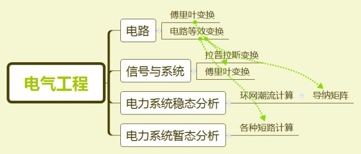
这种方法同样适用于读书自学。比如《战胜拖延症》那本书中提到了人的冲动与理智间的冲突，用了一个“马与骑手模型”。诶，恰好你之前读过理性情绪行为疗法，你想起里面的ABCDE法则的B，指的是自动化思维，而这个马指的也是自动化思维，你就把马骑马人和理性情绪行为疗法的ABCDE联系在一起了。站在一个更宏观的角度来看，这些有联系的知识之间有什么共性呢？你发现它们都属于“情绪管理“这个大范畴的内容。那情绪管理还有没有其他的呢？你想到还有一本书叫做《情商》，里面写到情商包括认识情绪、管理情绪、自我激励、理解他人情绪和人际关系管理五要素，也就是说，情绪管理属于情商的一个分支。那其他的四要素都是和情绪管理相关的。它们都是在心理学这个大学科领域下的。

**把新的内容，你要学的内容和以前记住的、所熟悉的内容联系在一起。**就这样，层层递进，那个叫做“自动化思维”的知识点与四五个知识点牢牢地包裹在一起，你已经很难忘记它了。
**你联系的内容越多，就越难遗忘。**

##### **3.定期重复**

你有没有过这样的经历？考试前一天晚上通宵抱佛脚，终于上了考场，你会感觉到很多死记硬背的东西在脑子里是飘着，但没有一个是真正学好或融会贯通的。你只能寄希望于老师的出题方式刚好合适你的记忆方式。然后老师进来了，在分发考卷前老师需要做一些准备工作。你几乎可以“感觉”知识从耳朵里快速流出！你在不停地默念最后记住的内容，企盼老师早点发卷子，不然就忘得越来越多了。
这就是因为考前时间紧张，没有足够的重复次数，而我们已经知道只有“重复”才能拾回记忆中缺失的片段。如果你想要在几年之后依然能够“裸考”过某一个曾经学过的科目，最好的建议是——早点学吧。

##### **4.想不起来的时候，试着去回忆一下当时的场景吧**

提示一个知识点的线索除了相关联的知识点，学习时的环境也有很重要的影响哦~
人有两套记忆系统，一个叫做外显记忆，还有一个叫做内隐记忆。外显记忆就是你背的课文内容本身啊；内隐记忆就是在你背的这个过程中，窗外树叶的沙沙声、黑板旁边滴滴答答走着的钟表、教室里桌子的位置……这些环境内容也被录制进了大脑中，只是你可能没有意识到。
有点类似于你想找一个知识点，但你不记得它所在的页码，可你记得那一页的正上方有一张插图。于是你就快速地翻书找那张插图，找到插图自然也就找到对应的内容了。
比如我一开始讲到的那个注电考试中化学题的例子。**当你觉得一个知识点怎么也回想不起来的时候，试着去回想你当时记住它的环境吧~**

##### **5.用自己的话重述内容**【输出

心理学上有个术语叫“生成效应”（generation effect），就是相比于别人告诉你的内容，你更容易记住自己说过的话。
我们在一本书上看到概念的时候，往往都伴随着术语、各种晦涩难懂的字句。把它翻译成“人话”，对着一个没学过这概念的朋友讲一遍，要是他能听懂，你就妥妥记住了。 

> 答主本人有一个方法，**尝试把所学到的知识当作答案，为它编一个问题，以问题的形式来记录知识。** 这样无形中用了费曼技巧，因为你需要为“别人”解惑。然后又可以给知识赋予意义，因为它可以解决问题。所以问题尽量编写的精彩一点，学完几个知识点以后可以编写一个覆盖多个知识点的问题。这样对知识进行了联系，达到融汇贯通的目的。另外，知识本来就很难全部记住吧！需要花很长时间的多次复习。所以平时随时多翻翻，到了需要的时候可以想起然后去查询也是非常棒的方法呀~
>
> 学过的东西马上就忘了怎么办？ - 阿兰正传的回答 - 知乎
> https://www.zhihu.com/question/27252044/answer/41845590

##### **6.“部分”学习法****【分治

这个方法特别适用于背课文！**比如前面那个背《陈情表》那个例子，把每三四句话分割成一个小的部分，学习第一部分直到掌握它，再学习第二部分直到掌握它，接着第三部分……背完一整个段落以后从第一句重新背到最后一句。
这样的好处是能够获得更快的反馈，如果你一股脑地从文章的第一句背到最后一句，可能背完一遍你已经不记得第一句讲什么了。这种划分细小单元的办法就好像把10张小纸条用长尾票夹夹起来一样，先找到它所在那一沓，然后再具体到某一张纸条，找起来就容易多啦~四、记忆宫殿（各种）**记忆术的基本原理就是前面说的“编码”，给没有意义的词组、数字和概念赋予意义**。
记忆宫殿其实就是把这些看似不相关的词脑洞大开地编成故事，而且这个故事一定是有场景的，和实际地理位置对应的。人们记忆有情节的故事和地理方位总是比记忆枯燥的概念要深刻的。
有一个TED演讲关于如何用记忆宫殿建立自己的记忆系统讲的非常详细~[Joshua Foer： 每个人都能掌握的记忆技巧](https://link.zhihu.com/?target=https%3A//www.ted.com/talks/joshua_foer_feats_of_memory_anyone_can_do%3Flanguage%3Dzh-cn%23t-92179)
嗯怎么说呢，可能因为我是路痴吧（我空间方位感特别差，相同一条路要走5次以上才能记住），这种大家都觉得巨好用的方法我并不感冒，我觉得最好用的还是“理解+建立知识体系”的方法~
泥萌可以自己试一试最适合自己的记忆方法哦~—————————————欢迎大家关注我的个人公众号【**小猫倩倩**】（**yqq-lc**），专注读书、学习方法论与理财科普，公众号后台1.回复【**高效学习**】，教你超好用的学习方法；2.回复【书单】，送你一张**7w+收藏**的书单；3.回复【财商】，告诉你我如何用半年时间从月光族到理财10%+收益，此文还**上过知乎日报**。

[编辑于 2018-06-20](https://www.zhihu.com/question/27252044/answer/405869399)

---

作者：米洛

##	学过的东西马上就忘了怎么办？ - 米洛的回答 - 知乎
https://www.zhihu.com/question/27252044/answer/96723723

题主和各位看官好，

我们先来看一下题主的问题描述中的一句：**每次学的知识到下次学新的就忘了，做了笔记，可是还是会忘？怎么办？**

这句话有一个重要的**未申明假设 (unstated assumption)** ，即做了笔记就不能够忘了。题主默认这个假设为真，所以很困惑，为什么自己做了笔记，还是会忘记所学的内容呢？

**可惜事实并非如此--**

### **记了笔记也不代表不会忘。**

早年，我也曾因记了一大堆笔记却记不起许多学过的内容而感到非常痛苦。后来，通过各种阅读和请教其他高效记忆者，我逐渐明白了，好的记忆能力需要科学的方法。否则，我们看过一堆内容，也只不过是获得了“数据大 (poorly-processed data) ”，而不是“大数据 (well-processed data) ”。

“数据大”通常只能用来感动自己，比如，哇，我好努力啊，今天又怒刷3套题，看了1本书，赶紧让我发个朋友圈先！可学完后，我们会发现，记忆效果并不好，而且还会因为低效而产生挫败感，甚至开始怀疑自己的智商（曾经的我）。相反，“大数据”就能让我们精进，每一天都实现更好的自己。

接下来，我会逐一分享我这几年总结出来的增强记忆的方法，工作和学习中都适用。

### **1. 好的方法需要转化为习惯** 

> 

虽然我没有说三遍，但这句话真的很重要。我们看过再多好的，适合自己的记忆方法，如果不将其转化成自己的习惯，那几乎就是在浪费时间。因为过了几天，我们的生活又会回归原样，该怎么样还怎么样，该记不住还是记不住（想想还是挺可怕的）。

至于如何养成一个习惯，我常用的方法是：

a. 定时提醒。我通常会用iPhone的闹钟和待办事项来提醒自己在特定时间培养一个习惯。

b. 把欲培养的习惯加入已有的习惯中。比如，如果我们要培养早上背10个单词的习惯，我们就可以把那10个单词写在即时贴上，贴在卫生间的镜子里，因为我们早上都会刷牙，所以刷牙时就会看到镜子上的即时贴，想起背单词这件事。其实，许多人养不成好习惯不一定是因为懒，而是因为记不住。

好习惯不仅对于记忆很重要，对于我们个人其他方面的成长同样重要。We are what we repeat.

### **2. 搞懂了才能记住**

> 

我在知乎私信中会收到许多关于记忆方法上的求助。根据这些知友描述的情况来看，他们的问题往往在于没有理解所学的内容。这个问题在文理工科中都很常见。比如，我随便选一个CS语言JavaScript中的概念--Object。

然后，我们看到这个概念有如下定义：In JavaScript, an object is a standalone entity, with properties and type. 

嗯，许多人都能看懂这句话。。。中的每个单词。即使有不懂的单词，查一查也就懂了。但是看懂了单词甚至句式，不代表我们就理解了这句话。如果我们不理解这句话，那它对于我们就没有什么意义，那我们自然就很难记住。

有的人可能会说，这不算啊，这是英文版的，来个中文版的，没有了语言障碍，我肯定能理解。好的，那我们来看一个中文版的解释：

\* 一切事物皆对象
\* 对象具有封装和继承特性
\* 对象与对象之间使用消息通信，各自存在信息隐藏

相信上面这三行里，没有知友们不认识的字吧？可认识这些字，不代表我们能看懂这三行。看懂这三行，需要：

a. 理解这三行中的一些更小的概念，比如封装，继承特性，信息隐藏等等。小的概念是大概念的根基，不理解小的概念就无法理解大的概念，就好比不懂代数是不可能学懂微积分的。

b. 寻找更好的讲解素材，比如把这个概念讲解地更清楚的一本书，因为不是每本教材都是讲解清晰的好教材。有些作者就是瞎写的。不要因为一份学习材料被印刷成书了，就觉得是权威。即使真的是权威，我们也应该用辩证的眼光来看待权威。

好的讲解素材还可以是某一段视频，或某一张图。为什么除了看书学，还可以看图或看视频学呢？因为不是所有人都能很好地咀嚼文本信息，有些人天生就是视觉派学习者，需要看图，看视频才能理解复杂的概念。

相信我，如果我们不理解一个概念，却想强记，那结果也只能是记住了一些很快就会遗忘的信息，而非能长存的知识。所以，要想记住，先得搞懂。人的大脑就是这么工作的。

**我相信这个道理很简单，懂的人也不少，可为什么就有人做不到呢？我觉得主要原因有两个：**
a. 懒。许多人觉得彻底搞懂一个概念是件很麻烦的事情，于是便懒得做。

b. 自我欺骗。许多人觉得，好像懂了就是懂了，大概懂了就是懂了。其实不是的，懂就是懂，不懂就是不懂。

### 3. 预习和复习

> ****

这个方法组合很容易被忽视，但它们其实只需要很少的时间，同时是许多高效记忆者的法宝。我的做法是1次预习+2次复习。预习通常就是课前阅读老师布置的材料，然后针对材料写下一些问题。带着这些问题听课，会让我们的听课效率和记忆效果都事半功倍。

还有就是复习了。我一般会在课后和下一节课前简单复习所学内容。个人的感觉最重要的是课后立刻复习。通常我会在课后用2分钟的时间，在大脑里简单概括这堂课的所学内容（尤其是那些我感兴趣的知识点），对于助记效果特别好。

遗憾的是，曾经的我并没有这个习惯，主要原因也是懒。因为刚下课时人往往比较累，而思考并总结课上所学，是需要耗费卡路里的，所以我之前就懒得做了。如果大家也有这个问题，那就一定要下定决心，在下课时多烧一些卡路里，来回顾刚才所学的内容。

### **4. 向他人转述**	[输出]

> 

如果我们无法简单明了地为别人讲懂一个复杂概念，我们其实还没懂这个概念。因此，要检测我们是否真正理解一个复杂概念，最好的办法就是去做别人的老师。

虽然现实生活中我们少有教学机会，但是，互联网中有许多这样的机会。我们可以通过在论坛中答题，通过写技术型博客，通过微信群答疑，来找到自己在理解中的欠缺，并及时补足。这样，我们不仅能渐渐理清自己的思路，还能为别人提供有价值的讲解。何乐而不为？ 

 ### 5.间隔重复

> ****

所谓的间隔重复，简单来说，就是隔一段时间就重新看一遍学过，背过的内容。想要记住一个东西，是需要不断重复这段记忆的。看一遍就能记住的，叫缘分，我们不能强求缘分天天发生，对吧？

我通常会用助记神器Quizlet来实现间隔重复。不管是背单词，英语的还是西班牙语的，还是背书本中的重要概念，Quizlet都是我的好帮手。

**地址：**[Simple free learning tools for students and teachers](https://link.zhihu.com/?target=https%3A//quizlet.com/)

----

## 学过的东西马上就忘了怎么办？ - 曾少贤的回答 - 知乎

https://www.zhihu.com/question/27252044/answer/97939951

谢腰，我自认这是一篇干货的回答。记忆可以分成

### 两种类型，

**一种是“工作记忆”，另外一种是“长期记忆”，**工作记忆是短暂性的记忆，可以想想，你在某一天记下一个单词，或者工作中记下某个人的名字，这些记忆储存的时间相当短暂；长期记忆则是通过反复记忆后，牢牢地储存在大脑里。短时间的注意力集中，就可以形成工作记忆，这也是为什么考试前一晚突击学习，第二天考试大部分知识点都能够记得的原因，因为处于压力状态下，大脑能最大限度地集中注意力。但一旦考试结束之后，你学习到的知识，很快就会被遗忘殆尽。为什么？因为工作记忆想要演变成长期记忆，需要满足两个条件：**这个知识点很有趣；重复。**某个知识点特别有趣，能让你一下子记住，或者这个知识点，每隔一段时间能够得到重复性地复习，满足这两个条件的任何一个，工作记忆就能演变成长期记忆。以下是方法论：

### **1.在融会贯通的前提下，进行重复。**

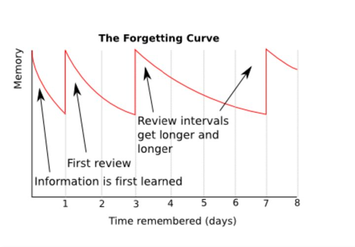除非是非常有趣的知识点，否则任何你现在记得的内容，都会随着时间的推移，而被你逐渐遗忘，所以你必须制定行之有效的重复计划。**重复的一大前提，就是：这个知识点是你真正掌握，真正理解的，而不能在一知半解的前提下，进行重复。**
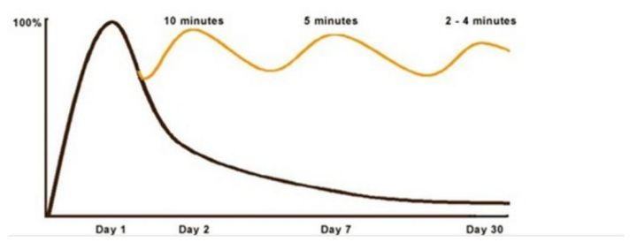重复记忆能让你拉长记忆的周期，而且能让你每次记忆的时间减少，它不需要你每一天都重复，而是制定固定的重复计划，它不需要你耗费相同的时间，相反，随着记忆的逐渐深入化，你耗费的时间，将逐步减少。

### **2.将知识点视觉化——图像是较好的选择。**

所有可以视觉化的知识点，都能够较为容易地被我们记忆。就像之前我在记忆中国历史朝代时，就喜欢用图像的形式来记忆，因为图像能够触发大脑视觉感应区域，可以让知识系统化，而不是一块块零散的模块。
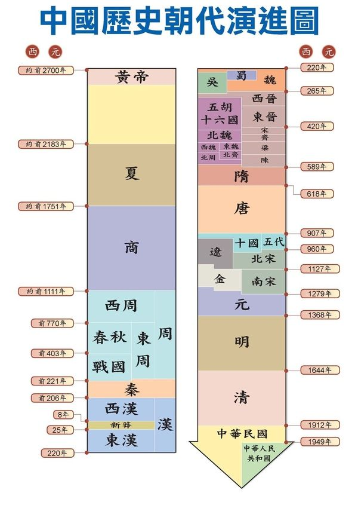（图来自网络）我之前也画过类似的图像，通过这个办法，可以将原本零碎的知识点，统一在同一张图像中，对于朝代的记忆，很有裨益。

### **3.记忆宫殿法。**

**将你想要记忆的东西，和你熟悉的空间联系在一起。**例如，五一放假后，你想去商场买食（gou）物（liang），大概有：鸡蛋、面包、牛奶、咖啡等等。你想较好地记忆下来，不想通过to-do list，这时，你可以用记忆宫殿法。想象你正要走进自己的房间，当你刚推开门，看见一盒牛奶放在地板上，沙发上堆放几片面包，一个鸡蛋在茶几上，正要掉到地板上，咖啡机正在搅拌着咖啡。只要联想一次，很快你就能记忆下来。将想要记忆的事物，和熟悉的区域发生联系，让一个个记忆任务，不再是陌生且琐碎的模块，而是和你存在密切联系的系统，这样记忆起来，会深刻许多。

## 学过的东西马上就忘了怎么办？ - 陈居文的回答 - 知乎

https://www.zhihu.com/question/27252044/answer/170177567

作者：陈居文

之前看了认知心理学，记忆策略部分专门整理出笔记，分享给大家。

### **一、记忆前的准备**

#### （一）注意。一心一意，不搞多任务。

#### （二）工作记忆。

人的工作记忆有限，短时间内只能保持5~9个项目。接触大量的新知识时，容易学了后面，忘了前面。对此，我们不仅要提前预习材料，减少记忆的负担，而且还要对相互联系的内容组块。

#### （三）背景。相似的场景时常唤起我们先前的回忆。

其实，我们在无意识之间，也会把记忆的背景环境，作为线索记在脑海中。如果事先了解提取（使用）的环境，我们便可以刻意创造类似的记忆环境。比如，晚会的彩排，以及模拟演练，用的就是这个原理。当然，背景即包括物理上，如物品的摆放，灯光照明等，也包括心理的状态。简单来说，心境一致时，与心情（情绪）好的时候更容易记起来。

### **二、具体的记忆方法**

##### （一）加工水平。

对于相互联系，内在逻辑结构严密的材料，死记硬背的作用很有限。我们可以从3个角度来深度加工材料，方便记忆。1 精细加工。就是所谓的知其然，还要知其所以然。面对材料，不仅要了解其具体意义，而且要弄清楚相互联系的概念。具体来说，我们可以向自己提问，而不只是复述。2 区别性。比如你先后认识两位名字相同的朋友，如果只是记住名字，那就很容易混淆。只有找到二者区别的特征，才不会记住后面，忘记前面。所以，我们面对材料时，就像做英语的同义辨析，要找到相似内容的差别。3 自我参照。人的记忆时常是按照以第一人称视角来组织的，而且与自身相关的事件会记得更牢。利用这一特点，我们可以将材料与自我关联起来。具体的方法有：想象自己应用这个知识的场景；回忆过去的经历，找出其中可以用这知识来解释的。只要能关联自身，就更容易记住。

##### （二）组块。

现在比较流行的思维导图或者说树状图，还有金字塔结构，都是组块的工具。之前提到，工作记忆容量太小，如果是零散的内容，比如超市购物的清单，不一会就忘干净了。类似的，不同领域的零碎知识，只要关联程度小，就很容易忘记，这也是为什么现在不提倡碎片化阅读，而倡导用大块时间来阅读专业书籍。但是一个复杂的概念，如态度有三个成分，分别是认知、情感、行为倾向。认知成分下又有事实、信念、观点、知觉和理解。因为其组块化，调用起来也只占据一个项目。据研究，专家的知识结构就是组块化的，因为组块可以大大降低认知资源的负担，让人思维更加敏捷，同时即使忘记其中一个，也可以顺藤摸瓜回忆起来。

1 知识原有的结构。对于大部分知识，最好的方法是，找到一本权威的专业书籍，系统地学习。这样我们就可以获得组块化的知识，而不必花时间自己组织。

2 首字母法。其他相关联的知识，我们可以使用首字母法。比如营销4P，大五人格ocean，将几个概念人为地合成，当成一个概念来记忆。

3 叙事。如果材料相关性很小，那只能虚构一个故事，让这些概念在编造的故事中登场。虽然有些费事，但比起单纯地重复，记忆的效果还是更好一些。

##### （三）记忆术。

关联小的随意信息，比如历史事件的年代、人名、π等等，没办法深入挖掘或加工，死记硬背效果又不好，此时记忆术就派上用场了。市面上很多关于记忆方法的书籍讲的就是这些内容。

1 位置法。设想一条路经，上面先后有序放置了一些路标，然后将材料放置于路标上，最后想象自己按顺序经过这条路。这些路径必须是我们所熟悉的，能够轻易回忆起来的场景，比如从自家去便利店的路线，或者你去上班上学的路线。位置法早在古希腊就被演讲家给用上了，它的奥秘在于将记忆的材料和平常熟悉的环境挂钩了，人们也称其“记忆宫殿”。

2 交互意象。这种方法需要调用多种感官，化抽象为表象。你需要构想概念的表象，不仅限于视觉，还有听觉等各种感觉，多多益善。因为每增加一种感官，都会成为记忆提取增加一条线索。其次，让它们在一个故事中相互作用，并且情节越荒诞，越容易记住，这也是增加区别性。

#### **三、记忆后的努力**练习。

 只要策略选择合适，学习时所花的时间越多，学到的内容越丰富，忘记的也越少。说到复习，人们通常想到重复阅读。事实上，复习的策略很多，大部分我们都使用过，就是学校和老师通常用的那一套。

#### （一）练习提取。经过努力回忆起之前的内容，可以巩固记忆。

我们在背单词的时候，也会遮住汉语来回想汉语释义。每次随堂测验、作业、考试等，都在不同程度地让我们主动回忆，在不知觉中完成一次复习。

#### （二）分散练习。也是就**间隔**学习。

一次花两小时背单词，不如在早晚各花一小时。因为大脑长时间接触一类刺激，很容易感到疲劳，导致效率降低。而分开学还能提供更多的环境线索，帮助提取。学校的同一门课程很少堆在一起上，至少相隔一天也是这个原因。

#### （三）测验。

考试虽然讨厌，但作用巨大。其一，考试能让付出更多努力。大学中，有些选修课如果不考试，大部分可能都不去上课。而在准备考试过程，必然需要组织材料，并对其精细加工。其次，克服预见偏差。我们倾向自信，在学过以后，总觉得自己已经明白了，不需要再投入时间钻研或复习，便没有动力学习了。测验让我们看清现实，明白自己掌握的程度，一方面激发了学习的动力，另一方面对症下药，可以只把时间花在不懂或忘记的地方。以上

[编辑于 2017-05-16]()

## 学过的东西马上就忘了怎么办？ - 周克的回答 - 知乎

https://www.zhihu.com/question/27252044/answer/125004946

### 学以致用

因为题主提到"工作中",因此我的回答也只针对职场.

### 反复使用,实践**.**

**将"**以致用**"作为"**学**"的目的,要意识到,"**学**"仅仅是"**用**"的一部分,最好的记忆办法,便是"**学**"之后的**反复使用,实践**.
**知之而不行,虽敦必困**.---荀子·儒效

## 学过的东西马上就忘了怎么办？ - 于浩浩的回答 - 知乎

https://www.zhihu.com/question/27252044/answer/670176471

作者：于浩浩

让我来终结这个问题，这一篇文章能让你的记忆力又宽又长，又大又圆！！！！

没有耐心的小伙伴可以直接拉到最下面看结论！！！！！！！！！！！！！！！！

目录：
一、更好的记忆方法
二、让知识自己蹦出来的方法
三、如何变得更专注

------

### 一、更好的记忆方法。

曾经看过几个实验，测试记忆力是怎样运行的。
Craik&Tulving于1975年关于记忆的浅层深层加工的经典实验，实验的详细过程和论文原文可参考文末。
给AB两组被试者出同样一组单词，让A组被试者数一数每个单词有多少个音节，
让B组被试者阅读单词的含义（或者设想单词可以被使用在哪些场景中），之后让两组被试者回忆列表上的单词，猜哪一组能够回忆出更多。
最后B组被试者的回忆单词数比A组要多很多。

**结论：我们在记一段知识的时候，会将这段记忆的相关信息（比如当时的情景、环境是怎样的、空气中飘着什么味道的气息、光线如何、问题相关的背景、空间记忆）一起记忆起来，之后想要提取当时输入的记忆，就要看输入时的记忆是否丰满（是否多样化的捆绑这段知识），并且有没有重现记忆时的线索。**

我自己举一个形象的比喻，我们的脑子就好比是一个**篮子**，篮子的竹条很宽很大。

我们的每一条记忆都是小虫子。

竹条之间有很大的缝隙，我们在记忆时，如果没有把知识养大，当瘦弱的知识放进篮子里时，知识搭在了竹条上，

时间一长，我们要吃饭、运动、生活，慢慢瘦弱的知识会被抖到掉到地上，再无回忆起来的可能。（艾宾浩斯H.Ebbinghaus遗忘曲线）

想要回忆起来，只有知识足够肥，这样才不会从大脑中掉出来。

知识想要变肥，要多跟之前的知识挂钩关联，知识很特殊，**不会因为你重复记忆而变得丰满，唯有将触觉、听觉、和以后要用知识场景都结合起来才会肥。**

比如我们背单词，以字典Dictionaries为例，**如果在记忆时不仅仅背字母顺序，手里还拿了一本沉甸甸的字典，能在脑海中想象着你的同学跟你借字典，或者你用到字典的场景，最好是自己造一句话，说出来，这种思考的过程**，就是把Dictionaries这个单词养肥、并且打上编号的过程。
这就形成了一条肥硕的记忆：

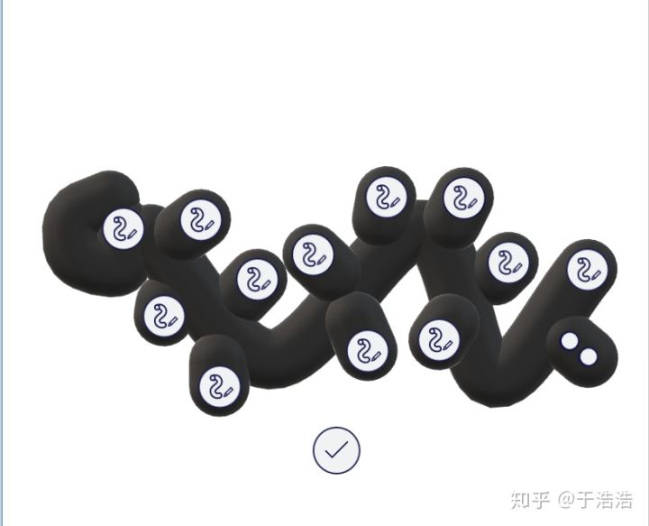肥Dictionaries

如果我们仅仅**单调，干巴巴的重复，那这条虫子会营养不良，从篮子中漏掉，掉到地上消失**。像下面这只：

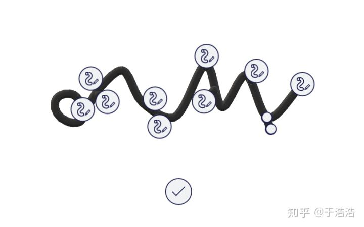瘦Dictionaries

###  结论：！！ 

对应的，你在学习知识的时候要做到：

##### **1、记忆的知识要换多个地方记忆。**

狗狗和人的大脑有一定的相似性，就是都对环境很敏感，狗子在家学会了口令，出门遛狗却不会了，因为外界的刺激太多，环境的更换造成了这样的结果。

针对这样的特性，我们在记忆时，要经常的更换环境，这样能帮自己记忆的更加牢固。

如果一个知识点经过了→ **在宿舍、自习室、小花园、路上、图书馆**这些地方的检验，同学，你已经忘不了这个知识点了。

##### **2、记忆的时候要发散联想**

也就是俗话说的老知识和新知识的结合，

把脑海中已经存在的知识、物品、人物进行结合。

比如最简单的记忆宫殿，进门的东线，每个知识点都寓意着不同的房间、或者不同的摆件等，

还可以想一些惊世骇俗的，比如钢铁侠在给一条哈士奇铲屎，将这些惊世骇俗的形象与知识进行连接，比如谐音、比如颜色、比如动作等。

##### **3、记忆的时候要增加触感、听觉、嗅觉、等多元感觉。**

背单词背到身边事物时，直接下手去抓一下，或者去实际应用一下，甚至可以把知识点教给别人，让别人给你复述一遍，这些都是多元从听觉、触觉去记忆知识的方法。

还有什么其他骚操作要看骚年自己探索啦。

##### 需要的时机出现

我们都知道，知识仅仅记忆是没有价值的，知识要在我们需要的时机出现，那才是真正的知识，否则就是没有感情堆砌的废物。

 下面的方法能够帮助你，让知识自然的蹦出来。

###   二**、让知识自己蹦出来的方法**

##### **1.刻意增加动脑回忆的场合**

这张老图，言简意赅

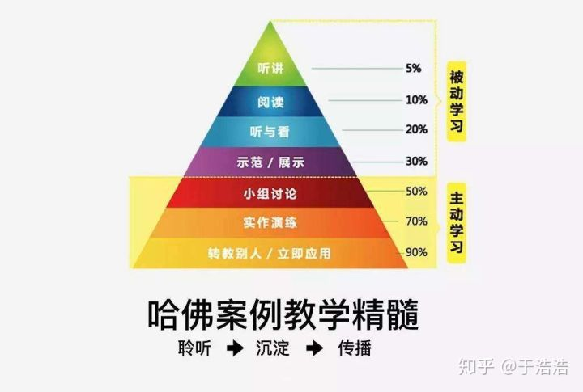又祭出这张骨灰图

**（1）与人讨论**
把学到的知识用自己的话，讲给别人听，说出口之前的大脑整理，就是重复逼迫自己回忆的过程，建立一个小组，互相分享每天学到的知识，一件特别有价值的事情。

**（2）写作**
我现在就正在做这件事情，将之前学到的知识，用自己的话说出来，举一些自己发散联想的例子。
当你想要表述一个观点，找例子的过程，就是把知识转化成自己的过程。
把复杂的东西，用简单的话准确的说出来，其实挺难的。
强行在脑海中寻找类似的理论、别人说的话、相似的场景、案例、都是迅速把毛毛虫变丰满的方法。
写作你真的要尝试一下。

##### **2.经历其他人的经历**

我们人脑，对于别人的经历和自己的经历是有严格的记忆区域划分的。
没有谁能对别人100%的感同身受，看到别人撞碎玻璃门了，噗嗤你乐了，真要换成自己撞了就龇牙咧嘴只喊疼了。
虽然不能完全代入别人的感觉，但想象自己在别人的视角去经历，已经足够优秀了。
有一个小技巧，就是想象【第一人称视角】，像玩CS，只能看到自己双手的那种视角。
用这种视角去想象，别人正在经历的事情感触是最深的。

##### **3.将知识抽象化，将遇到的问题抽象化。**

我们遇到的事情、一般都是非常具体的事，事情的细节将知识限制在了一个狭窄的领域里，好像无法总结出普适性原则。
抽象要做的事情就是把特定情景下的知识，去除细节，往上再走一层。
树杈遇到的事情得出的结论，抽象总结一下到了树枝，再总结一下就能到树干。
总结的知识/经验到了树干，就能跨学科使用。

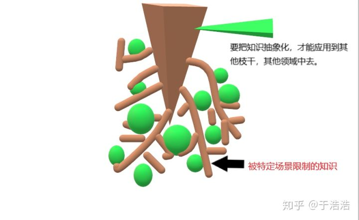渣技术，跪了

就好像我们刚刚的例子，军队分散攻击攻下碉堡，和医学中多角度低能量攻击恶性肿瘤的原则是共通的，
说实话我自己也是很难做到这点，但早点知道比晚知道要好，咱们一起加油。

##### **4.对比经历。**

将自己的经历与自己身边看到的，阅读中看到的其他人的经历进行比较，得出结论。
《考拉小巫的英语学习日记》是考拉小巫努力学习英语的记录。
看别人的经历，能很好的与自己产生对比，小巫实现了自己的梦想，自己却止步于此，两者一对比，就知道问题出在哪里。
你是从业互联网的，去看互联网从业者写的书、经历等，对比自身所经历的，为什么他成功了、活下来了，自己却凉了？

有的人做什么，成什么，成功的因素有什么？
有的人在哪里都是失败者，为什么呢？
查理芒格总是说“反过来想，总是反过来想”，他在弄明白怎样成功之前会先去了解，哪些因素导致了失败。
反过来想的思维方式非常值得借鉴。
**这条方法与各种传记更配哦~人物传记就是足够好的对比范本。**
不管是金融市场还是人生，历史总是惊人的相似。

###  三、更专注的方法。

##### 发散模式

##### 专注模式。

《学习之道》曾经讲过两种思维模式，发散模式和专注模式。
我们的大脑是一个很精明的仪器，它能检测到你对一个事物是否真的专注。
比如专注峰值是120，达到100就能启动发散模式。
这时我们在运动、洗澡、做家务时，虽然是做着与之前完全不相关的事情，但大脑后台还是在全方位的运转着。
很多科学家冥思苦想的难题，都是在一觉醒来、梦中、散步时灵光一闪想到的。
这“灵光一闪”的始作俑者，就是**发散思维。**
**那么怎样进入专注模式，达到100分峰值呢？**

##### **1.培养专注力**

能够迅速的忽视其他不紧要的信息，只接受单一信息是需要训练的。
在繁杂的情境下去进行一些单一信息接收训练，就非常好。
**在公交车上、地铁、其他吵闹的环境，冥想、阅读书籍就是非常好的专注力训练。**

##### **2.做热爱的事情**

如果你是一个理科生，有着严谨的思维逻辑。
却让你去做一个爱情导师、情绪疏导师，你觉得会怎么样？
或者让一个自由无拘无束的浪子去部队服役。
都很痛苦，很焦虑。
焦虑能极大的影响身心健康。
排解焦虑就会消耗很多的心力。
选错了路，越是专注，**越是能敏感的感受痛苦。**
心流模式的触发，就是要做心仪的事情，感受到峰值很高的愉悦，时间快速流逝，全身心的智力、体力都集中在一点上，心无旁骛。
努力之前，确定好方向先。

##### **3.要事第一**

《高能效人士的7个习惯》要事第一就非常经典。
二八定律也可以应用到这里，把自己80%的精力，用到真正重要但不急迫的20%的事情中去。
还记得神探夏洛克里的男主，关于犯罪的所有事情，近乎是所有事情，他都知道。
但跟犯罪无关的事情，他都基本是个白痴。

这种人把要事第一的原则发挥到了极致，把90%的精力集中到10%的事情上。
我们可以控制自己的精力，让他们消耗到对的事情中去。

##### **4.制造环境**

最近深有体会。
因为这几天我家特别乱，集中精力的效果也很差（我连着玩了2天，每天不低于3小时的火影）
但今天下午我去咖啡厅了，我看书看了一下午。（蛮专注的）

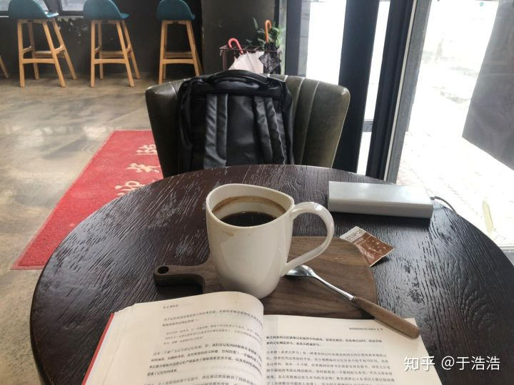

环境还真的挺重要的，一个整洁的环境有减少分散精力的可能性。

### 复习一下：

> ### **一、增强记忆的方法有：**
>
> ##### 1、记忆的知识要换多个地方记忆。
>
> ##### 2、记忆的时候要发散联想
>
> ##### 3、记忆的时候要增加触感、听觉、嗅觉、等多元感觉。
>
> ### **二、让知识自己蹦出来**
>
> ##### 1.刻意增加动脑回忆的场合，有教别人知识，写作，
>
> ##### 2.经历其他人的经历
>
> ##### 3.将知识抽象化，将遇到的问题抽象化。
>
> ##### 4.对比经历。
>
> ### **三、更专注的方法**
>
> ##### 1.培养专注力
>
> ##### 2.做热爱的事情
>
> ##### 3.要事第一
>
> ##### 4.制造环境
>
>
> 要结束啦，推本书吧：《奇特的一生》
> 参考文献：
> Craik&Tulving的论文Depth of processing and the retention 
> Craik&Tulving的实验：level of processing - Craik&Tulving(1975)

## 学过的东西马上就忘了怎么办？ - 努力奔跑不抱怨的回答 - 知乎

https://www.zhihu.com/question/27252044/answer/207815593

作者：努力奔跑不抱怨

实在没时间，先写个简略版本，再补充完整版。

### **1.结构化：**

学完一小节就进行总结，将笔记本上散乱记的方法梳理出一个思维导图。

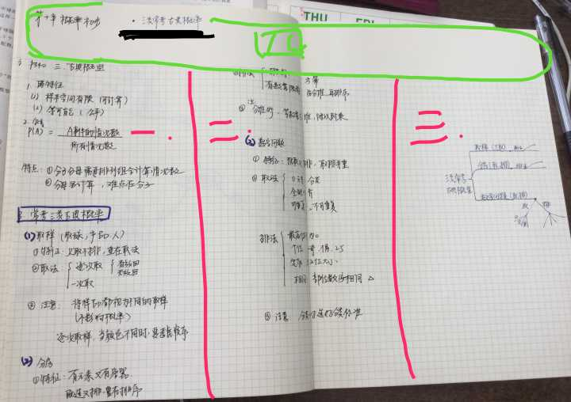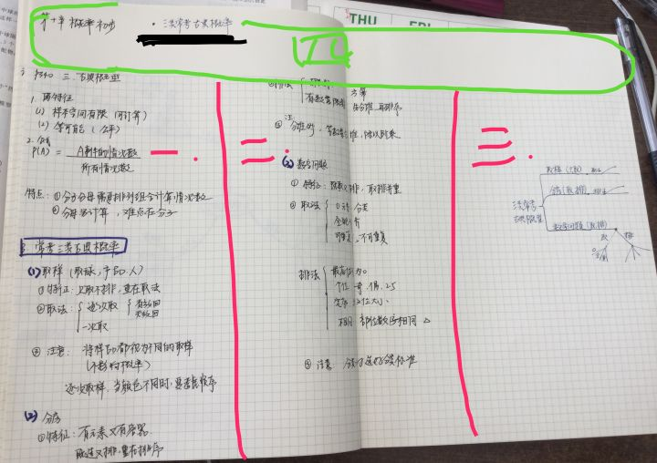

**一区二区是听课笔记，三区对听课笔记用自己的话做一个梳理，复习的时候根据三区回忆一二区的内容。四区再次结构化，把这页笔记的关键词写上，复习的时候根据关键词回忆框架再回忆具体内容。**

### **二、再结构化**

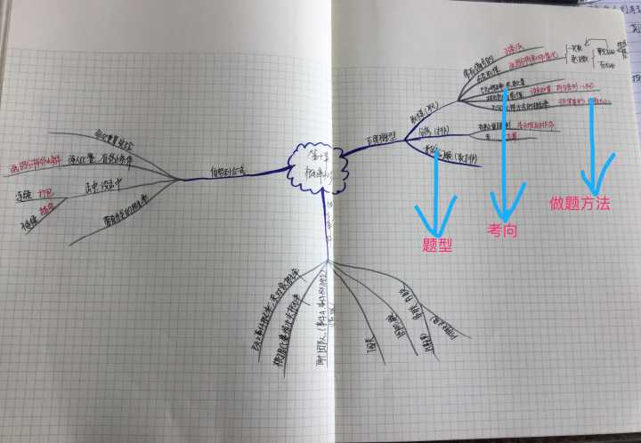

### **学完一章，要把一章的内容用导图整理，重点是自己默写出来，不要抄，默写。**

现在的目标应该是将尽可能多地将信息转化成符号或者图片，

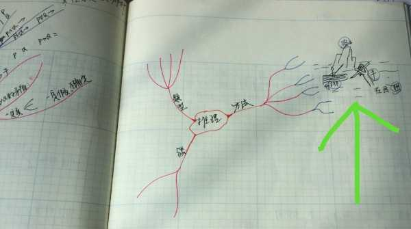

这时候就不用像图一写的那么详细，画个框架图，复习时候作为提示进行回忆，此时，（看图二绿箭头指的），我将图一那四种方法八个点这些很多字的文字信息转化成了一张图，也可以不画出来，在脑中想象：一个手在作图，画了一个假山，一个竹排。     分别对应：入手（手）、作图法（作图）、假设法（假山）、排除法（竹排）。 

当你把信息转化成动态的画面的时候已经想记不住都难了，想象的图像最好要有色彩，是动感的，图像画面越夸张有趣印象就越深刻，如果同时能调动起多个感官就更好了，比如记忆sun这个单词，想象一个大红太阳，发光发热仿佛都能感受到热的很难受的感觉

### **3.保存记忆：**

**复习是学习系统中重要的一环**

**【建立复习本】**

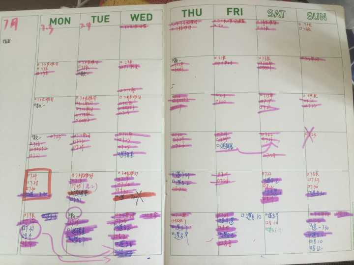

根据艾宾浩斯遗忘曲线，当天学完知识，当天晚上临睡前复习，第二天复习，第四天复习，第八天复习，第十五天复习，第三十天复习，以后每隔15天复习，这样一遍就形成了长期记忆，学过的想忘都难。 

最初用来记忆单词，效果极好，记忆单词是必须这样来复习的，有余力的学习其他科目也可以这样复习，百词斩的月计划本，你可以当天上完课整理总结完笔记，在笔记本上标上当天的日期比如8.31，然后在复习本上对应复习日期也标上8.31，以后就每天检查复习本进行的当天的复习任务。

### 努力回想，进行回忆

我在学渣时候，也听到过有学霸说他们背单词是联想着串起来背，就是今天背这个单词时候回想之前哪里出现过或者与这个单词拼写相似的，读音相似的等等，然后我当时觉得太好了这方法，于是我在上英语课时候也尝试着进行，但是发现，我怎么就做不到呢，一个别的词都想不起来。 直到现在我使用了这个复习本，才终于体会到学霸说的那种境界。  **学完根本就不复习，新知识学完第一天就忘掉百分之80，更别说再往后了，根本就不复习没形成长期记忆，谈何回忆起来呢？**

第一遍复习你对题的理解更深了，第二遍，第三遍你发现了一些题和题之间的规律，这个选项和那个选项，这题和那题的整体框架是一样的，选项结构也是一样，总结一下提炼出来，就是这题的模型，以后这类题就可以秒选了。

在晚上睡前的任何时候（比如自习室临走前默写、洗漱时候、路上、敷面膜等）进行回忆。**注：努力回想，进行回忆努力回想进行回忆释复习，**要比直接翻开笔记本看一遍的记忆效果好很很很很多，经常进行回忆式复习一段时间后就算当天没有总结复习，隔天翻开书学习前第三部分内容会在脑中浮现出 （我的亲身经历啊啊啊！以前是书看好几遍都没啥印象不太会做题....多么痛苦的经历....，后来坚持每晚睡前进行回忆，刚开始可能比较难，可以用手机拍个照片实在回忆不出来就看下或者回忆不出来的第二天醒来后赶紧看下，回忆出来的自然就是不用复习了，效率提高节省时间。）

---

### 学过的东西马上就忘了怎么办？ - Kay Li的回答 - 知乎【记忆有七个特点】

https://www.zhihu.com/question/27252044/answer/620663627

记忆有七个特点

---

 学过的东西马上就忘了怎么办？ - 神速蜗牛的回答 - 知乎[【关联】
https://www.zhihu.com/question/27252044/answer/41835708