##	学过的东西马上就忘了怎么办？ - 叶倩倩的回答 - 知乎

https://www.zhihu.com/question/27252044/answer/405869399

事实上，我从小就不是那种聪明小孩，特别是上了高中以后，反应速度更加令人堪忧。数学和物理老师在讲课的时候我几乎跟不上他们的节奏，幸好我笔速足够快，可以把他们写在黑板上的任何东西誊在笔记本上，下课再慢慢消化。大学的时候更是如此，学高等数学对我来说简直就是噩梦。
于是**一直慢吞吞地，用比别人更多的时间来学**。
天道酬勤，时隔多年我依然能够准确地回忆起那些知识。 
如果你打开这篇文章，想要成为“过目不忘”的记忆超人，那恐怕要失望了；但是，**如果你恰好和曾经的我一样，面临学业的困境，或者苦于读过的书放下就忘，这篇文章可能会帮到你**。

### 一、记忆是一种可以提高的技能

大三的时候有一次我和男友聊天，不知怎么说起了高中时候难忘的事（我们俩是初高中同学），他愤愤地讲起语文老师让默写《陈情表》，因为没有背会被罚抄了20遍的悲惨经历。彼时我是班里的语文科代表，自然“秉公执法”，毫不含糊地监督他悉数抄完。结果他抄完20遍还是没背下来，只记得“臣以险衅，夙遭闵凶。生孩六月，慈父见背”16字。
我的男友是学校出了名的学霸。对我来说像听天书一样的数学题，他看一眼题干就能心算出答案。唯独语文和英语emmmmm。看着他委屈的小眼神，我捧着肚子笑了很久，问他：“你是不是每次看两三个字就抄下来？”
他瞪大了眼睛看着我：“你怎么知道？”
我说，“你用这种方法背文言文，抄100遍也记不住”。
我和他讲，如果你**一次性看完整的一句话再抄，把每三四句话分成一个小块，背会第一个小块再背第二个，然后再背第三个……等到一个段落结束再从第一句梳理到段末最后一句，很快就记住了**。
陈情表是会背了，但是高考已经过去两年多了。
这件事让我思考了许久。我是一个在记忆古诗文方面有特长的人，基本上读3~5遍就能背下来的；与此同时，在记忆数学公式的时候又显得十分捉急。而他则恰好相反。所以你看，**没有一个通用的秘诀能够拥有好记性**，不同的人学习不同材料、用什么方式、在什么情况下、想记住多长时间，**记忆方法都是不同的**。
但是，**记忆的基本原理是相同的**。只要你掌握了原理，再配以适合自己的方法论，考试过关读书少忘肯定是没问题的~

### 二、记忆的基本原理为什么学了那么多知识却记不住？

我来打个比方，假设在你面前有一个文件筐，里面放了很多小纸条。如何找到某张特定的纸条呢？如果乱七八糟地堆在一起，想要找到其中特定一张无疑是很难的。但是，如果你**把这些纸条按照顺序编号，然后按照从大到小顺序整齐地放在盒子里，每10张用一个长尾夹夹好，**想要找到其中某一张是不是就容易多了呢？
记忆有三个阶段**，**

##### **一是编码，**

##### **二是存储，**

##### **三是检索**。

假设每一张小纸条代表着一个知识点，编码就是你把小纸条写上编号，并且按照从大到小的顺序排列的过程。存储就是把这些小纸条放在盒子里，进行归档。提取就是当你想要寻找某一张纸条的时候，就会按照之前排列的那个顺序把它捡出来。
但是，由于人脑的生理结构是天然会“遗忘”的，即使你把知识点按一定顺序排列好了，如果不去定期回忆还是会很快遗忘。在学会一个新知识点以后，你得进行多次重复，找回那些被忘掉的知识，它才能长久地存在于记忆中。

好了，我们接下来要解决的问题就是，如何把这些知识点小纸条进行编码呢？

### 三、如何记得又多又牢固

##### **1.先理解，后记忆**

一个没有被理解的知识点就像一张空白的小纸条，没有任何标记，死记硬背不但容易遗忘，而且回忆的时候还很容易出错——那么多没有标记的纸条，你要找哪一张呢？
如果你要记住的内容是一个全新的公式，一定要动手推导一下它是怎么来的；如果是教科书上一个从没见过的概念，记得看看它的定义，想一想它是出于什么需要被提出来的，为了用它表征什么；如果是一套体系，那就要弄懂运作的原理。有了理解，才能继续深加工。
经过这样一个“理解”的过程，空白的小纸条就写上了编号。

##### **2.建立与其他知识的联系**

**这个特别重要！**
无论是学校的课程安排，还是我们工作进入一个新领域从入门到进阶，知识的深度和广度都是递增的。一开始学的内容就像盖房子的地基一样，每一个知识点就像是砌墙的一块砖，通过混凝土牢固地结合在一起。如果你没有打好地基，或者只是把砖块堆砌在一起而缺少混凝土联结，房子随时都有坍塌的风险。
怎么做呢？
**文科类要记忆的内容往往是有意群的**，无论是背政治还是文言文。把一大段话的中心意思提炼成几个关键词，你会发现它们之间要么是平行，要么是递进，要么是转折或是别的关系。所以**你只要记住它们之间的联系**就行了，背到一句话的时候，自然会想起下一句是什么。比如《陈情表》第一段就是按时间顺序写成长经历，从近亲到远亲到童仆，最后说自己形单影只。如果两三个字一组，破坏了文章原有的意思，相当于把作者已经排列好小纸条又打散了，能记住才奇怪。
对于理工科的内容，**如果是基础专业课第一次接触的概念，请务必完全理解。后面当你学到一个新的知识点时，去要寻找这个学科内以前学过的和它有关联的点。**比如我是学电的，大一下的电路就是最基础的内容，后面所有的专业课都是建立在《电路》基础上的。学到《信号与系统》的时候，要用到其中的傅里叶变换；学到《电力系统稳态/暂态分析》的时候，要用到其中电路的Y和▲等效变换……如果电路没学好，那绝对是后患无穷。同时，因为有前面的课程做基础，后面再学新概念的时候联系旧概念，就很难忘记了。

这种方法同样适用于读书自学。比如《战胜拖延症》那本书中提到了人的冲动与理智间的冲突，用了一个“马与骑手模型”。诶，恰好你之前读过理性情绪行为疗法，你想起里面的ABCDE法则的B，指的是自动化思维，而这个马指的也是自动化思维，你就把马骑马人和理性情绪行为疗法的ABCDE联系在一起了。站在一个更宏观的角度来看，这些有联系的知识之间有什么共性呢？你发现它们都属于“情绪管理“这个大范畴的内容。那情绪管理还有没有其他的呢？你想到还有一本书叫做《情商》，里面写到情商包括认识情绪、管理情绪、自我激励、理解他人情绪和人际关系管理五要素，也就是说，情绪管理属于情商的一个分支。那其他的四要素都是和情绪管理相关的。它们都是在心理学这个大学科领域下的。

**把新的内容，你要学的内容和以前记住的、所熟悉的内容联系在一起。**就这样，层层递进，那个叫做“自动化思维”的知识点与四五个知识点牢牢地包裹在一起，你已经很难忘记它了。
**你联系的内容越多，就越难遗忘。**

##### **3.定期重复**

你有没有过这样的经历？考试前一天晚上通宵抱佛脚，终于上了考场，你会感觉到很多死记硬背的东西在脑子里是飘着，但没有一个是真正学好或融会贯通的。你只能寄希望于老师的出题方式刚好合适你的记忆方式。然后老师进来了，在分发考卷前老师需要做一些准备工作。你几乎可以“感觉”知识从耳朵里快速流出！你在不停地默念最后记住的内容，企盼老师早点发卷子，不然就忘得越来越多了。
这就是因为考前时间紧张，没有足够的重复次数，而我们已经知道只有“重复”才能拾回记忆中缺失的片段。如果你想要在几年之后依然能够“裸考”过某一个曾经学过的科目，最好的建议是——早点学吧。

##### **4.想不起来的时候，试着去回忆一下当时的场景吧**

提示一个知识点的线索除了相关联的知识点，学习时的环境也有很重要的影响哦~
人有两套记忆系统，一个叫做外显记忆，还有一个叫做内隐记忆。外显记忆就是你背的课文内容本身啊；内隐记忆就是在你背的这个过程中，窗外树叶的沙沙声、黑板旁边滴滴答答走着的钟表、教室里桌子的位置……这些环境内容也被录制进了大脑中，只是你可能没有意识到。
有点类似于你想找一个知识点，但你不记得它所在的页码，可你记得那一页的正上方有一张插图。于是你就快速地翻书找那张插图，找到插图自然也就找到对应的内容了。
比如我一开始讲到的那个注电考试中化学题的例子。**当你觉得一个知识点怎么也回想不起来的时候，试着去回想你当时记住它的环境吧~**

##### **5.用自己的话重述内容**【输出

心理学上有个术语叫“生成效应”（generation effect），就是相比于别人告诉你的内容，你更容易记住自己说过的话。
我们在一本书上看到概念的时候，往往都伴随着术语、各种晦涩难懂的字句。把它翻译成“人话”，对着一个没学过这概念的朋友讲一遍，要是他能听懂，你就妥妥记住了。 

> 答主本人有一个方法，**尝试把所学到的知识当作答案，为它编一个问题，以问题的形式来记录知识。** 这样无形中用了费曼技巧，因为你需要为“别人”解惑。然后又可以给知识赋予意义，因为它可以解决问题。所以问题尽量编写的精彩一点，学完几个知识点以后可以编写一个覆盖多个知识点的问题。这样对知识进行了联系，达到融汇贯通的目的。另外，知识本来就很难全部记住吧！需要花很长时间的多次复习。所以平时随时多翻翻，到了需要的时候可以想起然后去查询也是非常棒的方法呀~
>
> 学过的东西马上就忘了怎么办？ - 阿兰正传的回答 - 知乎
> https://www.zhihu.com/question/27252044/answer/41845590

##### **6.“部分”学习法****【分治

这个方法特别适用于背课文！**比如前面那个背《陈情表》那个例子，把每三四句话分割成一个小的部分，学习第一部分直到掌握它，再学习第二部分直到掌握它，接着第三部分……背完一整个段落以后从第一句重新背到最后一句。
这样的好处是能够获得更快的反馈，如果你一股脑地从文章的第一句背到最后一句，可能背完一遍你已经不记得第一句讲什么了。这种划分细小单元的办法就好像把10张小纸条用长尾票夹夹起来一样，先找到它所在那一沓，然后再具体到某一张纸条，找起来就容易多啦~四、记忆宫殿（各种）**记忆术的基本原理就是前面说的“编码”，给没有意义的词组、数字和概念赋予意义**。
记忆宫殿其实就是把这些看似不相关的词脑洞大开地编成故事，而且这个故事一定是有场景的，和实际地理位置对应的。人们记忆有情节的故事和地理方位总是比记忆枯燥的概念要深刻的。
有一个TED演讲关于如何用记忆宫殿建立自己的记忆系统讲的非常详细~[Joshua Foer： 每个人都能掌握的记忆技巧](https://link.zhihu.com/?target=https%3A//www.ted.com/talks/joshua_foer_feats_of_memory_anyone_can_do%3Flanguage%3Dzh-cn%23t-92179)
嗯怎么说呢，可能因为我是路痴吧（我空间方位感特别差，相同一条路要走5次以上才能记住），这种大家都觉得巨好用的方法我并不感冒，我觉得最好用的还是“理解+建立知识体系”的方法~
泥萌可以自己试一试最适合自己的记忆方法哦~—————————————欢迎大家关注我的个人公众号【**小猫倩倩**】（**yqq-lc**），专注读书、学习方法论与理财科普，公众号后台1.回复【**高效学习**】，教你超好用的学习方法；2.回复【书单】，送你一张**7w+收藏**的书单；3.回复【财商】，告诉你我如何用半年时间从月光族到理财10%+收益，此文还**上过知乎日报**。

[编辑于 2018-06-20](https://www.zhihu.com/question/27252044/answer/405869399)

---

作者：米洛

##	学过的东西马上就忘了怎么办？ - 米洛的回答 - 知乎
https://www.zhihu.com/question/27252044/answer/96723723

题主和各位看官好，

我们先来看一下题主的问题描述中的一句：**每次学的知识到下次学新的就忘了，做了笔记，可是还是会忘？怎么办？**

这句话有一个重要的**未申明假设 (unstated assumption)** ，即做了笔记就不能够忘了。题主默认这个假设为真，所以很困惑，为什么自己做了笔记，还是会忘记所学的内容呢？

**可惜事实并非如此--**

### **记了笔记也不代表不会忘。**

早年，我也曾因记了一大堆笔记却记不起许多学过的内容而感到非常痛苦。后来，通过各种阅读和请教其他高效记忆者，我逐渐明白了，好的记忆能力需要科学的方法。否则，我们看过一堆内容，也只不过是获得了“数据大 (poorly-processed data) ”，而不是“大数据 (well-processed data) ”。

“数据大”通常只能用来感动自己，比如，哇，我好努力啊，今天又怒刷3套题，看了1本书，赶紧让我发个朋友圈先！可学完后，我们会发现，记忆效果并不好，而且还会因为低效而产生挫败感，甚至开始怀疑自己的智商（曾经的我）。相反，“大数据”就能让我们精进，每一天都实现更好的自己。

接下来，我会逐一分享我这几年总结出来的增强记忆的方法，工作和学习中都适用。

### **1. 好的方法需要转化为习惯** 

> 

虽然我没有说三遍，但这句话真的很重要。我们看过再多好的，适合自己的记忆方法，如果不将其转化成自己的习惯，那几乎就是在浪费时间。因为过了几天，我们的生活又会回归原样，该怎么样还怎么样，该记不住还是记不住（想想还是挺可怕的）。

至于如何养成一个习惯，我常用的方法是：

a. 定时提醒。我通常会用iPhone的闹钟和待办事项来提醒自己在特定时间培养一个习惯。

b. 把欲培养的习惯加入已有的习惯中。比如，如果我们要培养早上背10个单词的习惯，我们就可以把那10个单词写在即时贴上，贴在卫生间的镜子里，因为我们早上都会刷牙，所以刷牙时就会看到镜子上的即时贴，想起背单词这件事。其实，许多人养不成好习惯不一定是因为懒，而是因为记不住。

好习惯不仅对于记忆很重要，对于我们个人其他方面的成长同样重要。We are what we repeat.

### **2. 搞懂了才能记住**

> 

我在知乎私信中会收到许多关于记忆方法上的求助。根据这些知友描述的情况来看，他们的问题往往在于没有理解所学的内容。这个问题在文理工科中都很常见。比如，我随便选一个CS语言JavaScript中的概念--Object。

然后，我们看到这个概念有如下定义：In JavaScript, an object is a standalone entity, with properties and type. 

嗯，许多人都能看懂这句话。。。中的每个单词。即使有不懂的单词，查一查也就懂了。但是看懂了单词甚至句式，不代表我们就理解了这句话。如果我们不理解这句话，那它对于我们就没有什么意义，那我们自然就很难记住。

有的人可能会说，这不算啊，这是英文版的，来个中文版的，没有了语言障碍，我肯定能理解。好的，那我们来看一个中文版的解释：

\* 一切事物皆对象
\* 对象具有封装和继承特性
\* 对象与对象之间使用消息通信，各自存在信息隐藏

相信上面这三行里，没有知友们不认识的字吧？可认识这些字，不代表我们能看懂这三行。看懂这三行，需要：

a. 理解这三行中的一些更小的概念，比如封装，继承特性，信息隐藏等等。小的概念是大概念的根基，不理解小的概念就无法理解大的概念，就好比不懂代数是不可能学懂微积分的。

b. 寻找更好的讲解素材，比如把这个概念讲解地更清楚的一本书，因为不是每本教材都是讲解清晰的好教材。有些作者就是瞎写的。不要因为一份学习材料被印刷成书了，就觉得是权威。即使真的是权威，我们也应该用辩证的眼光来看待权威。

好的讲解素材还可以是某一段视频，或某一张图。为什么除了看书学，还可以看图或看视频学呢？因为不是所有人都能很好地咀嚼文本信息，有些人天生就是视觉派学习者，需要看图，看视频才能理解复杂的概念。

相信我，如果我们不理解一个概念，却想强记，那结果也只能是记住了一些很快就会遗忘的信息，而非能长存的知识。所以，要想记住，先得搞懂。人的大脑就是这么工作的。

**我相信这个道理很简单，懂的人也不少，可为什么就有人做不到呢？我觉得主要原因有两个：**
a. 懒。许多人觉得彻底搞懂一个概念是件很麻烦的事情，于是便懒得做。

b. 自我欺骗。许多人觉得，好像懂了就是懂了，大概懂了就是懂了。其实不是的，懂就是懂，不懂就是不懂。

### 3. 预习和复习

> ****

这个方法组合很容易被忽视，但它们其实只需要很少的时间，同时是许多高效记忆者的法宝。我的做法是1次预习+2次复习。预习通常就是课前阅读老师布置的材料，然后针对材料写下一些问题。带着这些问题听课，会让我们的听课效率和记忆效果都事半功倍。

还有就是复习了。我一般会在课后和下一节课前简单复习所学内容。个人的感觉最重要的是课后立刻复习。通常我会在课后用2分钟的时间，在大脑里简单概括这堂课的所学内容（尤其是那些我感兴趣的知识点），对于助记效果特别好。

遗憾的是，曾经的我并没有这个习惯，主要原因也是懒。因为刚下课时人往往比较累，而思考并总结课上所学，是需要耗费卡路里的，所以我之前就懒得做了。如果大家也有这个问题，那就一定要下定决心，在下课时多烧一些卡路里，来回顾刚才所学的内容。

### **4. 向他人转述**	[输出]

> 

如果我们无法简单明了地为别人讲懂一个复杂概念，我们其实还没懂这个概念。因此，要检测我们是否真正理解一个复杂概念，最好的办法就是去做别人的老师。

虽然现实生活中我们少有教学机会，但是，互联网中有许多这样的机会。我们可以通过在论坛中答题，通过写技术型博客，通过微信群答疑，来找到自己在理解中的欠缺，并及时补足。这样，我们不仅能渐渐理清自己的思路，还能为别人提供有价值的讲解。何乐而不为？ 

 ### 5.间隔重复

> ****

所谓的间隔重复，简单来说，就是隔一段时间就重新看一遍学过，背过的内容。想要记住一个东西，是需要不断重复这段记忆的。看一遍就能记住的，叫缘分，我们不能强求缘分天天发生，对吧？

我通常会用助记神器Quizlet来实现间隔重复。不管是背单词，英语的还是西班牙语的，还是背书本中的重要概念，Quizlet都是我的好帮手。

**地址：**[Simple free learning tools for students and teachers](https://link.zhihu.com/?target=https%3A//quizlet.com/)

----

## 学过的东西马上就忘了怎么办？ - 曾少贤的回答 - 知乎

https://www.zhihu.com/question/27252044/answer/97939951

谢腰，我自认这是一篇干货的回答。记忆可以分成

### 两种类型，

**一种是“工作记忆”，另外一种是“长期记忆”，**工作记忆是短暂性的记忆，可以想想，你在某一天记下一个单词，或者工作中记下某个人的名字，这些记忆储存的时间相当短暂；长期记忆则是通过反复记忆后，牢牢地储存在大脑里。短时间的注意力集中，就可以形成工作记忆，这也是为什么考试前一晚突击学习，第二天考试大部分知识点都能够记得的原因，因为处于压力状态下，大脑能最大限度地集中注意力。但一旦考试结束之后，你学习到的知识，很快就会被遗忘殆尽。为什么？因为工作记忆想要演变成长期记忆，需要满足两个条件：**这个知识点很有趣；重复。**某个知识点特别有趣，能让你一下子记住，或者这个知识点，每隔一段时间能够得到重复性地复习，满足这两个条件的任何一个，工作记忆就能演变成长期记忆。以下是方法论：

### **1.在融会贯通的前提下，进行重复。**

除非是非常有趣的知识点，否则任何你现在记得的内容，都会随着时间的推移，而被你逐渐遗忘，所以你必须制定行之有效的重复计划。**重复的一大前提，就是：这个知识点是你真正掌握，真正理解的，而不能在一知半解的前提下，进行重复。**
重复记忆能让你拉长记忆的周期，而且能让你每次记忆的时间减少，它不需要你每一天都重复，而是制定固定的重复计划，它不需要你耗费相同的时间，相反，随着记忆的逐渐深入化，你耗费的时间，将逐步减少。

### **2.将知识点视觉化——图像是较好的选择。**

所有可以视觉化的知识点，都能够较为容易地被我们记忆。就像之前我在记忆中国历史朝代时，就喜欢用图像的形式来记忆，因为图像能够触发大脑视觉感应区域，可以让知识系统化，而不是一块块零散的模块。
（图来自网络）我之前也画过类似的图像，通过这个办法，可以将原本零碎的知识点，统一在同一张图像中，对于朝代的记忆，很有裨益。

### **3.记忆宫殿法。**

**将你想要记忆的东西，和你熟悉的空间联系在一起。**例如，五一放假后，你想去商场买食（gou）物（liang），大概有：鸡蛋、面包、牛奶、咖啡等等。你想较好地记忆下来，不想通过to-do list，这时，你可以用记忆宫殿法。想象你正要走进自己的房间，当你刚推开门，看见一盒牛奶放在地板上，沙发上堆放几片面包，一个鸡蛋在茶几上，正要掉到地板上，咖啡机正在搅拌着咖啡。只要联想一次，很快你就能记忆下来。将想要记忆的事物，和熟悉的区域发生联系，让一个个记忆任务，不再是陌生且琐碎的模块，而是和你存在密切联系的系统，这样记忆起来，会深刻许多。

## 学过的东西马上就忘了怎么办？ - 陈居文的回答 - 知乎

https://www.zhihu.com/question/27252044/answer/170177567

作者：陈居文

之前看了认知心理学，记忆策略部分专门整理出笔记，分享给大家。

### **一、记忆前的准备**

#### （一）注意。一心一意，不搞多任务。

#### （二）工作记忆。

人的工作记忆有限，短时间内只能保持5~9个项目。接触大量的新知识时，容易学了后面，忘了前面。对此，我们不仅要提前预习材料，减少记忆的负担，而且还要对相互联系的内容组块。

#### （三）背景。相似的场景时常唤起我们先前的回忆。

其实，我们在无意识之间，也会把记忆的背景环境，作为线索记在脑海中。如果事先了解提取（使用）的环境，我们便可以刻意创造类似的记忆环境。比如，晚会的彩排，以及模拟演练，用的就是这个原理。当然，背景即包括物理上，如物品的摆放，灯光照明等，也包括心理的状态。简单来说，心境一致时，与心情（情绪）好的时候更容易记起来。

### **二、具体的记忆方法**

##### （一）加工水平。

对于相互联系，内在逻辑结构严密的材料，死记硬背的作用很有限。我们可以从3个角度来深度加工材料，方便记忆。1 精细加工。就是所谓的知其然，还要知其所以然。面对材料，不仅要了解其具体意义，而且要弄清楚相互联系的概念。具体来说，我们可以向自己提问，而不只是复述。2 区别性。比如你先后认识两位名字相同的朋友，如果只是记住名字，那就很容易混淆。只有找到二者区别的特征，才不会记住后面，忘记前面。所以，我们面对材料时，就像做英语的同义辨析，要找到相似内容的差别。3 自我参照。人的记忆时常是按照以第一人称视角来组织的，而且与自身相关的事件会记得更牢。利用这一特点，我们可以将材料与自我关联起来。具体的方法有：想象自己应用这个知识的场景；回忆过去的经历，找出其中可以用这知识来解释的。只要能关联自身，就更容易记住。

##### （二）组块。

现在比较流行的思维导图或者说树状图，还有金字塔结构，都是组块的工具。之前提到，工作记忆容量太小，如果是零散的内容，比如超市购物的清单，不一会就忘干净了。类似的，不同领域的零碎知识，只要关联程度小，就很容易忘记，这也是为什么现在不提倡碎片化阅读，而倡导用大块时间来阅读专业书籍。但是一个复杂的概念，如态度有三个成分，分别是认知、情感、行为倾向。认知成分下又有事实、信念、观点、知觉和理解。因为其组块化，调用起来也只占据一个项目。据研究，专家的知识结构就是组块化的，因为组块可以大大降低认知资源的负担，让人思维更加敏捷，同时即使忘记其中一个，也可以顺藤摸瓜回忆起来。

1 知识原有的结构。对于大部分知识，最好的方法是，找到一本权威的专业书籍，系统地学习。这样我们就可以获得组块化的知识，而不必花时间自己组织。

2 首字母法。其他相关联的知识，我们可以使用首字母法。比如营销4P，大五人格ocean，将几个概念人为地合成，当成一个概念来记忆。

3 叙事。如果材料相关性很小，那只能虚构一个故事，让这些概念在编造的故事中登场。虽然有些费事，但比起单纯地重复，记忆的效果还是更好一些。

##### （三）记忆术。

关联小的随意信息，比如历史事件的年代、人名、π等等，没办法深入挖掘或加工，死记硬背效果又不好，此时记忆术就派上用场了。市面上很多关于记忆方法的书籍讲的就是这些内容。

1 位置法。设想一条路经，上面先后有序放置了一些路标，然后将材料放置于路标上，最后想象自己按顺序经过这条路。这些路径必须是我们所熟悉的，能够轻易回忆起来的场景，比如从自家去便利店的路线，或者你去上班上学的路线。位置法早在古希腊就被演讲家给用上了，它的奥秘在于将记忆的材料和平常熟悉的环境挂钩了，人们也称其“记忆宫殿”。

2 交互意象。这种方法需要调用多种感官，化抽象为表象。你需要构想概念的表象，不仅限于视觉，还有听觉等各种感觉，多多益善。因为每增加一种感官，都会成为记忆提取增加一条线索。其次，让它们在一个故事中相互作用，并且情节越荒诞，越容易记住，这也是增加区别性。

#### **三、记忆后的努力**练习。

 只要策略选择合适，学习时所花的时间越多，学到的内容越丰富，忘记的也越少。说到复习，人们通常想到重复阅读。事实上，复习的策略很多，大部分我们都使用过，就是学校和老师通常用的那一套。

#### （一）练习提取。经过努力回忆起之前的内容，可以巩固记忆。

我们在背单词的时候，也会遮住汉语来回想汉语释义。每次随堂测验、作业、考试等，都在不同程度地让我们主动回忆，在不知觉中完成一次复习。

#### （二）分散练习。也是就**间隔**学习。

一次花两小时背单词，不如在早晚各花一小时。因为大脑长时间接触一类刺激，很容易感到疲劳，导致效率降低。而分开学还能提供更多的环境线索，帮助提取。学校的同一门课程很少堆在一起上，至少相隔一天也是这个原因。

#### （三）测验。

考试虽然讨厌，但作用巨大。其一，考试能让付出更多努力。大学中，有些选修课如果不考试，大部分可能都不去上课。而在准备考试过程，必然需要组织材料，并对其精细加工。其次，克服预见偏差。我们倾向自信，在学过以后，总觉得自己已经明白了，不需要再投入时间钻研或复习，便没有动力学习了。测验让我们看清现实，明白自己掌握的程度，一方面激发了学习的动力，另一方面对症下药，可以只把时间花在不懂或忘记的地方。以上

[编辑于 2017-05-16]()

## 学过的东西马上就忘了怎么办？ - 周克的回答 - 知乎

https://www.zhihu.com/question/27252044/answer/125004946

### 学以致用

因为题主提到"工作中",因此我的回答也只针对职场.

### 反复使用,实践**.**

**将"**以致用**"作为"**学**"的目的,要意识到,"**学**"仅仅是"**用**"的一部分,最好的记忆办法,便是"**学**"之后的**反复使用,实践**.
**知之而不行,虽敦必困**.---荀子·儒效

## 学过的东西马上就忘了怎么办？ - 于浩浩的回答 - 知乎

https://www.zhihu.com/question/27252044/answer/670176471

作者：于浩浩

让我来终结这个问题，这一篇文章能让你的记忆力又宽又长，又大又圆！！！！

没有耐心的小伙伴可以直接拉到最下面看结论！！！！！！！！！！！！！！！！

目录：
一、更好的记忆方法
二、让知识自己蹦出来的方法
三、如何变得更专注

------

### 一、更好的记忆方法。

曾经看过几个实验，测试记忆力是怎样运行的。
Craik&Tulving于1975年关于记忆的浅层深层加工的经典实验，实验的详细过程和论文原文可参考文末。
给AB两组被试者出同样一组单词，让A组被试者数一数每个单词有多少个音节，
让B组被试者阅读单词的含义（或者设想单词可以被使用在哪些场景中），之后让两组被试者回忆列表上的单词，猜哪一组能够回忆出更多。
最后B组被试者的回忆单词数比A组要多很多。

**结论：我们在记一段知识的时候，会将这段记忆的相关信息（比如当时的情景、环境是怎样的、空气中飘着什么味道的气息、光线如何、问题相关的背景、空间记忆）一起记忆起来，之后想要提取当时输入的记忆，就要看输入时的记忆是否丰满（是否多样化的捆绑这段知识），并且有没有重现记忆时的线索。**

我自己举一个形象的比喻，我们的脑子就好比是一个**篮子**，篮子的竹条很宽很大。

我们的每一条记忆都是小虫子。

竹条之间有很大的缝隙，我们在记忆时，如果没有把知识养大，当瘦弱的知识放进篮子里时，知识搭在了竹条上，

时间一长，我们要吃饭、运动、生活，慢慢瘦弱的知识会被抖到掉到地上，再无回忆起来的可能。（艾宾浩斯H.Ebbinghaus遗忘曲线）

想要回忆起来，只有知识足够肥，这样才不会从大脑中掉出来。

知识想要变肥，要多跟之前的知识挂钩关联，知识很特殊，**不会因为你重复记忆而变得丰满，唯有将触觉、听觉、和以后要用知识场景都结合起来才会肥。**

比如我们背单词，以字典Dictionaries为例，**如果在记忆时不仅仅背字母顺序，手里还拿了一本沉甸甸的字典，能在脑海中想象着你的同学跟你借字典，或者你用到字典的场景，最好是自己造一句话，说出来，这种思考的过程**，就是把Dictionaries这个单词养肥、并且打上编号的过程。
这就形成了一条肥硕的记忆：

肥Dictionaries

如果我们仅仅**单调，干巴巴的重复，那这条虫子会营养不良，从篮子中漏掉，掉到地上消失**。像下面这只：

瘦Dictionaries

###  结论：！！ 

对应的，你在学习知识的时候要做到：

##### **1、记忆的知识要换多个地方记忆。**

狗狗和人的大脑有一定的相似性，就是都对环境很敏感，狗子在家学会了口令，出门遛狗却不会了，因为外界的刺激太多，环境的更换造成了这样的结果。

针对这样的特性，我们在记忆时，要经常的更换环境，这样能帮自己记忆的更加牢固。

如果一个知识点经过了→ **在宿舍、自习室、小花园、路上、图书馆**这些地方的检验，同学，你已经忘不了这个知识点了。

##### **2、记忆的时候要发散联想**

也就是俗话说的老知识和新知识的结合，

把脑海中已经存在的知识、物品、人物进行结合。

比如最简单的记忆宫殿，进门的东线，每个知识点都寓意着不同的房间、或者不同的摆件等，

还可以想一些惊世骇俗的，比如钢铁侠在给一条哈士奇铲屎，将这些惊世骇俗的形象与知识进行连接，比如谐音、比如颜色、比如动作等。

##### **3、记忆的时候要增加触感、听觉、嗅觉、等多元感觉。**

背单词背到身边事物时，直接下手去抓一下，或者去实际应用一下，甚至可以把知识点教给别人，让别人给你复述一遍，这些都是多元从听觉、触觉去记忆知识的方法。

还有什么其他骚操作要看骚年自己探索啦。

##### 需要的时机出现

我们都知道，知识仅仅记忆是没有价值的，知识要在我们需要的时机出现，那才是真正的知识，否则就是没有感情堆砌的废物。

 下面的方法能够帮助你，让知识自然的蹦出来。

###   二**、让知识自己蹦出来的方法**

##### **1.刻意增加动脑回忆的场合**

这张老图，言简意赅

又祭出这张骨灰图

**（1）与人讨论**
把学到的知识用自己的话，讲给别人听，说出口之前的大脑整理，就是重复逼迫自己回忆的过程，建立一个小组，互相分享每天学到的知识，一件特别有价值的事情。

**（2）写作**
我现在就正在做这件事情，将之前学到的知识，用自己的话说出来，举一些自己发散联想的例子。
当你想要表述一个观点，找例子的过程，就是把知识转化成自己的过程。
把复杂的东西，用简单的话准确的说出来，其实挺难的。
强行在脑海中寻找类似的理论、别人说的话、相似的场景、案例、都是迅速把毛毛虫变丰满的方法。
写作你真的要尝试一下。

##### **2.经历其他人的经历**

我们人脑，对于别人的经历和自己的经历是有严格的记忆区域划分的。
没有谁能对别人100%的感同身受，看到别人撞碎玻璃门了，噗嗤你乐了，真要换成自己撞了就龇牙咧嘴只喊疼了。
虽然不能完全代入别人的感觉，但想象自己在别人的视角去经历，已经足够优秀了。
有一个小技巧，就是想象【第一人称视角】，像玩CS，只能看到自己双手的那种视角。
用这种视角去想象，别人正在经历的事情感触是最深的。

##### **3.将知识抽象化，将遇到的问题抽象化。**

我们遇到的事情、一般都是非常具体的事，事情的细节将知识限制在了一个狭窄的领域里，好像无法总结出普适性原则。
抽象要做的事情就是把特定情景下的知识，去除细节，往上再走一层。
树杈遇到的事情得出的结论，抽象总结一下到了树枝，再总结一下就能到树干。
总结的知识/经验到了树干，就能跨学科使用。

渣技术，跪了

就好像我们刚刚的例子，军队分散攻击攻下碉堡，和医学中多角度低能量攻击恶性肿瘤的原则是共通的，
说实话我自己也是很难做到这点，但早点知道比晚知道要好，咱们一起加油。

##### **4.对比经历。**

将自己的经历与自己身边看到的，阅读中看到的其他人的经历进行比较，得出结论。
《考拉小巫的英语学习日记》是考拉小巫努力学习英语的记录。
看别人的经历，能很好的与自己产生对比，小巫实现了自己的梦想，自己却止步于此，两者一对比，就知道问题出在哪里。
你是从业互联网的，去看互联网从业者写的书、经历等，对比自身所经历的，为什么他成功了、活下来了，自己却凉了？

有的人做什么，成什么，成功的因素有什么？
有的人在哪里都是失败者，为什么呢？
查理芒格总是说“反过来想，总是反过来想”，他在弄明白怎样成功之前会先去了解，哪些因素导致了失败。
反过来想的思维方式非常值得借鉴。
**这条方法与各种传记更配哦~人物传记就是足够好的对比范本。**
不管是金融市场还是人生，历史总是惊人的相似。

###  三、更专注的方法。

##### 发散模式

##### 专注模式。

《学习之道》曾经讲过两种思维模式，发散模式和专注模式。
我们的大脑是一个很精明的仪器，它能检测到你对一个事物是否真的专注。
比如专注峰值是120，达到100就能启动发散模式。
这时我们在运动、洗澡、做家务时，虽然是做着与之前完全不相关的事情，但大脑后台还是在全方位的运转着。
很多科学家冥思苦想的难题，都是在一觉醒来、梦中、散步时灵光一闪想到的。
这“灵光一闪”的始作俑者，就是**发散思维。**
**那么怎样进入专注模式，达到100分峰值呢？**

##### **1.培养专注力**

能够迅速的忽视其他不紧要的信息，只接受单一信息是需要训练的。
在繁杂的情境下去进行一些单一信息接收训练，就非常好。
**在公交车上、地铁、其他吵闹的环境，冥想、阅读书籍就是非常好的专注力训练。**

##### **2.做热爱的事情**

如果你是一个理科生，有着严谨的思维逻辑。
却让你去做一个爱情导师、情绪疏导师，你觉得会怎么样？
或者让一个自由无拘无束的浪子去部队服役。
都很痛苦，很焦虑。
焦虑能极大的影响身心健康。
排解焦虑就会消耗很多的心力。
选错了路，越是专注，**越是能敏感的感受痛苦。**
心流模式的触发，就是要做心仪的事情，感受到峰值很高的愉悦，时间快速流逝，全身心的智力、体力都集中在一点上，心无旁骛。
努力之前，确定好方向先。

##### **3.要事第一**

《高能效人士的7个习惯》要事第一就非常经典。
二八定律也可以应用到这里，把自己80%的精力，用到真正重要但不急迫的20%的事情中去。
还记得神探夏洛克里的男主，关于犯罪的所有事情，近乎是所有事情，他都知道。
但跟犯罪无关的事情，他都基本是个白痴。

这种人把要事第一的原则发挥到了极致，把90%的精力集中到10%的事情上。
我们可以控制自己的精力，让他们消耗到对的事情中去。

##### **4.制造环境**

最近深有体会。
因为这几天我家特别乱，集中精力的效果也很差（我连着玩了2天，每天不低于3小时的火影）
但今天下午我去咖啡厅了，我看书看了一下午。（蛮专注的）

环境还真的挺重要的，一个整洁的环境有减少分散精力的可能性。

### 复习一下：

> ### **一、增强记忆的方法有：**
>
> ##### 1、记忆的知识要换多个地方记忆。
>
> ##### 2、记忆的时候要发散联想
>
> ##### 3、记忆的时候要增加触感、听觉、嗅觉、等多元感觉。
>
> ### **二、让知识自己蹦出来**
>
> ##### 1.刻意增加动脑回忆的场合，有教别人知识，写作，
>
> ##### 2.经历其他人的经历
>
> ##### 3.将知识抽象化，将遇到的问题抽象化。
>
> ##### 4.对比经历。
>
> ### **三、更专注的方法**
>
> ##### 1.培养专注力
>
> ##### 2.做热爱的事情
>
> ##### 3.要事第一
>
> ##### 4.制造环境
>
>
> 要结束啦，推本书吧：《奇特的一生》
> 参考文献：
> Craik&Tulving的论文Depth of processing and the retention 
> Craik&Tulving的实验：level of processing - Craik&Tulving(1975)

## 学过的东西马上就忘了怎么办？ - 努力奔跑不抱怨的回答 - 知乎

https://www.zhihu.com/question/27252044/answer/207815593

作者：努力奔跑不抱怨

实在没时间，先写个简略版本，再补充完整版。

### **1.结构化：**

学完一小节就进行总结，将笔记本上散乱记的方法梳理出一个思维导图。

**一区二区是听课笔记，三区对听课笔记用自己的话做一个梳理，复习的时候根据三区回忆一二区的内容。四区再次结构化，把这页笔记的关键词写上，复习的时候根据关键词回忆框架再回忆具体内容。**

### **二、再结构化**

### **学完一章，要把一章的内容用导图整理，重点是自己默写出来，不要抄，默写。**

现在的目标应该是将尽可能多地将信息转化成符号或者图片，

这时候就不用像图一写的那么详细，画个框架图，复习时候作为提示进行回忆，此时，（看图二绿箭头指的），我将图一那四种方法八个点这些很多字的文字信息转化成了一张图，也可以不画出来，在脑中想象：一个手在作图，画了一个假山，一个竹排。     分别对应：入手（手）、作图法（作图）、假设法（假山）、排除法（竹排）。 

当你把信息转化成动态的画面的时候已经想记不住都难了，想象的图像最好要有色彩，是动感的，图像画面越夸张有趣印象就越深刻，如果同时能调动起多个感官就更好了，比如记忆sun这个单词，想象一个大红太阳，发光发热仿佛都能感受到热的很难受的感觉

### **3.保存记忆：**

**复习是学习系统中重要的一环**

**【建立复习本】**

根据艾宾浩斯遗忘曲线，当天学完知识，当天晚上临睡前复习，第二天复习，第四天复习，第八天复习，第十五天复习，第三十天复习，以后每隔15天复习，这样一遍就形成了长期记忆，学过的想忘都难。 

最初用来记忆单词，效果极好，记忆单词是必须这样来复习的，有余力的学习其他科目也可以这样复习，百词斩的月计划本，你可以当天上完课整理总结完笔记，在笔记本上标上当天的日期比如8.31，然后在复习本上对应复习日期也标上8.31，以后就每天检查复习本进行的当天的复习任务。

### 努力回想，进行回忆

我在学渣时候，也听到过有学霸说他们背单词是联想着串起来背，就是今天背这个单词时候回想之前哪里出现过或者与这个单词拼写相似的，读音相似的等等，然后我当时觉得太好了这方法，于是我在上英语课时候也尝试着进行，但是发现，我怎么就做不到呢，一个别的词都想不起来。 直到现在我使用了这个复习本，才终于体会到学霸说的那种境界。

  **学完根本就不复习，新知识学完第一天就忘掉百分之80，更别说再往后了，根本就不复习没形成长期记忆，谈何回忆起来呢？**

第一遍复习你对题的理解更深了，第二遍，第三遍你发现了一些题和题之间的规律，这个选项和那个选项，这题和那题的整体框架是一样的，选项结构也是一样，总结一下提炼出来，就是这题的模型，以后这类题就可以秒选了。

在晚上睡前的任何时候（比如自习室临走前默写、洗漱时候、路上、敷面膜等）进行回忆。**注：努力回想，进行回忆努力回想进行回忆释复习，**要比直接翻开笔记本看一遍的

记忆效果好很很很很多，经常进行回忆式复习一段时间后就算当天没有总结复习，隔天翻开书学习前第三部分内容会在脑中浮现出 （我的亲身经历啊啊啊！以前是书看好几遍都没啥印象不太会做题....多么痛苦的经历....，后来坚持每晚睡前进行回忆，刚开始可能比较难，可以用手机拍个照片实在回忆不出来就看下或者回忆不出来的第二天醒来后赶紧看下，回忆出来的自然就是不用复习了，效率提高节省时间。）

---

## 学过的东西马上就忘了怎么办？ - Kay Li的回答 - 知乎【记忆有七个特点】!!!!!

https://www.zhihu.com/question/27252044/answer/620663627

记忆有七个特点

首先，记忆有七个特点：

1.记忆对象必需达到一定强度，才能被大脑记忆下来。好比磁带录音，声音太小或者声源太远，都没有好的录音效果。输入的信息可以累积。累积的途径有：

1.依赖同一信号的多次重复输入，可以起到强化输入信号的作用；

2.通过不同的信息通道传递同一种信息，亦能在脑内留下较多的记忆痕迹。

2.同通道阻力的大小影响有关，而通道阻力受大脑中枢控制。如受到注意的信息容易输入脑子，容易记住，并且容易记牢，而不受注意的东西经常是视而不见，听而不闻。与注意力大小相关的是记忆的需要和记忆的兴趣。有记忆的需要，也就是有一个明确的记忆目标，我们才能集中自己的注意力去记他，也才能深刻地记住他它。这好比为了解决问题去查阅文献，这就比一般随便看看时记得深刻得多。由于兴趣或者事物的好奇心直接影响学习者的注意力，所以兴趣亦能促进记忆。如一些人虽不善于记忆数字和文章，却对电影明星、京剧唱段、市场价格等自己感兴趣的事有惊人的记忆，说起来滔滔不绝。有兴趣的记忆之所以效率较高，主要是因为信息输入的阻力较小。

3.由于信息通道容量的限制，一次输入的信息不能过多。尽管我们脑子的记忆容量十分巨大，但在单位时间内也不是随心所欲要记多少就能记多少，而有一定的限度。美国心理学家米勒教授认为，人一次能够记忆的最大的数量是七。他把七叫做“魔力之七”。不管所记的内容是什么，只要**数量在七以内，记忆的效率就高**。

4.记忆或信息存贮要**便于输出**。这好比图书馆**检索**工作。管理员只有预先把书籍分门别类、编号及插在相应的书架上，检索工作才能做得尽可能快速于准确。这就要求输入的信号要有一定的清晰度或可辨程度，不能是混淆不清的杂乱信号；信息输入后还要进行适当的编码。

5.前后输入或存贮的信息既可能**互相促进，也可能发生互相干扰**。

6.人类的记忆是和遗忘并存的，这虽然不像录音机的磁带那样，新的输入及即引起旧的消失，但没有遗忘也就没有记忆。遗忘并不都是坏事，它有时亦是记忆的需要。我们为了记住那些最重要的内容，**必须遗忘那些次要的、无关的内容**。比如外出走路时，看到沿途的建筑物、风景、飞驰而过的汽车、遇到的行人，听到种种不同的声音。这些对象大多没有长时记忆的必要，所以只要不是特别引人注目的，就会很快忘记。

7.人脑有多种记忆水平的存在。一个人能立即想起他所知道的东西，这种记忆能力属于记忆的高级水平。认知——看见时才认识或想起则是记忆的较低级水平。再低级的记忆水平属于记忆能力简单：这种人对以前出现过的东西，既不能想起，也不能认知，不过再次学习时要比第一次容易记住。还有一种特殊的记忆水平叫作“潜意识”，它是指很有信息贮进脑子后，隔上一定的时间，**尽管意识上已忘却了，但能促进知识积累或观念的形成**。比如我们每天都阅读报纸，往往都是过目一下，并不作笔记或特别化精力去记，因此，过后都忘记了，但报纸中的各种信息仍可以**不知不觉得熔化到我们的思维方法中去，熔化到我们的知识体系里去**。这种人脑具有多种记忆水平的现象，显然与信息输入或累积的不同强度有关。从记忆的上述特点出发，以下是增进记忆力的七条原则或方法。

**第一条原则：**

##### 1.明确记忆的目的，做好记忆的精神准备。

由于信息通道的开闭状态或阻力大小直接受大脑中枢的控制，只有摆出记忆的姿态，**集中注意力盯住要记忆的目标**，并培养**记忆的兴趣**，才有可能**有效地**接受信息的**输入**。在一般情况下，有意识、有目的地去记住往往比无意记忆地效率要高。

##### 2.整理记忆的环境。

 在记忆的地点如房间内要尽可能**减少环境的干扰**，一切可能转移自己注意力的东西不应放在桌上，特别是进入背诵阶段的时候，桌上应只放置背诵必需的东西。不仅室内要安静，甚至室内的墙壁颜色、灯光亮度都要适宜，既要雅静，又要明亮，能够使人精神振奋。灯光太暗，不仅增大视觉通道获取信息的阻力，而且容易催眠。

##### 3.让记忆带上情调。

由于凡能使脑子发生**兴奋的情绪**活动都会减少信息通道的阻力，从而增大输入强度，以达到存贮信息或记忆的目的。把记忆内容与**生动活泼的形式**相结合。比如记英语单词的“连字”游戏，从一个单词开始，要求从它的最后一个字母接上另一个新单词。从实践当中记，也容易使**记忆带上情调**。因为实践是多种多样的，不仅充满着新奇与趣味，而且往往要经过艰苦的劳动。

**第二条原则：限制	**选择、概括

当要记的内容较多时，由于一次记忆的数量受信息通道容量的限制，必须先对记忆对象进行选择、概括，根据主次决定记忆水平。

##### 1.筛选并确定记忆的对象。

每次记忆什么？记多记少？都要具体而明白地确定下来。要**分清哪些时主要的，哪些是次要**的，或者哪些是非记不可的，哪些又是可记可不记的，这样才能把**力量用在刀刃**上，记忆那些**最重要的信息**。

##### 2.概括记忆的内容。

当必须记忆的内容繁杂而数量大时，为适应通道容量的限制，可先对记忆内容进行**概括化处理**，即找出众多事物的**共同点或规律性以分门别类**，或者制成**表格**，或写成**文章摘要**。这样把零碎的内容变成一大块的整体了，要记的对象反而就**少而精**了。

**第三条原则：**由于记忆的过程中，先后记住的信息既可以在一定条件下相互促进，亦能在一定的条件下互相干扰，所以我们必须发扬促进，**排除干扰。**

##### 1.增强前后记忆的相互促进。

为了使最先输入的信息能成为组织后输入信息的“核心”，并影响到以后记忆的兴趣，先记的应该是基础的、通俗易懂的、有趣的、或者是统观全貌的信息。比如学科的纲领以及有关的基本原理、原则、公式、概念等。记住了这些，就容易记住学科的其他具体内容。对后记的东西应该尽可能与先前记住的东西去联系，以便同时起到“温故”与“知新”的双重作用。

##### 2.避免前后记忆的干扰。

比如一个人学会俄语后学英语，在“汉译英”时常常首先回忆起俄语译法，而迟迟想不起英语的相应词汇。

##### 3.选择记忆的最佳时机。

记忆应放在头脑最清醒、主观干扰最少的时候进行。昏昏欲睡或头脑发胀的时候尽量不要进行记忆性的学习，此时不仅通道阻力大，信息的输入、输出及加工处理的效率都极低。

##### 4.记忆的时间不宜太久。

它有两种不同含义，一是每次记忆的时间不要太久，否则学习者不可能长时间保持高度集中的注意力，记到后来，由于外界干扰或中枢的疲劳现象使通道阻力急剧增高，记忆效果就极差了。

**第四条原则：**在记忆的过程中，若对记忆信息作**适当的加工处理，比如编码**，则可大大提高记忆的效率与效果。编码法，即是记忆的第四条原则。编码的方式很多，略举两种：

1。联想自行百度“罗马桩”

2.**记忆公式或图像化处理。**

抽象难记的数学概念、定理，一旦公式化后往往容易记住。为精确表达一条定律的文字描述往往较为繁琐，而只要写成一条简短的代数式就能充分表达。当公式不能或不宜表达记忆知识时，图像化则可能较为方便。如三角函数的图像、二次曲线的图像，等等，均可使函数或者曲线的性质一目了然。

**第五条原则：**要使输入的信息能够长期存贮起来，必需达到一定的**输入强度**或**增大信息量**。这是增强记忆的第五条原则，它可以采取**重复多次或选择**。与**合用多条信息通道**等方法来实现。

##### 1.必要的重复记忆。

一次输入的强度往往达不到足以存贮的程序，故为了长久的记忆通常需要重复多次的输入。这也就是记忆需要强化或复习的道理。

##### 2.理解有助于记忆。

这是一种众所周知的一种记忆方法。其实质在于通过理解记忆对象的各种含意，使学习者获得了有关记忆对象大量的信息，达到印象深而难忘。比如记英语单词时，要想要此词的多种词义、构词法等一个完整的单词的映像。这样去记住往往比仅了解它一个词义时容易记住。

##### 3.多记胜于复习。

在记忆过程中，我们不必强求完全记住某部分内容后才能去记住更深更多的内容。对前面的东西初记以后可以暂且放开，仍然大踏步地记忆更深一层和有联系地内容。这样，即使对后面部分记得不够牢固，但对前面内容的重要部分往往已记得十分娴熟了。人类自孩提时代起，在日常生活中就是这样学会各种知识和经验的，可以说多没有为了记忆特别花过很多的精力。这不但是在实践中多次重复的缘故，也是因为知识面越来越广，越来越深，那些最基本的东西就成为“常识”深深地印在我们地脑子中了。

##### 4.多通道记忆

。我们记忆知识可以通过视觉、听觉、运动觉等不同信息通道来输入信息，但是各种通道地阻力有明显的个体及年龄的差异，所以根据不同情况采用多通道记忆法就有明显的优点。

一是可以从几条通道输入**足够强度**的信息，或者**增大**有关记忆**对象的信息量**，保证信息的转存；

二是即使有一条信息通道暂时关闭或阻力增高，或传入了干扰信号，也能由其他通道同时输入的信息得到**弥补或及时纠正**，故不仅记得快，亦不易记错。朗读，即可以同时开动视、发声、听三种器官，是一种最简单的多通道记忆法。不仅是读，讲一遍亦能**增进记忆**，故教别人的内容一般记得较牢。当然，这主要还是因**为教人时自己先要充分理解并记住所教的内容**，但讲述本身也要开动多种信息通道，讲述者自己往往**比听众有更深刻的感受**。从这点上讲，**教也就是学**。此外，同学之间的讨论，特别是争论亦有助于记忆。这不但是多通道记忆，而且发生争论时必然伴有强烈的情绪活动，可使记忆带上情调。

**第六条原则：**信息存贮或记忆的目的是为了输出或应用。如果存贮混乱导致输不出来，也就是遗忘了。所以从输出信息的角度来考虑存贮过程，也是一条原则，它包括一下四种方法：

1.认清记忆对象的特征。在提取**存贮信息**时，只有对那些**可辨度较大**的信息才能不易弄错。当几个对象之间极为相似时，也就是可辨度很小时，往往给记忆带来很大的困难。我们在记忆可辨度较小的几个相似事物时，要**设法增加它们的可辨度**。常用的方法是对它们进行**比较**后再记忆。有些人靠直接背辞典来记英语单词，也会有较好效果，其原因大概亦在现在的辞典给词时，总是把与这个词相似词形的单词同时列出，在记忆过程中就容易列出比较，方便为了记忆。

2.对号入座，**纳入自己的知识结构**。当自己的知识结构已基本建立，或者说已记住较多内容并把它们**整理成有组织、有系统**的状态后，进一步的记忆只要“对号入座”，分别纳入其应该进入的位置或空档即行。

**第七条原则：**

1.为了记忆而忘却。了解遗忘机制的意义将使我们正确地对待遗忘。遗忘的作用之一是使我们能清晰地记住最重要、最重要的信息，故我们不要害怕遗忘。对于那些以前记住但后来发觉用处较少的东西，甚至可以有意识地不去复习，让它遗忘得更快些。这样，头脑里被它占据得位置就“空”了出来，便能存贮新的、更重要、更有用的信息。
以上节选自《智慧的钥匙——最佳学习方法》作者金观源，希望对你们有帮助。

## 学过的东西马上就忘了怎么办？ - 医路有我的回答 - 知乎

https://www.zhihu.com/question/27252044/answer/118774416

作者：医路有我

分享看过的几本书中的一些方法。

医学生，要背太多东西，整理一下记忆方法也算是方便自己开学继续背书。
去年看过的《超级快速阅读》，作者讲得一些小知识很有趣，感觉这本书的题目并没有表达出这本书的涵盖范围。下图更为合适。

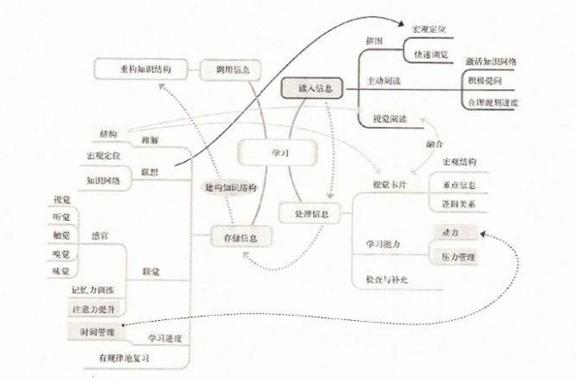

本书分四部分来讲如何学习。

**一、读入信息。**

**1.2主动阅读，积极思考**如果想在学习一段时间以后回忆起所需的信息，必须学会主动阅读。大脑储存信息的两条规律：

> 要想记住一条信息，必须将其与已有的知识结合在一起。
> 只要我们不断练习，总有一天这种新的技能会习惯成自然，变成我们下意识下的行为方式。

**做好视觉卡片之后，向自己提各种问题。**
**在阅读过程中，我们的思维要走在作者的前面，将读到的信息与已有的知识相比较，进而将两者融合实现记忆。**

去年在知乎上有人推荐《如何阅读一本书》，我特意去图书馆借阅了这本书，书中的观点也是这样的，不断地提问自己。好方法的原理都是相同的。
之后作者讲述了怎么提高阅读速度，我照着练习后，效果不错。因为和本题关系不大，不详细列出，方法是用手指或者笔尖辅助阅读。高三时从当当上买过一本《如何高效学习》，里面有提到这个方法，可惜那时的我 too young too simple，以为这样会减慢阅读速度。

**二、处理信息。**

**视觉卡片**
这个挺有用的，尤其我的专业要背的东西那么多，用视觉卡片的方式记笔记，不会让我觉得乱七八糟，便于记忆。假期在读《思维导图》，越来越觉得大多快速高效的方法都是从一个源头散发出来的。

**视觉卡片的优点：**

**制作视觉卡片的三个步骤：**
**1.把握整体行文结构**
类似上文提过的宏观定位。比如读一本书，具体某一章，这一章里还有许多小标题，这些小标题就交代了这一章的“行文结构”。

**2.提取关键词**
这对还在继续学业的人比较适合。边听老师的课边制作出视觉卡片显然不太可能，所以作者提出了这种方法。自学的时候也可以用到。边读书边随手记，或者从网上边看学习视频边随手记。

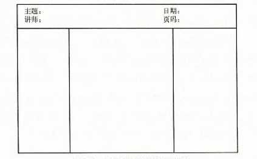

左边一栏，依次记录课程的要点，即第一个步骤“把握整体行文结构”中的内容。中间一栏记录关键词。右边一栏做补充笔记使用，进一步思考后有了新的想法或是查到了新的信息，都可以补充到里面去。

**3.画出要点间的逻辑关系**
第一张图里有各种箭头。用不同颜色的笔在相关的关键词之间画出箭头。
后文讲了怎么缓解压力，运动法和放松减压法。我习惯每晚去跑步，跑完之后心情舒畅，再去记忆更有效率。
《如何高效学习》中提出“笔记流”，也是与图像联系起来，分解成示意图，用箭头。

**三、储存信息。**
**五感并用**
这个观念和《如何高效学习》中的比喻类似。我当时用比喻的方式记忆英语词组的含义，成效不错，后来还介绍给我朋友用，不知她有没有放在心上。
简单来说就是给枯燥无味的知识编上一个生动的故事，充分调动自己的感官在脑海中演绎这个故事，故事越荒诞越好，以此达到记忆的目的。

**信息过滤与短时记忆**

> 我们接受的信息会以电脉冲的形式进入大脑，如果想将其转化为短时记忆，必须集中精力，向大脑输送更多的同一事物的信息，并且将其也既有的知识网络联系起来。短时记忆实际上是将信息变为大脑实际储存内容的一个转化步骤。在这个步骤中，信息被第一次过滤，只有有意义的一部分信息才能够通过筛选，变成短时记忆。
> 只要在学习时集中注意力，我们就能正确的用好自己的过滤网。

**有限的记忆力与劳逸结合的学习计划**

> 记忆与理解水平不是完全同步的。连续阅读两个多小时，我们的理解能力不会受多大影响。但是我们停下来回忆刚刚读过的内容，就会发现问题了。如果要背东西或者记忆东西的话，学习45分钟左右就应该站起来休息一下了，休息时间5分钟左右足够了**。**

我有段时间在用番茄时钟APP，因为那上面25分钟休息一次，每次都背不完一个部分的内容，后来就不用了，感兴趣的朋友可以试试。

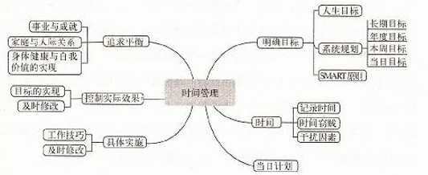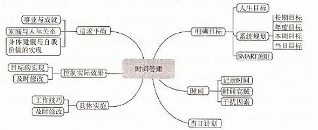

上图是作者在书中提到的如何管理时间，作者作了详细的介绍。

**系统复习法打造超级记忆**

记忆曲线人人都知道，及时复习才能把短时记忆转变成长期记忆。下图是复习与不复习学习效果的比较。

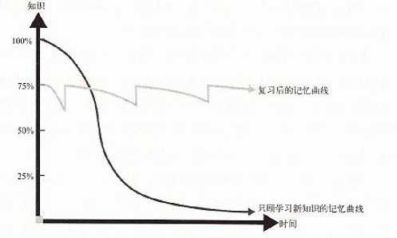

作者介绍了一种文件夹记忆法。虽说已经比较简便了，但作为一个学生，我还是觉得好麻烦，就没实践过。原理就是找一个有10个或者12个夹层的文件夹，代表工作日，把制作的视觉卡片放在里面，周一复习代表周一隔层里的视觉卡片，复习完根据是记忆规律把这些卡片放到对应哪天要复习的隔层里。

最后一大部分粗略讲了要将知识运用到实际中。**………………………………………………………………………**

对比开头的这张表，是不是发现这样做实用性很高？

---

##  学过的东西马上就忘了怎么办？ - 神速蜗牛的回答 - 知乎[【关联】

https://www.zhihu.com/question/27252044/answer/41835708

作者：神速蜗牛

我自己做了个研究和推广行之有效的思维方法的公益组织，里面有一篇正好是说这个的。偷懒直接贴过来了。

**什么是关联思维**

关联是我们的大脑运作的基本方式。因此，掌握了关联思维的方法之后，我们就可以利用这种大脑的基础运作方式优化我们的思考和学习效率。关联思维的解释如下：

我们的大脑是这样记忆东西的：**我们会把某种事物特征化，然后将事物与特征彼此关联。每个事物都关联了很多个特征，每个特征也同时关联了很多个事物。我们的大脑会通过这种特征与事物的关联来进行检索和思考。其中，事物的特征是可以被编辑的。**也就是说，我们对事物的认识越丰富，在事物中甄别出越多的特征，就会越有利于我们的思考与记忆。这段话很抽象，下面我们来举一个实际的例子（注意，这也是基于关联思维产生的我们大脑的运作方式，既：我们都是通过让抽象逻辑关联无数个实例来理解这个逻辑的。我们的大脑天然的无法直接理解抽象的逻辑。）：

我说两个词，请各位思考听到这两个词之后，你想到了什么。第一个词“人行横道”，第二个词“非洲”。你一定想到的是斑马，对不对？但是仔细想想我们就会发现这种思考非常蹊跷，凭什么一个东西和一个地方结合在一起，就会让我们联想到一种动物？这就是关联思维的运作方式了。

在斑马这个案例中，我们把斑马这个事物关联了很多特征，比如马，比如生活在非洲，比如身上有条纹，等等等等。关联的特征如前所述，是因人而异，可编辑的。也就是说我们越了解斑马这种动物，我们在斑马身上能关联的特征就会越多。比如对斑马的饲养员来说，斑马的气味，步态，皮毛粗糙程度等就是比我们多出来的关联特征。

那么，我们是如何将斑马和人行横道、非洲两个词关联在一起的呢？简单回顾一下我们就会发现，是因为人行横道让我们想到了条纹，而条纹+非洲符合斑马的特征，于是，我们大脑中的检索系统就自动为我们找到了答案。这是我们大脑的运作方式，但很遗憾，这种方式虽然是大脑的原生方式，可是它自己运用得并不好，这就需要我们不得不有意识的去加强关联，来帮助我们的大脑建立联系。

**关联思维的运用方法**

### **1，****关联与记忆**

你是否有刚看完一本书，转眼就不记得其内容的经历？你是否有学习一项技能或者一个学科时，无论如何都记不住所学的东西的经历？这些都是不恰当地关联在搞鬼。

为了说清这件事，请大家配合我一起做一个试验。首先请各位努力回忆一下，你所能记得的最早的记忆，大约是什么时候的什么事情。然后再请你努力分析一下你为什么会记得这件事情。我们就会发现我们对一件事记忆的深浅，往往决定着这段记忆所关联的其他特征的重要程度。

比如我最早的儿时记忆是１-2岁时一次走失的经历。当时的情况是这样的：我妈妈和大姨带我逛街，然后我妈妈好像是因为要去办什么事情，就把我交给了我大姨。但我大姨却把这茬给忘了，在她的意识里我一直还跟我妈在一起。于是，两个人就这么分开了，把我留在了当场谁都没管。而我之所以会如此清晰的记得这件事，是因为这件事所产生的情绪体验，是我一生中最强烈。走失时的紧张、恐惧和慌乱，被好心人带到派出所过程中体验到的迷茫和困惑，以及最终我大姨出现在派出所门口那一瞬间无比的喜悦，是这些强烈的情绪牢牢的把这段记忆抓住，因此才让我对这件事情终生难忘。

所以，记忆深刻的第一个法则是：**一段记忆刻在我们头脑中的深度，取决于这段记忆及其关联的所有内容的强度。**因此，往往让我们终身难忘的事情，是那些给我们情感冲击最为强烈的事情。这些联系甚至坚固到即便你忘了那段记忆，也会因为回忆起那个情绪体验而重新想起那些回忆。

以上就是记忆的第一法则，现在，我们来说第二个。记忆的第二法则：**我们对一件事情记忆的深度，还取决于这件事情在大脑中的关联复杂度。**想象我们的大脑是一个四通八达的交通网络，每两个地点都被若干条道路连接。那么，那些有足够多道路连接的地点，就是对我们非常重要的知识和技能，我们会经常想起它们，使用它们，根本不会忘记它们。但是，也会有一些地方，这些地方并没有很多道路连接，甚至没有道路可以连接。那么这个地方就会变成我们大脑中的孤岛。无论我们用任何办法，都很难检索到那个地方。这就解释了为什么我们会很难记住一些知识和技能：它们的关联太少了。

自从我发现关联思维对记忆的影响后，我就会要求参加原点计划线下集训营的学员在学习一门程序语言的时候，尽量不要上来就死看书。因为看书这件事无法把你所学到的知识及时的和其他特性关联在一起，这个知识就会变成一座孤岛，虽然存在，但无法到达。

所以，在原点集训中，我会要求大家这样学习：先给自己设定一个目标，比如用Web实现一个页面计算器。然后，基于这个目标去设计一整套学习计划。比如，为了实现页面计算器，你首先需要了解HTML语言（不需要全部了解，只要能解决页面计算器就好），还需要了解一下算法的知识，等等。当你有了这个学习计划之后，你就可以针对性的去查询和学习这些知识了。这一整套工作的根本目的，其实就是在帮助你为抽象的程序语言创造足够多的关联项。

我可以和各位保证，当你采用这种方法学习的时候，无论你要学的是什么技能，这套方法都可以帮助你极大的提高学习效率和记忆力。你的学习计划中的每一个项目，你的总目标，以及你所查询的每一个实现目标必不可缺的知识都彼此关联在一起，构成了一张思维的网络。这样学到的东西，真的会过目不忘。

### **2，****如何创造关联**

在之前斑马的案例里，我们曾提到过这样一句话：随着对事物了解的深入，**我们对事物所关联的特征是可编辑，会变化的**。因此，我们可以通过良好的**行为习惯去刻意的协助大脑创造**尽可能多的关联，以全面提高大脑的运转效率。这其中最重要的方法就是**定期回顾**。

以上个章节中对程序语言的学习为例。一个目标的完成只是开始。每当我们掌握了一些技能，都必须要花一些时间（不用担心，这些时间很短，但非常必要）进行回顾。回顾的内容主要是：我所新学的知识和技能，是否为我过去的难题提供了新的解法和思路？这个提问和回答的过程本身，就是在将你新掌握的技能编入旧有的知识体系中，壮大你的思维网络的过程。

还是老规矩，用事实来说话。如何避免看过的书不会忘呢？你需要掌握这样的方法。

**总结精华**

**停顿关联**

**仔细思考**

**折换角度**

**反驳推翻**

**调整完善**

**化为己用**

我非常喜欢看书，原点荐书单中的每一本书都是我在自己所读的书籍中**精挑细选出来的精华**。而我的读书速度其实比大多数人都要缓慢，平均每天只有20-50页，但我可以做到看过的书过目不忘。这是因为我在阅读的时候会**不断停下来为所读的内容建立关联**。比如当我读到《创新者的窘境》这本书中关于过度满足理论的时候，我就会在读完这个章节后从书中抬起头来，花几分钟时间盯着天花板**仔细的思考**：在我所知道的事情中，有哪些事情是可以对应上这一理论的，并仔细思考这一理论是如何在这些事情中起作用的。然后**再换个角度想**，在我所知道的事情中，有没有一些**可以反驳**过度满足的例子，他们又是怎样的。当完成这一整套思考之后，我会得到我自己的结论。这个时候，过度满足这个理论就已经从作者的理论变成我的理论了，我可以**根据我自己的经历，去调整过度满足这一理论，甚至完善它，将它化为己用**。但这还不够。有时候我还会拿出手机，用iphone自带的记事本将这些东西写成读书笔记。等所有这些都完成之后，我才会继续低下头，阅读后面的章节。

**回顾式关联**for调用

我在看书时所有的这些行为，都是在为我的大脑建立足够的关联，以帮助我在我需要的时候可以即时调用这些知识。而且，恰恰因为我在阅读的时候做了充分的关联，所以虽然我有写读书笔记的习惯，但直到目前，我都还没有翻看过我的读书笔记，因为书中看的东西在足够的关联下，根本不会出现想不起来的情况。

因此，请各位务必要注意：**回顾式关联并不会花费你很长时间，但却非常重要。**以我来说，2014年一年我差不多阅读了50多本书，平均每个新增的**知识点所花费的回顾时间不过5分钟。但这些细碎的时间却可以让我长久**的记住这50多本书。性价比还是相当高的。因此，强烈建议大家除了养成为自己的大脑制造足够多的关联的好习惯之外，也务必要经常回顾以往的知识。

### **3，****创新与关联思维**

目前有很多人和很多书都在从各种不同的角度研究创造力，并且也取得了相当的成果。在这些成果中，就有和关联思维有关的方法，那就是“关联创新法”。“关联创新法”最早被我所了解是通过《创新者的基因》这本书。原点计划对其进行了进一步的完善。除了原书作者的内容外，我们还基于原点计划自己的原创理论：**目标导向**的思维方法，物理的思维方法对其进行了扩展。同时，原点计划还给出了“关联创新法”的操作手册，可以让大家有目的的训练并掌握这种创新方法。**（输入数字4或点击文章底部的阅读原文可以直接阅读《关联创新法》）**

**目标导向**

大家如果对我的研究思维方法的公益组织感兴趣（叫原点计划），可以在微信里搜索关注一下，文章最后顺手给自己打个广告吧。

[http://weixin.qq.com/r/CUy5ofTE-KmDrbDC9xkb](https://link.zhihu.com/?target=http%3A//weixin.qq.com/r/CUy5ofTE-KmDrbDC9xkb) (二维码自动识别)

给自己的微信公众号打个小广告：原点计划是我发起的一个公益项目。项目旨在研究和推广行之有效的思维方法。我认为当今社会正在陷入对知识的过度崇拜之中。无论是教育系统还是媒体，都不断传播着各种各样的知识，哪怕这些知识中的大部分都未曾被人使用过。我们已经传播了远大于需要的知识，但却从未对组织知识的方法（也就是思考的方法）进行必要的研究。

原点计划就是在这样的背景下成立的。我们希望通过我们的努力，可以唤醒全社会对思维方式的重视。并吸引越来越多的人和原点计划一起，探索行之有效的思维方法。

我在知乎回答的所有问题，都是基于原点计划研究出的思维方法的。欢迎感兴趣的朋友关注和转发~~~~

## 学过的东西马上就忘了怎么办？ - 医路有我的回答 - 知乎

https://www.zhihu.com/question/27252044/answer/118774416

作者：医路有我

分享看过的几本书中的一些方法。

医学生，要背太多东西，整理一下记忆方法也算是方便自己开学继续背书。
去年看过的《超级快速阅读》，作者讲得一些小知识很有趣，感觉这本书的题目并没有表达出这本书的涵盖范围。下图更为合适。

本书分四部分来讲如何学习。

### **一、读入信息。**

##### **1.2主动阅读，积极思考**

如果想在学习一段时间以后回忆起所需的信息，必须学会主动阅读。大脑储存信息的两条规律：

> 要想记住一条信息，必须将其与已有的知识结合在一起。
> 只要我们不断练习，总有一天这种新的技能会习惯成自然，变成我们下意识下的行为方式。

**做好视觉卡片之后，向自己提各种问题。**
**在阅读过程中，我们的思维要走在作者的前面，将读到的信息与已有的知识相比较，进而将两者融合实现记忆。**

去年在知乎上有人推荐《如何阅读一本书》，我特意去图书馆借阅了这本书，书中的观点也是这样的，不断地提问自己。好方法的原理都是相同的。
之后作者讲述了怎么提高阅读速度，我照着练习后，效果不错。因为和本题关系不大，不详细列出，方法是用手指或者笔尖辅助阅读。高三时从当当上买过一本《如何高效学习》，里面有提到这个方法，可惜那时的我 too young too simple，以为这样会减慢阅读速度。

### **二、处理信息。**

**视觉卡片**
这个挺有用的，尤其我的专业要背的东西那么多，用视觉卡片的方式记笔记，不会让我觉得乱七八糟，便于记忆。假期在读《思维导图》，越来越觉得大多快速高效的方法都是从一个源头散发出来的。

**视觉卡片的优点：**

##### **制作视觉卡片的三个步骤：**

##### **1.把握整体行文结构**

类似上文提过的宏观定位。比如读一本书，具体某一章，这一章里还有许多小标题，这些小标题就交代了这一章的“行文结构”。

##### **2.提取关键词**

这对还在继续学业的人比较适合。边听老师的课边制作出视觉卡片显然不太可能，所以作者提出了这种方法。自学的时候也可以用到。边读书边随手记，或者从网上边看学习视频边随手记。

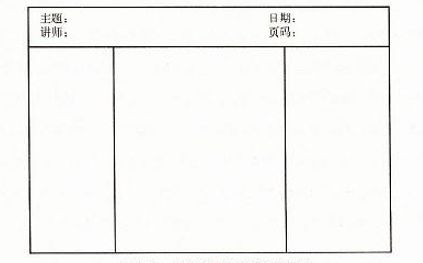

左边一栏，依次记录课程的要点，即第一个步骤“把握整体行文结构”中的内容。中间一栏记录关键词。右边一栏做补充笔记使用，进一步思考后有了新的想法或是查到了新的信息，都可以补充到里面去。

##### **3.画出要点间的逻辑关系**

第一张图里有各种箭头。用不同颜色的笔在相关的关键词之间画出箭头。
后文讲了怎么缓解压力，运动法和放松减压法。我习惯每晚去跑步，跑完之后心情舒畅，再去记忆更有效率。
《如何高效学习》中提出“笔记流”，也是与图像联系起来，分解成示意图，用箭头。

### **三、储存信息。**

##### **五感并用**

这个观念和《如何高效学习》中的比喻类似。我当时用比喻的方式记忆英语词组的含义，成效不错，后来还介绍给我朋友用，不知她有没有放在心上。
简单来说就是给枯燥无味的知识编上一个生动的故事，充分调动自己的感官在脑海中演绎这个故事，故事越荒诞越好，以此达到记忆的目的。

##### **信息过滤与短时记忆**

> 我们接受的信息会以电脉冲的形式进入大脑，如果想将其转化为短时记忆，必须集中精力，向大脑输送更多的同一事物的信息，并且将其也既有的知识网络联系起来。短时记忆实际上是将信息变为大脑实际储存内容的一个转化步骤。在这个步骤中，信息被第一次过滤，只有有意义的一部分信息才能够通过筛选，变成短时记忆。
> 只要在学习时集中注意力，我们就能正确的用好自己的过滤网。

**有限的记忆力与劳逸结合的学习计划**

> 记忆与理解水平不是完全同步的。连续阅读两个多小时，我们的理解能力不会受多大影响。但是我们停下来回忆刚刚读过的内容，就会发现问题了。如果要背东西或者记忆东西的话，学习45分钟左右就应该站起来休息一下了，休息时间5分钟左右足够了**。**

我有段时间在用番茄时钟APP，因为那上面25分钟休息一次，每次都背不完一个部分的内容，后来就不用了，感兴趣的朋友可以试试。

上图是作者在书中提到的如何管理时间，作者作了详细的介绍。

### **系统复习法打造超级记忆**

记忆曲线人人都知道，及时复习才能把短时记忆转变成长期记忆。下图是复习与不复习学习效果的比较。

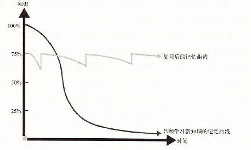

作者介绍了一种文件夹记忆法。虽说已经比较简便了，但作为一个学生，我还是觉得好麻烦，就没实践过。原理就是找一个有10个或者12个夹层的文件夹，代表工作日，把制作的视觉卡片放在里面，周一复习代表周一隔层里的视觉卡片，复习完根据是记忆规律把这些卡片放到对应哪天要复习的隔层里。

最后一大部分粗略讲了要将知识运用到实际中。**………………………………………………………………………**

对比开头的这张表，是不是发现这样做实用性很高？

学过的东西马上就忘了怎么办？ - 医路有我的回答 - 知乎
https://www.zhihu.com/question/27252044/answer/118774416

---

## 学过的东西马上就忘了怎么办？ - 【杨大宝】的回答 - 知乎

https://www.zhihu.com/question/27252044/answer/769284255

首先，我们要确认一下：什么叫学了之后没忘？我们可以认为，就是看完书之后，闭着眼睛也能复述出书里的要点。这其中包括三个过程：即阅读时的对文字的**解码**、**记忆**的过程，以及回忆时对已存储信息的**提取**过程。也就是说，其中任何一环出了问题，都会导致回忆时，什么也想不起来。那为什么会出现这些问题呢？我们要从大脑工作的“策略”说起。01 **大脑的本性是 “懒惰”的**。它会使用的策略，都会尽可能减少自己的负担。什么意思呢？在向你解释之前，我们要先从一个小实验开始：下面是俄罗斯画家列宾的一幅油画——unexpected visitor，顾名思义，是在说家里来了一个意料之外的客人。现在，我希望你不要往下翻，先尽可能仔细地观察到画面中的每一处细节，读懂这幅画：
画作《unexpected visitor（意外访客）》
好啦，观察好每一处细节了吗？如果你看完了，先挡住那幅画，回答我几个问题：

1） 谁是那个意外的来客？

2） 画面上有几个孩子？

3） 墙上有几幅画？

你都能回答出每个问题吗？脑科学研究中曾做过这个实验，如果一开始给出的问题是：你要尽可能全面地观察这幅画的信息时，那其实这个问题是很笼统的，这时人们会怎么样呢？即使所有人都很自信自己观察到了画中的每个角落、每个细节，并且几乎所有人都能准确判断出，谁是那个意外来客，但一旦问到细节信息，如墙上的画、桌边的孩子，他们的印象就不准确了。有的说只有两个孩子，有的说只有四五幅挂画，总之，基本上不会有人说对。而如果我调换顺序，一开始就给你这三个问题，你就会在观察中有意识地注意这些细节，那自然，这些细节问题就难不倒你。这是为什么呢？就是我们一开始说的——大脑是要尽可能使用使我们感觉最省力的策略——

**什么东西有用，我就只关注什么**。每次我们看图片、文字时，如果没有明确要关注的细节，大脑就默认为你的目的是——大概知道你看的是什么，而细节是什么，对大脑来说是无用的。也就是说，眼睛接收到的所有信息，你只需要加工、理解一个重要的框架，把接受到的信息形成一个近似的草图，就足以实现“知道它是什么”这一目的了，完全不必再额外耗费力气去关注细节。就像在这幅图中，你知道谁是“意外访客”，也知道画中有孩子、墙上有挂画，认知就完整了。而当你独自回顾某些细节时，必须以回答这些问题为目的，再次仔细观察，大脑才会去注意这些具体信息。

也就是说，如果在看书前，你**没有明确的要知道某些细节的意识，那你必然会遗漏它们**——学过了，却什么也没记住。不过，虽然只要我们在阅读之前，针对书中的核心内容，准备好问题，就能唤醒我们有意识地去加工这些信息。但是偷懒的大脑，是不愿意短时间内加工过多的信息量的。一个人短时记忆能处理的信息点上限，是7±2个，即5~9之间。就比如我们记电话号码时，你需要记忆12345678901，11位数，很难，而分成123-4567-8901三块来记，就会很容易。

因为一共分了3块，每块数字都是3-4个，符合**7±2法则**。

所以说，在准备问题时，不能一次关注过多重点，否则会混淆记忆。至于“提取”这一环节，我们前面说到，当你合上书时，只有通过在脑海中搜索，并且找到了刚刚存储的信息，才能通过语言、书写的形式复述出来。而最符合大脑“偷懒”习性的“提取”方式，就是顺藤摸瓜。即如果你给新的信息，建立起很多找到它的线索，回忆的时候，就有更大概率提取到与它链接的信息，进而顺着线索把它揪出来，那提取它就会非常容易。

认知心理学研究表明，如果人们在获得信息时对它进行**深度加工**，那么这些信息的提取和回忆效果就可以得到提高。什么是深度加工呢？简单来说，是对要理解、记住的内容**补充细节**、**举出例子**、**做出推论**、或使之与其他观念**形成联想**。

死记硬背，你记住的知识点就是散装的，没有经过**压缩和组块**，没有生成合理联想，把它嵌入知识体系，导致提取信息时没有充足的线索，自然合上书就什么也想不起来啦。02好啦，说了这么多，看了书记不住的原因无外乎这么几个：无重点阅读会忽略细节；信息点太多混淆记忆；没有充分的联想线索，不便于检索。那我们要怎么解决呢？就比如有同学会问，我看专业教材的时候，概念什么的太多了，随便数一数就远超过9个了好吗？那这里我们就有一个技巧——

### **信息压缩**。

这就有点像围棋高手，能记住棋盘布局一样。对于外行人来说，每个棋子的位置都是零散的信息，我们一次很难记得清楚。但是在高手的眼里，他理解每个棋子为什么放在那里，这样布局的意义是什么，对他们来说，棋子不再谁松散零碎的信息，而是织起来的一张大网，单凭逻辑和推理，就能准确复盘所有棋子的位置了。如果我们也把所有的概念织成一张大网，就也能做到只用一个概念梳理出一串概念。所以我们在一开始，可以只重点关注五个核心的顶级概念，其他的概念都分别围绕着它们展开，与它们建立联系，把零散的信息粘合成一个体系，即“信息块”。其实建立信息块的同时，也就把“深度加工”这件事也给做了。比如下图：
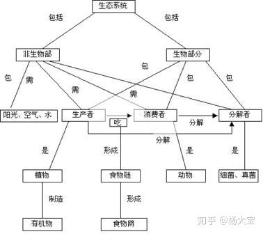“生态系统”概念图
我们需要记很多概念，比如消费者、分解者、生产者、食物链、生态系统等等，很零碎。但是用概念图梳理出它们的关系结构，你会发现这些零碎的知识，都可以整合在“生态系统”这一个知识块中，通过理解它们彼此之间是怎么关联的，就能很容易记住这些概念。所以说阅读之前我们要整理出的要点，应该是像“生态系统”这个概念一样，是最顶级的，能把很多零碎概念都整合到一起的核心概念。那具体的操作方法呢？

### 我叫它“**5张纸策略**”：

核心就是，在学习前，设置问题，注意只关注最重要的部分。首先，你要先准备5张白纸：step 1. 确定阅读时要关注的5个关键概念或主题，只用关键词或短语简要描述它，写在每一页的顶部；step 2. 用你自己的理解，尝试着简要解释这些概念，只写几行就可以了。要注意全凭自己的理解，不要参考书上的内容，便于后面对比书上的介绍，摘出你的理解误区。毕竟犯过错的地方影响才会更深嘛；step 3. 阅读并利用书上的介绍，理解5个关键概念，比如他都涵盖哪些小的概念，它们之间有什么关联，它们与核心概念有什么关联，能解决核心概念的哪部分问题，等等。然后书上的解释与你在step2中的回答作比较；step 4. 修改或重写你对每个主题的理解；step 5. 五个概念都掌握了，如果你发现还有内容没有被包含进来，再重复上述过程，继续学习这些新的概念。这样一来，你看完书之后的短期记忆的效果会很好。03刚刚我们讲的都是，如何在第一次阅读新内容时，保证合上书能立即回忆起重要内容。但是，如果你想在很长时间以后，依然能提取出来，则需要再对抗另一个天敌——遗忘。

方法很简单，一句话：

### **不经常提取，必然导致自然遗忘**。

记忆的本质，是建立神经元的联结。我们大脑的一贯准则，是尽可能只留着有用的记忆。因为如果所有事情都要记住的话，恐怕不用几天，脑容量就爆满了。所以，为了及时清理掉无用的记忆联结。大脑就会采取这种策略：经常使用到的记忆通路，是有用的，那么联结就会被强化；而不怎么使用的记忆通路，就是无用的，那么联结就会逐渐减弱甚至消失，这就是遗忘。也就是说，如果你想避免时间带来的遗忘，最有效的方式就是经常去提取、回忆，加强记忆联结，也就是“有策略”地复习。根据艾宾浩斯曲线，在看完书当天，我们就要复习，以减缓遗忘的进程。此后还要每隔一段时间，就复习一次——也就是**分散复习**。这样把任务分散开，可以降低每次复习的疲劳感。且多次重复，能加强“记忆联结”。
艾宾浩斯曲线

要记住，永远不要等到大楼崩塌了之后再去从地基开始修补。不要觉得经常复习很麻烦，一旦你忘光了，从头学起来会更麻烦。不过要注意的是，除了什么时间要复习，怎么复习也对记忆效果有很大影响。主要有两种方式：一种是直接阅读书或笔记，即阅读式学习；另一种是通过回答一些问题，通过主动提取去唤起回忆，即提问式学习。下图显示的是阅读式学习（study）与提问式学习（test），分别在5分钟后、2天后，留存在大脑中的信息量。
我们可以发现，虽然直接阅读的方式，在复习刚结束时，要比测试的方法记住更多信息，但是两天后，反而忘得更多；而测试的方法，则会在长期记忆中起到更好的效果。所以，我们复习时，先不必去看书本、笔记，可以把之前的5张纸拿出来，重新按照自己的理解写上答案，然后再对照标准答案，修改错误和遗漏的要点。好啦，最后我们来总结一下，怎么解决看过书就忘的问题：

首先，利用“5张纸策略”，记录书中**最核心**的概念，概念数量要满足7±2法则。

然后带着“理解这些概念在讲什么”的问题去有意识地理解相关细节，并且通过**补充细节**、**举出例子**、**做出推论**、或**形成联想**的方式，把零碎的知识点联系起来，形成概念图。其次，根据艾宾浩斯遗忘规律定期安排复习，并且，用测试的方式复习要比直接看一遍书或笔记效果更好哦~ 

---

## 学过的东西马上就忘了怎么办？ - 凌晨晓的回答 - 知乎

https://www.zhihu.com/question/27252044/answer/41856112

作者：凌晨晓

题主的问题根本上在于【学校里的学习方法】与【工作上的学习方法】不尽相同所致，或者换一句话说，题主没能分清楚它们之间的异同之处。
比如你在学校里面，每门学科各不相同，但其学习方法大都遵循一个相同的模式：
老师讲解，学生理解，复习、解题……
而衡量这个方法是否有效的标准就是考试得到高分。

但出来工作之后，这个方法并不奏效了，因为在工作中衡量你是否掌握一样东西的时候，并不存在一道道的题目让你去解，而且标准也并非得到高分。
工作方面的知识，虽然各行各业有其独特之处，甚至有常言道【隔行如隔山】，但仍有其共通之处：
1，虽然偶有师傅带，但靠自己掌握的仍占多数，俗话讲【师傅领进门，修行在个人】。
2，往往学到的东西是要解决实际的、具体的问题。
3，遇到的问题具有重复性，因此学到的东西经常能够得到反复的实践。

针对工作上的学习方法，以下是一些个人的体会，仅供题主参考。

### **多向前辈请教。**

1，**多向前辈请教。**要注意请教时的态度方法，前辈们需要尊重；要注意问问题的时机，人家的时间也是很宝贵的；……但是最重要的是要问得有技巧、要提问得具体而细致、要涉及到步骤或细节，避免提一些大而空泛的问题。比如，问【这个地方的技术标准出处在哪里？】要比你问【这个东西的实现原理是什么？】好得多；问【这份文件的检查步骤第二项如何高效地完成？】要比你问【怎么使用这份文件？】前辈们解答起来也轻松得多，而且非常乐意。

### **理论结合实际**

2，**理论结合实际**。学到的东西要亲自动手去实践，利用各项知识去动手完成工作上面的任务，而不是学完了事。不结合实际，就没有考量的机会。不亲手去完成任务，最终是纸上谈兵。

### **知识点的网状互联。**

3，**知识点的网状互联。**每个所学的知识点要找到相互之间的连接，最终形成网状结构。如同思维导图一般，利用这张图，清楚地看出自己薄弱的地方
4，**向他人讲解。**记住所学东西的最

### **向他人讲解。**

好方法是向他人讲解，尝试用自己的话完整地转述出来。只有当你能够教导别人的时候，你才能真正掌握该知识点。
作者：凌晨晓链接：https://www.zhihu.com/question/27252044/answer/41856112来源：知乎著作权归作者所有。商业转载请联系作者获得授权，非商业转载请注明出处。

## 学过的东西马上就忘了怎么办？ - 审事的回答 - 知乎

https://www.zhihu.com/question/27252044/answer/41843736

### 	“无忌，我教你的还记得多少？”

“回太师傅，我只记得一大半”
“那，现在呢？”
“已经剩下一小半了”
“那，现在呢？”
“我已经把所有的全忘记了！” 
“好，你可以上了…” 

## 学过的东西马上就忘了怎么办？ - 荞麦的回答 - 知乎

https://www.zhihu.com/question/27252044/answer/469623754

大学期间曾用7天熟记65种植物的习性特征，随后带大四园林专业的学姐讲解植物，结束后他们问我是哪一届园林专业学生；

大三用两天背5000字以上的讲解词，工作后利用下班时间约21小时记10000字以上徽州知识，并且能流利讲解。

在我个人经验基础上，我又花费1天半的时间翻了知乎、简书上点赞量超过1千大约50篇关于学习记忆的文章以及回答，总结出以下4点让你提高学习记忆效率的秘籍.

   作者：荞麦

大学期间曾用7天熟记65种植物的习性特征，随后带大四园林专业的学姐讲解植物，结束后他们问我是哪一届园林专业学生；

大三用两天背5000字以上的讲解词，工作后利用下班时间约21小时记10000字以上徽州知识，并且能流利讲解。

在我个人经验基础上，我又花费1天半的时间翻了知乎、简书上点赞量超过1千大约50篇关于学习记忆的文章以及回答，总结出以下4点让你提高学习记忆效率的秘籍.

### **1.学习时，要将书本上的知识转化成自己的认知**

> 孔子云：“学而不思则罔，思而不学则殆。”

原谅我引用了这么经典（老掉牙）的一句话。虽然很老，但是道理却是真实存在。

当我们在看到书上或课程时，需要**将你看到的内容转换成属于自己的认知**。不然，你看到的知识永远都是书本上的，对你来说没有任何的用处。

比如我在看营销思维的课程时，老师讲到“我们要对有效流量负责”，我就联想到以前工作状态，并没有对有效流量负责……

由书本产生的思考，一般都会记录下来。因为有加上自己的理解，所以这些内容就变得非常清晰，能够轻易记住。

关于思考的方向可以是以下几种

- 以前生活中或工作中，哪一件事可以用这个知识点解释，我当时是怎么做的
- 现实生活中有哪些现象可以印证这个观点
- 今后工作或生活在什么情况下可以使用这一点
- 上面的知识跟之前学过的哪些知识类似、相反、有关联......

### **2.给自己制定一个检测方法**

常常会觉得自己看书效率挺好的，但是再过几章之后，又会对之前学的知识产生怀疑，自己到底有没有学好呢，真迷茫啊，到底是现在回头复习还是接着看呢？

其实出现这种情况的原因是你没有给自己吃一颗定心丸，也可以说是**学习时没有仪式感**。

你说我记住了，那么我怎么验证到底有没有记住呢？

这时候必须要**给自己一个评判标准**，那我们要用什么样的检测方法呢？这里可以参考**费曼学习法**。

*费曼是20世纪著名的理论物理学家，在研制原子弹的曼哈顿计划中担任重要角色，曾获诺贝尔物理学奖。除了在物理研究领域中作出巨大贡献之外，他在教学方面也有独到的见解。他提出的「4步学习」技巧是非常有效的学习方法：*

> Pick a topic you want to understand and start studying it. 选择一个学习主题，开始阅读关于它的所有资料，做必要的笔记。
>
> Pretend to teach your topic to a classroom. Make sure you're able to explain the topic in simple terms. 假装你在教室里向学生解释这个主题，用尽量简单的词汇去描述它，力求学生能听懂。（听众可以是人，也可以是你的毛绒玩具）。
> Go back to the books when you get stuck. 当你讲解卡壳的时候，再回头阅读资料，弄清楚再继续讲解。
> Simplify and use analogies. 回到第一步，试图用更加简洁、直白的语言去讲述概念。

除了以上所说的讲给学生听，你还可以自己把学到的内容默写出来，或者画一个思维导图都是不错的方式。

### **3.对外输出，获得精神上的鼓励**

现在回过头来看自己的记忆史，我发现自己**记得最快最好的时候是在必须要输出的时候**。因为很担心自己讲不出来很丢脸，所以总会强迫自己集中注意力。

这一点从知乎大神以及所有关于记忆的文章中几乎都能看到，这其实就是所谓的**倒逼成长**，非常管用。那如何对外输出呢？有朋友可能会问我又不做讲解员，也没有人要讲解。

其实除了讲给别人听，你还可以**参加学习小组**把自己总结的说出来，或者**跟感兴趣的朋友讨论**。

如果不想直接找朋友交流，也可以**把你学到的知识写一篇文章发到朋友圈、微博或者简书、豆瓣等社交媒体**，这样感兴趣的朋友自然会跟你互动。

既加深印象同时也会获得精神上的鼓励，让你持续学下去，从而形成良性循环。

### **4.想不起来很正常，再复习一遍就好，将学过的知识串联起来**

根据艾宾浩斯遗忘曲线，前一天的信息第二天在记忆中只能记住33%，你看过的书的内容，最多会留下三分之一。

而第三天会在这个基础上继续遗忘，并且，遗忘的速度会先是非常快然后才会减慢。

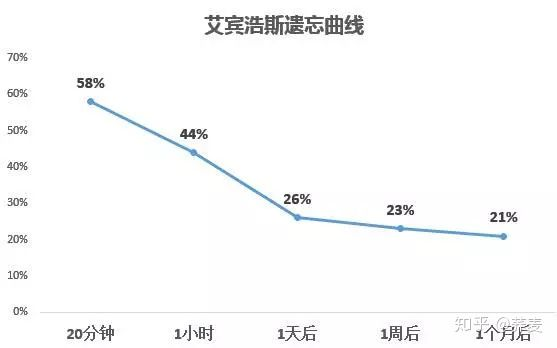

**看了就忘是人之本性，是自然规律，不忘才会奇怪。**所有说我们记忆的知识想不起来是一件非常正常的事情。

当你想不起来的时候不用过于责备自己，拿出之前记的笔记再复习一遍就可以了。

如果你之前已经通过自己的检测，你会发现复习一遍再看所花费的时间跟精力要少很多。

当你下次看书遇到的一些知识还可以跟跟之前所学的内容串联到一起，这样能进一步加深记忆跟理解。

其实这四种方法是一个整体，你也可以同时去练。

1. **把书本上的知识转化成自己的认知。**
2. **给自己制定一个检测方法**
3. **对外输出，获得精神上的鼓励**
4. **想不起来很正常，再复习一遍就好，同时将知识串联！**

------

关注**【荞麦自习室】**，送大家三份见面礼。

1. 后台回复“**网站**”，即可获得**73个网站推荐**、包括世界名校课堂、各类语言、考证、艺术、手工、设计等各类不同网站推荐。
2. 后台回复“**PPT**”，即可获得**200套PPT精选模板**，包括商务风、文艺风、创意风、企业宣传、小清新等
3. 后台回复“**思维导图**”，即可获得**思维导图xmind8安装包**，助你快速记忆！

### 学过的东西马上就忘了怎么办？ - 海猫君的回答 - 知乎

https://www.zhihu.com/question/27252044/answer/768782734

--

## 学过的东西马上就忘了怎么办？ - Orange的回答 - 知乎

https://www.zhihu.com/question/27252044/answer/41919245

作者：Orange

排名第一已经说的差不多了。我就结合前几天看到的补充一点点点。

### **长期记忆**

而其中只有长期记忆可持续最久（题主应该想知道的是怎么达到长期记忆的效果），知友基本都提到了以及来到达最好效果。所以我也就不再复述。人的是有限的，人们通常的（或许更少），如我们在拨打一通新号码时，如果有人与你打招呼，那么这新进来的信息就会挤掉原有信息，你此时很可能忘掉要拨打的号码。而对于加强记忆有非常大的意义。如我们背单词时根据音节将international分成in-ter-na-tion-al从而，大大提高了记忆的效率。所以我想

## 学过的东西马上就忘了怎么办？ - Code Diy的回答 - 知乎

https://www.zhihu.com/question/27252044/answer/109618508

### **1 做了笔记，还会忘。**

做笔记的过程，只是将在临时记忆中存储了。

### 长时间不回忆，还会被遗忘

这种存储是写入的过程，可以在此基础上，**使用回忆法记忆**，根据线索回忆笔记内容，可以将临时记忆存储到永久记忆。不过由于需要记忆的东西太多，**长时间不回忆，还会被遗忘，**这也是周期性记忆的使用原因。间隔一定时间，回忆记忆内容。

### **2 学生时代与工作状态下记忆的差别**

**工作后会发现记忆力下降的感觉。**

对比分析，**学生时代主要是内化过程，**

### **工作时候是外化过程**

**处理方式**
**输出方式**

## 学过的东西马上就忘了怎么办？ - 朴雨夏树的回答 - 知乎

https://www.zhihu.com/question/27252044/answer/763567487

## 学过的东西马上就忘了怎么办？ - 叶修的回答 - 知乎

https://www.zhihu.com/question/27252044/answer/124871353

[脱萝妇司机](https://www.zhihu.com/people/0x-1)、[方应杭](https://www.zhihu.com/people/zhihusucks)、[caoglish](https://www.zhihu.com/people/caoglish) 等 

原因很简单，大脑本身就是会遗忘；解决办法很复杂，本文通篇都是。用一句最简洁而内涵丰富的话来概括这个解决方案，就是：**在基于遗忘曲线的时间策略下，通过输出和关联来复习，既加强内容的意义，也建立更强的脑神经链接**。当然，就这一句概括的话，一般人是看不懂的，下面是详细介绍。

###	 **一、有意义的东西更容易记住**

先来看一张图：大家都知道艾宾浩斯遗忘曲线，但是很多人没有注意到，不同的内容遗忘程度是有区别的。最强烈、最容易遗忘的是无意义的东西，在艾宾浩斯的实验里，是一些无意义的音节。有意义的东西，记忆率就会更好一些。图中可以看到，有意义的内容——诗歌、散文等，忘得更慢。这就是大脑的一种本能。大脑倾向于忘记那些没有意义的东西，这属于大脑的自我保护、自我清洗机制，对于没有意义的东西，当然是扔掉了好，免得占地方，相当于我们打扫房间扔垃圾一样。所以，我们要为自己学习的东西赋予意义，这样学习的会更好。比如，如果是上班的人学习某种技能，在学习之前，就在心里默念：这个技能可以让我做事情更快更轻松，不用加班，能多休息；
让我完成工作效果更好，更容易让老板和客户满意；
更容易升值加薪，更好的发展机会；
……如果是学生，可以在学习之前，在心里默念：这个知识点学好了，可以考更高的分数，让我有面子，让我自己感觉很爽；
高考可以多加5分，大学更好一些；
以后如果做XX工作要用这个知识，提前储备上；
……诸如此类。每个人觉得有意义的点不同，可以自行添加意义。不过，只靠赋予意义效率也是不够的，该忘的还是会忘记，所以还需要结合其他方法。

### **二、输出是最好的学习**

学习有很多种方法技巧，其中，我最提倡的，是通过输出来学习。根据我的经验，这种方法比其他方法效果更加强烈。在这个大类下，又有好几个小类别。

##### **1 学习金字塔**

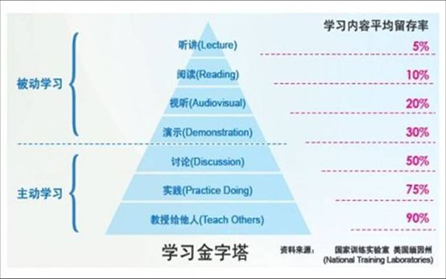**学习金字塔理论：**在听讲、阅读、视听、演示、讨论、实践和教授给他人这几种学习方法中，自己作为老师，向他人教授知识，是最有效的。
具体来讲，你可以做以下几件事情：主动上台讲课（如果你们老师有这种学生讲课的活动环节）；给其他同学讲题；做ppt演示和分享；自己编写小教材（解题经验、方法等）；实际操练几次你就会发现，效果会非常好的。

##### 	**2 费曼技巧**

所谓费曼技巧，操作方法如下：

###### 1、拿张白纸； 

###### 2、在白纸顶部写上你想理解概念； 

###### 3、用你自己的话解释它，就像你在教给别人一样。 

###### 4、遇到解释不了的地方，就通过查课本、问老师、或到互联网搜寻答案。 

##### 5、1-4反复循环我们看到，其实费曼技巧，就是学习金字塔理论一个延伸。

在学习金字塔理论当中，教授别人带动自己的学习，是指的真实的教授，而费曼技巧是在大脑中模拟教授别人，是在做思想实验。可以说，不论是真实的教授别人，还是如费曼技巧那样模拟教授别人，核心都是一样的。通过亲自把思维的路径走一遍，自然会遇到各种思维的模糊点、分叉点，发现隐藏的问题，从而让自己可以解决这些问题，最终学的更好。

##### **3 进行练习和测试**

除去对别人进行输出外，我们还可以对练习进行输出。当我们做作业、做试卷的时候，其实也是一种输出——我们把脑子里的东西，输出到纸面上。这个地方，我们要调整自己对试卷的态度，考试不是为了评比，而是一种学习的检测。当我们对试卷进行输出的时候，其实就是在检测自己的学习遗漏。如果我们能够把握住这一点，在考试完后对照错题进行漏洞弥补，就能够有效的学会相应的内容，这是一个有效的学习循环。

##### **4 做知识梳理，以半默写的形式画思维导图（结构图）**

对于所学的内容，我们还可以完全做自我输出——闭卷情况下做知识梳理，或者默写。对知识进行结构化梳理（或者是小知识点的默写，如语文古诗、英语单词、单独的数学公式等），是一种很好的学习方式。结构化思维，我之前的答案里已经讲过很多次了，这里就不细讲了。今天从一个新的角度上来讲。当大家做知识梳理的时候，不仅可以直接对着书做抄录，还可以以半默写的形式来做。操作方法如下：快速复习一会儿知识点，感觉没问题就行；
关上书，尝试默写其知识和知识结构，或者默写思维导图（在这一步中，这种想默写但是又想不起来的难受的感觉非常重要，就是这种难受的感觉会帮助你学习）；
把所有能默写出来的地方写好，然后看看哪些地方有遗漏；
打开书，把有遗漏的地方再学习一遍；
继续关上书，尝试默写；
如此循环操作。
这样的默写出来的思维导图，效果又比直接画的好。
**总结：**输出是最好的学习，一方面输出的过程就是在检查学习的漏洞，方便补充学习；一方面输出会提出问题（自己提问，别人提问），问题本身会加深大脑的印象；一方面，有些输出的过程中的社交和活动，本身就富有意义。

### **三、关联**

关联也是一个很好的学习策略，它与输出不同，是另一个维度下的方法。在关联这个大类下，又分为好几个小类。

##### **1 关联旧的知识**

大脑记住东西，靠的是脑细胞之间的联系。一个陌生的知识点，孤零零的在那里，就相当于在大脑里面，一个脑细胞孤零零的漂浮在大海中，是一个孤岛、孤舟，没有和大陆连在一起，很容易覆灭。
对应的策略就是，我们需要把新的知识，和旧的知识关联起来，让孤舟靠岸，孤岛和大陆连在一起。举几个例子吧：**语文作文：**比如高中生一开始学习写议论文的时候是个难点。一班语文老师都会讲议论文的 **总论点——分论点——论据** 这种结构。这种讲解，在知识点上是完全正确的，但是实际上有很多学生就是掌握不了，就是感觉差了点什么东西，模模糊糊的无法深入理解。我原来是这么解决的。很多学生小时候都玩过类似乐高、组装机器人之类的东西，印象深刻，我就**把论文的写作结构和组装机器人做一个关联**。我给学生们看了两幅图：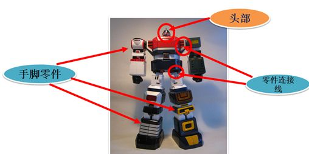然后说了一句话：议论文就是组装机器人。其余所有具体讲解内容都和其他老师一样，但是就加了这两幅图，加了这样一个关联——议论文和组装机器人的关联，学生就表示终于听懂了。后来他们写议论文的时候，脑子里就想一句话，怎么组装机器人？思路就比较容易理清楚了。
**数学学习：**

比如学习立体几何时，研究一个四面体的中心点性质。这是一个新知识，我目前还没有掌握的。但是初中时候的平面几何中，平面三角形的中心点知识我已经掌握了的，那么我就把四面体的中心点性质和平面几何中心点性质联系起来，作比较、对比，找异同点。这样的学习方式就让我理解起来更容易了。
**心理学学习**这是我在[有哪些令人叫绝的心理学效应？ - 叶修的回答](https://www.zhihu.com/question/20357247/answer/118278119)中的回答的一部分，截取过来。比如我要学习一个新的知识：**锚定效应**锚定效应指的是人们在对某人某事做出判断时，易受第一印象或第一信息支配，就像沉入海底的锚一样把人们的思想固定在某处。如，卖东西的时候，先带顾客看一些价格昂贵的商品（如价格5000+的手机），再看一些相对便宜的商品（如1999的手机，其实从它的质量上看也不真正便宜），购买率就会更高。那么现在，我就要把这个知识和我之前的一些旧知识关联起来了。比如我联系到以前就了解过的——人很容易受到外部环境的影响（如再想到斯坦福监狱实验）。锚定效应和外部影响就有类似的地方——外部锚定。
还可以联系到我之前在股票市场上的一些经验：牛市时候高价股会冲一波，这是对牛市的一个确认，大家习惯了高价股的价格以后，对于中低价股的暴力上涨就没有那么恐慌了，因此打开了上涨空间。中间的联系是，这就是大家对于高股价的一个锚定。

##### **2 新知识相互关联**

上面讲的，新-旧知识关联是最好的。但是有时候，我们也会用到 新知识-新知识 之间的关联。为什么新知识之间的关联也会有用呢？原理上是这样的：假设你在一个非常混乱的抽屉里找一把钥匙，里面什么耳机线、草稿纸、电源线、签字笔、各种书籍、文件夹、手提袋等等，搅成一团，你这一个小小的钥匙就很难找到——你的新的单独的知识点就很难记忆起来。
然而，如果你这个钥匙不是单独的小小一把，而是十几个钥匙串成一串，体积比较大，就比较好找了。尽管抽屉还是那么混乱，但是大体积的东西就容易被识别出来。你也可以这样理解：在头脑的大海中，一艘单独的小舟很容易翻船。然而，把几艘小舟连起来，形成一个大船，这样就不容易翻船了。
比如上面那个新的心理学知识——锚定效应，我是和另外一个新知识 登门坎效应
关联起来学习的。我把这两个知识放在一起思考：这两个效应如果起了冲突该怎么办？
两个效应有什么内在的共同点吗？
在什么情况下才能使用这个效应，什么时候使用那个效应？这样的学习效果就会更好。再比如，你新学了一个天文知识：我们能探测到的星星有约2000亿个；又学到一个生物知识：我们大脑中的神经元大约有2000个。那么你就把这两个知识关联起来：天上的星星和我的大脑神经元数量一样多——我的大脑就是一片天，或者说天就是上帝的大脑。虽然这样理解是没有逻辑的，但是这样的关联就会让你记忆的更牢固。

##### **3 地点关联。**

地点关联，是古代记忆术的一种，也叫地点定位法。这个方法也有一定作用，但是比较局限，比如记忆非理解性的零散信息可以，但是用来记忆需要理解的数学、物理或者其他内容，效果就不好了。这个方法略作介绍，也许有人用得上吧。以地点定位法中的房间法为例。首先，在你的房间中，找出十样东西来。从门口，依着顺时钟方法来回想。以我的个人房间为例，我的房间顺时钟是，门、书柜、衣柜、壁灯、床、床头柜、书桌、抬灯、窗子、电风扇。然后，把你要记忆的东西转化为图像——这就是弱点，因为复杂数学公式等无法转化为图像。只有语文课文、古诗或者其他少数内容能够转化为图像。这样一来，我如果有五十个图像要记忆，就可以分成五个图像为一组，把五个图像分别连在我的房间的十个对象上。这样，如果我要回想第二十三个图像是什么，我只要想起「床怎么了」，进而想起第二十一个，二十二个，二十三个，而不必从第一个图像来慢慢想到第二十三个。　　以房间法为例，你可以不只利用你的房间，还有客厅，厨房，教室、车子、车库、等等。甚至校园，火车站……在你的脑海中的各种低点，也可以成为你记忆的成千上万「档案柜」。另外，也有些其他的记忆术，我在回答[高中学习，什么样的应试方法是好的？ - 叶修的回答](https://www.zhihu.com/question/19930474/answer/121940253)下有讲解（上篇：思维原理篇——3记忆术）。
全文总结：
另外有个问题与此相关度较高的，可以作为参考：[为什么有很多学生在老师讲课的时候什么都懂，但是做题却不会做？ - 叶修的回答](https://www.zhihu.com/question/21990278/answer/124329890?from=profile_answer_card)本文提到的结构化思维在这里：[为什么有些人很聪明？他们遇到问题时的思维方式与我们差别在哪呢？ - 叶修的回答](https://www.zhihu.com/question/25670119/answer/120873720)其他相关回答：[叶修：如何提高学习能力？](https://www.zhihu.com/question/25401103/answer/184678160)[叶修：高中学习，什么样的应试方法是好的？](https://www.zhihu.com/question/19930474/answer/121940253)(高中学习类问题的最高赞答案)[叶修：怎样拥有学霸那种一学就是十几个小时的精力？](https://www.zhihu.com/question/26014277/answer/126509877)[叶修：排名在前 1% 的高中生是靠天赋还是靠努力？](https://www.zhihu.com/question/22164041/answer/145588550)[叶修：学霸是怎么学习的？学霸有哪些高效的学习方法和技巧？](https://www.zhihu.com/question/21061778/answer/168455811)[叶修：真正的学霸是什么样子？](https://www.zhihu.com/question/49078888/answer/159040278)近期知乎私信问我问题的同学和家长太多了，而我上知乎少，很多不能及时回复（知乎私信系统也不好用）。想要咨询问题的同学和家长，还是加我的助理微信吧：yexiuzhuli001微信上的咨询问题，我如果有空，会尽可能回复。另外可以关注我的公众号：学习策略师，学习和思维方法，后面主要在公众号里分享。

