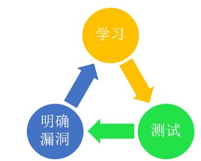

基于遗忘曲线的时间策略**

学过的东西马上就忘了怎么办？ - 叶修的回答 - 知乎
https://www.zhihu.com/question/27252044/answer/124871353

[叶修](https://www.zhihu.com/people/mike-leaf)

公众号：学习策略师；微信：celueshi2018

[脱萝妇司机](https://www.zhihu.com/people/0x-1)、[方应杭](https://www.zhihu.com/people/zhihusucks)、[caoglish](https://www.zhihu.com/people/caoglish) 等 

原因很简单，大脑本身就是会遗忘；解决办法很复杂，本文通篇都是。用一句最简洁而内涵丰富的话来概括这个解决方案，就是：**在基于遗忘曲线的时间策略下，通过输出和关联来复习，既加强内容的意义，也建立更强的脑神经链接**。当然，就这一句概括的话，一般人是看不懂的，下面是详细介绍。

##		**一、有意义的东西更容易记住**

先来看一张图：大家都知道艾宾浩斯遗忘曲线，但是很多人没有注意到，不同的内容遗忘程度是有区别的。最强烈、最容易遗忘的是无意义的东西，在艾宾浩斯的实验里，是一些无意义的音节。有意义的东西，记忆率就会更好一些。图中可以看到，有意义的内容——诗歌、散文等，忘得更慢。这就是大脑的一种本能。大脑倾向于忘记那些没有意义的东西，这属于大脑的自我保护、自我清洗机制，对于没有意义的东西，当然是扔掉了好，免得占地方，相当于我们打扫房间扔垃圾一样。所以，我们要为自己学习的东西赋予意义，这样学习的会更好。比如，如果是上班的人学习某种技能，在学习之前，就在心里默念：这个技能可以让我做事情更快更轻松，不用加班，能多休息；
让我完成工作效果更好，更容易让老板和客户满意；
更容易升值加薪，更好的发展机会；
……如果是学生，可以在学习之前，在心里默念：这个知识点学好了，可以考更高的分数，让我有面子，让我自己感觉很爽；
高考可以多加5分，大学更好一些；
以后如果做XX工作要用这个知识，提前储备上；
……诸如此类。每个人觉得有意义的点不同，可以自行添加意义。不过，只靠赋予意义效率也是不够的，该忘的还是会忘记，所以还需要结合其他方法。
##	**二、输出是最好的学习**

学习有很多种方法技巧，其中，我最提倡的，是通过输出来学习。根据我的经验，这种方法比其他方法效果更加强烈。在这个大类下，又有好几个小类别。

**1 学习金字塔**

**学习金字塔理论：**

在听讲、阅读、视听、演示、讨论、实践和教授给他人这几种学习方法中，自己作为老师，向他人教授知识，是最有效的。
具体来讲，你可以做以下几件事情：主动上台讲课（如果你们老师有这种学生讲课的活动环节）；给其他同学讲题；做ppt演示和分享；自己编写小教材（解题经验、方法等）；实际操练几次你就会发现，效果会非常好的。

\###			**2 费曼技巧**所谓费曼技巧，操作方法如下：

1、拿张白纸； 

2、在白纸顶部写上你想理解概念； 

3、用你自己的话解释它，就像你在教给别人一样。 

4、遇到解释不了的地方，就通过查课本、问老师、或到互联网搜寻答案。 
5、1-4反复循环我们看到，其实费曼技巧，就是学习金字塔理论一个延伸。在学习金字塔理论当中，教授别人带动自己的学习，是指的真实的教授，而费曼技巧是在大脑中模拟教授别人，是在做思想实验。可以说，不论是真实的教授别人，还是如费曼技巧那样模拟教授别人，核心都是一样的。通过亲自把思维的路径走一遍，自然会遇到各种思维的模糊点、分叉点，发现隐藏的问题，从而让自己可以解决这些问题，最终学的更好。
###		**3 进行练习和测试**除去对别人进行输出外，我们还可以对练习进行输出。

当我们做作业、做试卷的时候，其实也是一种输出——我们把脑子里的东西，输出到纸面上。这个地方，我们要调整自己对试卷的态度，考试不是为了评比，而是一种学习的检测。当我们对试卷进行输出的时候，其实就是在检测自己的学习遗漏。如果我们能够把握住这一点，在考试完后对照错题进行漏洞弥补，就能够有效的学会相应的内容，这是一个有效的学习循环。

###	**4 做知识梳理，以半默写的形式画思维导图（结构图）**

对于所学的内容，我们还可以完全做自我输出——闭卷情况下做知识梳理，或者默写。

#####	对知识进行结构化梳理

（或者是小知识点的默写，如语文古诗、英语单词、单独的数学公式等），是一种很好的学习方式。结构化思维，我之前的答案里已经讲过很多次了，这里就不细讲了。今天从一个新的角度上来讲。当大家做知识梳理的时候，不仅可以直接对着书做抄录，还可以以半默写的形式来做。操作方法如下：快速复习一会儿知识点，感觉没问题就行；

关上书，尝试默写其知识和知识结构，或者默写思维导图（在这一步中，这种想默写但是又想不起来的难受的感觉非常重要，就是这种难受的感觉会帮助你学习）；
把所有能默写出来的地方写好，然后看看哪些地方有遗漏；
打开书，把有遗漏的地方再学习一遍；
继续关上书，尝试默写；
如此循环操作。
这样的默写出来的思维导图，效果又比直接画的好。
**总结：**输出是最好的学习，一方面输出的过程就是在检查学习的漏洞，方便补充学习；一方面输出会提出问题（自己提问，别人提问），问题本身会加深大脑的印象；一方面，有些输出的过程中的社交和活动，本身就富有意义。

##		**三、关联	是很好的学习策略**

关联也是一个很好的学习策略，它与输出不同，是另一个维度下的方法。在关联这个大类下，又分为好几个小类。

###		**1 关联旧的知识**大脑记住东西，靠的是脑细胞之间的联系。

一个陌生的知识点，孤零零的在那里，就相当于在大脑里面，一个脑细胞孤零零的漂浮在大海中，是一个孤岛、孤舟，没有和大陆连在一起，很容易覆灭。

对应的策略就是，我们需要把新的知识，和旧的知识关联起来，让孤舟靠岸，孤岛和大陆连在一起。举几个例子吧：

**语文作文：**比如高中生一开始学习写议论文的时候是个难点。一班语文老师都会讲议论文的 **总论点——分论点——论据** 这种结构。这种讲解，在知识点上是完全正确的，但是实际上有很多学生就是掌握不了，就是感觉差了点什么东西，模模糊糊的无法深入理解。我原来是这么解决的。很多学生小时候都玩过类似乐高、组装机器人之类的东西，印象深刻，我就**把论文的写作结构和组装机器人做一个关联**。我给学生们看了两幅图：然后说了一句话：议论文就是组装机器人。其余所有具体讲解内容都和其他老师一样，但是就加了这两幅图，加了这样一个关联——议论文和组装机器人的关联，学生就表示终于听懂了。后来他们写议论文的时候，脑子里就想一句话，怎么组装机器人？思路就比较容易理清楚了。

**数学学习：**比如学习立体几何时，研究一个四面体的中心点性质。这是一个新知识，我目前还没有掌握的。但是初中时候的平面几何中，平面三角形的中心点知识我已经掌握了的，那么我就把四面体的中心点性质和平面几何中心点性质联系起来，作比较、对比，找异同点。这样的学习方式就让我理解起来更容易了。
**心理学学习**这是我在[有哪些令人叫绝的心理学效应？ - 叶修的回答](https://www.zhihu.com/question/20357247/answer/118278119)中的回答的一部分，截取过来。比如我要学习一个新的知识：**锚定效应**锚定效应指的是人们在对某人某事做出判断时，易受第一印象或第一信息支配，就像沉入海底的锚一样把人们的思想固定在某处。如，卖东西的时候，先带顾客看一些价格昂贵的商品（如价格5000+的手机），再看一些相对便宜的商品（如1999的手机，其实从它的质量上看也不真正便宜），购买率就会更高。那么现在，我就要把这个知识和我之前的一些旧知识关联起来了。比如我联系到以前就了解过的——人很容易受到外部环境的影响（如再想到斯坦福监狱实验）。锚定效应和外部影响就有类似的地方——外部锚定。
还可以联系到我之前在股票市场上的一些经验：牛市时候高价股会冲一波，这是对牛市的一个确认，大家习惯了高价股的价格以后，对于中低价股的暴力上涨就没有那么恐慌了，因此打开了上涨空间。中间的联系是，这就是大家对于高股价的一个锚定。

###		**2 新知识相互关联**
上面讲的，新-旧知识关联是最好的。但是有时候，我们也会用到 新知识-新知识 之间的关联。为什么新知识之间的关联也会有用呢？原理上是这样的：假设你在一个非常混乱的抽屉里找一把钥匙，里面什么耳机线、草稿纸、电源线、签字笔、各种书籍、文件夹、手提袋等等，搅成一团，你这一个小小的钥匙就很难找到——你的新的单独的知识点就很难记忆起来。
然而，如果你这个钥匙不是单独的小小一把，而是十几个钥匙串成一串，体积比较大，就比较好找了。尽管抽屉还是那么混乱，但是大体积的东西就容易被识别出来。你也可以这样理解：在头脑的大海中，一艘单独的小舟很容易翻船。然而，把几艘小舟连起来，形成一个大船，这样就不容易翻船了。
比如上面那个新的心理学知识——锚定效应，我是和另外一个新知识 登门坎效应
关联起来学习的。我把这两个知识放在一起思考：这两个效应如果起了冲突该怎么办？
两个效应有什么内在的共同点吗？
在什么情况下才能使用这个效应，什么时候使用那个效应？这样的学习效果就会更好。再比如，你新学了一个天文知识：我们能探测到的星星有约2000亿个；又学到一个生物知识：我们大脑中的神经元大约有2000个。那么你就把这两个知识关联起来：天上的星星和我的大脑神经元数量一样多——我的大脑就是一片天，或者说天就是上帝的大脑。虽然这样理解是没有逻辑的，但是这样的关联就会让你记忆的更牢固。
###		**3 地点关联。**

·地点关联，是古代记忆术的一种，也叫地点定位法。这个方法也有一定作用，但是比较局限，比如记忆非理解性的零散信息可以，但是用来记忆需要理解的数学、物理或者其他内容，效果就不好了。这个方法略作介绍，也许有人用得上吧。以地点定位法中的房间法为例。首先，在你的房间中，找出十样东西来。从门口，依着顺时钟方法来回想。以我的个人房间为例，我的房间顺时钟是，门、书柜、衣柜、壁灯、床、床头柜、书桌、抬灯、窗子、电风扇。然后，把你要记忆的东西转化为图像——这就是弱点，因为复杂数学公式等无法转化为图像。只有语文课文、古诗或者其他少数内容能够转化为图像。这样一来，我如果有五十个图像要记忆，就可以分成五个图像为一组，把五个图像分别连在我的房间的十个对象上。这样，如果我要回想第二十三个图像是什么，我只要想起「床怎么了」，进而想起第二十一个，二十二个，二十三个，而不必从第一个图像来慢慢想到第二十三个。　　以房间法为例，你可以不只利用你的房间，还有客厅，厨房，教室、车子、车库、等等。甚至校园，火车站……在你的脑海中的各种低点，也可以成为你记忆的成千上万「档案柜」。另外，也有些其他的记忆术，我在回答[高中学习，什么样的应试方法是好的？ - 叶修的回答](https://www.zhihu.com/question/19930474/answer/121940253)下有讲解（上篇：思维原理篇——3记忆术）。

全文总结：
另外有个问题与此相关度较高的，可以作为参考：[为什么有很多学生在老师讲课的时候什么都懂，但是做题却不会做？ - 叶修的回答](https://www.zhihu.com/question/21990278/answer/124329890?from=profile_answer_card)本文提到的结构化思维在这里：[为什么有些人很聪明？他们遇到问题时的思维方式与我们差别在哪呢？ - 叶修的回答](https://www.zhihu.com/question/25670119/answer/120873720)其他相关回答：[叶修：如何提高学习能力？](https://www.zhihu.com/question/25401103/answer/184678160)[叶修：高中学习，什么样的应试方法是好的？](https://www.zhihu.com/question/19930474/answer/121940253)(高中学习类问题的最高赞答案)[叶修：怎样拥有学霸那种一学就是十几个小时的精力？](https://www.zhihu.com/question/26014277/answer/126509877)[叶修：排名在前 1% 的高中生是靠天赋还是靠努力？](https://www.zhihu.com/question/22164041/answer/145588550)[叶修：学霸是怎么学习的？学霸有哪些高效的学习方法和技巧？](https://www.zhihu.com/question/21061778/answer/168455811)[叶修：真正的学霸是什么样子？](https://www.zhihu.com/question/49078888/answer/159040278)近期知乎私信问我问题的同学和家长太多了，而我上知乎少，很多不能及时回复（知乎私信系统也不好用）。想要咨询问题的同学和家长，还是加我的助理微信吧：yexiuzhuli001微信上的咨询问题，我如果有空，会尽可能回复。另外可以关注我的公众号：学习策略师，学习和思维方法，后面主要在公众号里分享。

---

##	Other

