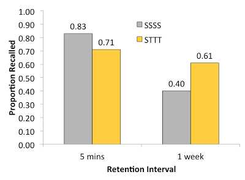
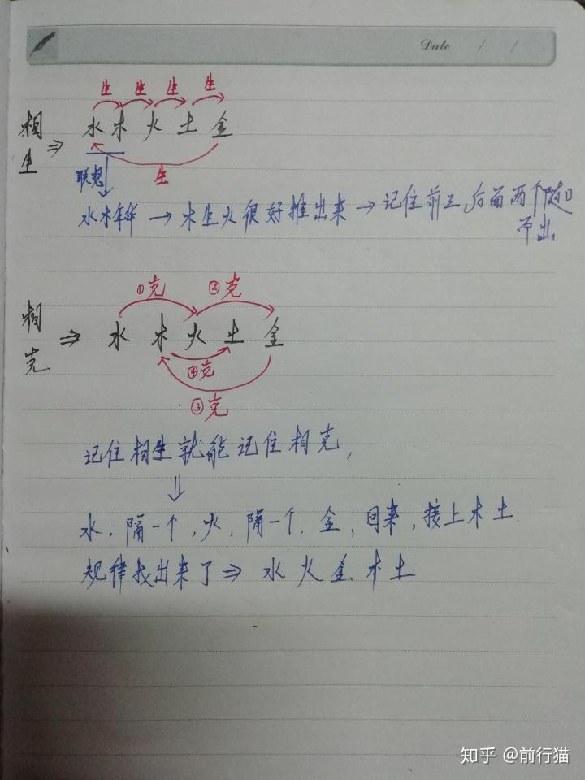

## 忘记，恰恰是学习的开始。

作者：Nichole

给高票答案点了一圈反对。自我感觉有用的记忆技巧恰恰通常是不可靠的，大量关于judgement of learning (JOL；自我学习判断) 的研究发现人们对自己的学习的判断和实际学习结果只有非常弱的关联或没有关联，最惨的是，当人们觉得自己进步最大的时候，恰恰学习效果最差；当人们觉得学习得最少的时候，恰恰学习效果最强 (Townsend & Heit, 2010) 。为什么会这样？**因为很多短期内能提升记忆的方法恰恰对形成长期记忆没什么用，短期内看不到成效的方法反而能促进长期记忆效果。**

### 视觉化和重复

首先反对很多高票回答中提到的视觉化和重复。有效的记忆力技巧需要得到大量的实验持之以恒地证明在同等情况下，采用此方法比别的方法能记住的东西更多，而不是靠人自我感觉可以在短期内记住，因为人对自身的记忆力和学习的判断大多数情况下并不正确。

很多答案里提到的视觉化在于把知识点想象为一个场景，用图像的形式来记忆，也就是认知心理学中imagery use. 那么视觉化对记忆力的帮助有多大？ 

综合了2013年前的文献，得到的比较统一的结论是 “the effects of using mental imagery to learn from text may be rather limited and not robust… we rate the use of imagery for learning text as low utility ” (**采用想象视觉化来学习文本的效果相当有限并且不稳定...我们认为视觉化对学习文本效能为低等**）(Dunlosky et al., 2013) ，理由如下： 

##### \1. 能够使用视觉化有效帮助记忆力的情况相当有限：

支持视觉化效果的实验通常使用的是能够被轻易视觉化的叙述或短故事，比如说有些答案中提到的电影台词。有许多研究(e.g. De Beni & Moe, 2003) 发现，视觉化对记忆比较抽象的、概念型的文本并没有帮助；即便对于容易想象的文本，只有在听文本的情况下视觉化才对记忆力有帮助，而对阅读文本没有帮助。 

##### \2. 视觉化的效果并不稳定：

视觉化的效果很大程度取决于你用什么来测试，在什么时候测试。即便对学生进行了大量的视觉化的训练并明确指示学生用视觉化的技巧来考试，实验仍没有发现视觉化对阅读理解有任何提升 (Lesgold et al., 1975; Miccinati, 1982)。 

那么重复(rereading)呢？ 

复习／重复是最广泛使用的学习技巧，几个调查发现62-84%的学生采用重复学习内容来记忆 （Kornell & Bjork, 2007; Karpicke et al. 2009)。然而，在同一篇文献综述(Dunlosky et al., 2013)里，**复习也被列为低效能的学习技巧。 重复学习内容对考试成绩的作用并不稳定，有些实验发现没有帮助甚至有负面效果 (Carrier, 2003)，单纯重复对长期的记忆和理解几乎没有帮助** (Callender & McDaniel, 2009; Dunlosky & Rawson, 2005). 

需要注意的是，形象化和重复并不是一无是处，而是由于它们的效用不稳定，并有相当大的局限性，在有其它已被证明更有效的记忆策略可以选择的情况下，它们并不应该被作为最优选择来推崇。 

---------------------------- 反对完后的正文分割线 ----------------------- 

之所以说了那么多反对似是而非的记忆策略的理由是为了说明： 
**很多情况下人并不清楚什么记忆力策略真正有效，我们时常混淆了“表现”和“学习”，生怕忘记。但忘记，恰恰是学习的开始。**

先抛结论： 

- **表现 (performance) 是当下你记住了多少，学习(learning)是持久地记住并使用知识，表现和学习是两个可以被分隔的概念，有效的记忆策略可能损害当下的表现，却帮助真正的长期的学习。**
- **忘记是形成有效长期记忆的重要组成部分。**
- **学习应当是困难的。** 

大量对不同人群，不同测验方式的研究支持的是，对真正的学习（形成持久的记忆）而言： 

- **测试 (testing) 比重复 (rereading) 有效，即便没有反馈、犯错也可以帮助记忆。**
- **在学习某内容前就提前测试自己(pretesting)可以显著提升将来记住内容的几率**
- **分隔开学习区间 (spacing) 比 集中在某一时间大量学习 (massing)有效**
- **同时学习不同东西 (interleaving) 比 一个时间内只学习一样东西(blocking) 有效**

###		**1. 表现 (performance) 不等同于学习 (learning)**

表现和学习是两个迥然不同的概念 (Soderstrom & Bjork, 2015)：
表现 ＝ 当下或短时间内，对内容的掌握和记忆 
学习 ＝ 习得相对永久的理解上的改变，形成持久的、能够被灵活运用的记忆 

就像题主描述的，人们经常陷入的误区是，表现等同于学习：如果当下没有记住没有理解，说明没有有效地学习到一样东西，但事实却不是这样的。这样的误解会导致我们采取能即时取得好的当下表现的记忆策略（如各高票答案里的方法），舍弃让我们感觉到困难的策略，最终伤害了真正的学习。 

比如说，重复读可以让我们感觉知识都很熟悉，很流畅，学完马上测试自己也能让我们觉得自己掌握得还不错，但是这种熟悉感和掌握感仅仅是因为我们**刚刚才看过这些知识，所以记忆犹新**。但这些这些知识并没有形成有效的根基，所以会被迅速地忘记，不能形成有效的长期记忆。相反，当我们费劲地去想记起某个信息，甚至得到一个错误的答案，这样困难的努力和错误反而更能加深长期的记忆力。 

###		**2. 忘记是形成有效长期记忆的重要组成部分**

记忆分两个步骤，储存 (storage)和提取 (retrieval)。Bjork lab提出记忆的储存强度 (storage strength)和提取强度 (retrieval strength)，储存强度指内容是否有被很好地习得和储存，是否能在以后被记起。提取强度是指这个内容在当下能不能被记起。这两者可以被区分。比如说，你现在度假酒店的房间号能被轻易地记起（高提取强度），但却不可能在很久后被想起（低储存强度）；你儿时的电话号码可能记得很牢（高储存强度），一下子想不起来了（低提取强度），但如果被提醒就能马上想起。 

**真正有效的长期记忆的目标实际上是增加内容的储存强度。**它们(Bjork lab) 多年的研究可以被应用到学习上，如下：

##### \1. 当我们学习一个内容，储存强度和提取强度都在增加。 

##### \2. 当我们学习完一个内容，储存强度越高，提取强度降低的速度就越慢 （忘得更慢）。 

##### \3. 当重新学习一个内容，**提取强度越低，储存强度增长得就越快** （真正的学习） 。

**提取强度低的时候，你得到的信号是你“忘记”了，但这恰恰给真正的学习提供契机。** 
下面介绍的所有研究都是在时间相同的情况下，比较不同记忆方法的效果。

###		**3. 测试比单纯重复有效，即便犯错也能够帮助记忆。**
Roediger & Karpicke (2006) 给了学生一段文章来学习。SSSS组的学生反复阅读、学习这段文章20分钟。STTT组的学生只学习了5分钟那段文章，文章就被拿走了，然后他们得到一张空白的纸，让他们写下“你们能记起来的任何东西”，五分钟后，他们拿到一张新的空白的纸，”写下你们能记起来的任何东西“，这个测试的过程重复了三遍。也就是说，20分钟里，SSSS组从头到尾都在阅读学习，STTT组的学生只有四分之一的时间学习，四分之三的时间在重复测试前面5分钟学的内容。值得注意的是，STTT组并没有得到任何关于他们测试自己时的反馈。 

5分钟后，他们测试了所有学生对文章内容的记忆力。一个星期后，他们又重新测试了这批学生对文章的记忆力。下图是记忆力考试的结果，灰色为20分钟内都重复学习的SSSS组，黄色为只学了5分钟却用了15分钟重复测试自己的STTT组。当测试在5分钟后进行，重复学习组表现更加好，但一个星期后，结果却反转了，单纯重复的人忘记了一半以上的内容，但那些重复测试自己的人们不仅记住得更多，遗忘的速度也大大降低了。 

也就是说，尽管当时觉得自己“忘记”了，需要费更大的劲才能提取信息，储存强度和长期记忆却得到了更大的提升。 

尽管实验反复证明测试比重复有效，但很多时候我们拒绝测试自己，因为我们害怕忘记，害怕产生错误，万一我们学习到了错误的记忆呢？但实验也发现，即便在还没开始学习的时候，我们犯的错误都能够帮助记忆。 

Kornell et al. (2009)让人们学一系列相关的词语组，如“鲸鱼－哺乳动物”。一些人直接学习这些词语组，另一些人先只看到一个提示词（鲸鱼-???），猜另一个词语，然后才看到正确的词语组合。当提前猜测另一个词语是什么的时候，几乎所有的猜测都是错误的，但“猜测－学习”组的人却在之后的词语组记忆测试取得比“直接学习”组更好的成绩。这也许是因为猜测主动地激发了和提示词（鲸鱼)相关的概念，这些概念帮助人们把提示词和目标词（鲸鱼－哺乳动物）更好地结合在一起。 

同样的，Potts & Shanks (2014) 在告诉人们一个外国词汇的意思前，先让他们猜这个词汇的意思，结果表明：先猜并且猜错的人比直接学习这个词汇的人后来能记住的几率更大。然而，当他们问人们哪个方法更帮助记忆的时候，绝大多数人都说直接学习最有效，这说明大多数人并不能很好地预测什么方法能够形成有效的记忆。 

##### 效果主要来源于测试时**提取信息所需要付出的努力(effortful processing)**。

#####  	提取强度越低，提取的过程越费力，感觉越困难，形成的记忆就越牢固

评论里有人问测试能够加深记忆的机制是什么。

> 2014年发在Psychological Bulletin一篇研究(Rowland, 2014)统计了关于测试和记忆的331个实验，不仅发现测试确实对记忆有可靠且明显的帮助，而且这个效果主要来源于测试时**提取信息所需要付出的努力(effortful processing)**。**提取强度越低，提取的过程越费力，感觉越困难，形成的记忆就越牢固。**也就是说，**直接回忆(recall)** 比做选择题（recognition, 辨认记忆）更有用，没有任何线索的自由回忆(free recall) 比基于线索的回忆（cued recall, 比如说填空题）更有用。

不断地测试和提取信息，比重复阅读，更能帮助长期记忆。即便没有得到任何反馈，即便产生了错误，这样的测试对学习都是有效的。 

###		 **4. 分散学习区间 (spacing) 比 集中在某一时间大量学习同一内容 (massing) 更能帮助长期记忆。**

 **同时学习不同内容(interleaving) 比 专注于一个内容更能帮助长期记忆**

大量学习同一内容(massing)能在短期内提升表现，但分隔开学习区间和同时学习不同内容更能有效率地提升长期记忆和学习。 

##### 增加内容的储存强度

分散学习区间会降低提取强度，却能增加内容的储存强度，在心理学上被称为the spacing effect. 比如说，当我们刚读了一个章节，内容都还记忆犹新（高提取强度），再马上重读那章节并不会很大地提升你对内容的学习（储存强度）。但当我们读完了那个章节，把它放下，去做别的事情，让我们“忘记”刚才的内容（低提取强度），然后过段时间再重新拾起这个章节，我们会得到更大的储存强度的提升 (Bjork & Kroll, 2015). 

混搭着学习不同的内容也许感觉上更难，短期能也可能降低表现，但长期来说，能形成更有效的内容储存。在一个实验中 (Roherer & Taylor, 2007)，一组人在一个时间段内集中学习一个几何形状，做相关练习，在下一个时间段集中学习下一个几何形状，做相关练习，如此重复，听起来是不是很像初中我们学几何时候的过程？。另一组人混搭着时间学习不同的几何形状，随机地得到关于不同几何形状的练习。当学完马上测试时，前面集中学习组表现得更好，但一个星期后测试，结果反转了，混搭随机学习的组表现的更好，也就是说，混合的学习安排更能帮助有效的长期学习效果。

##### 联想

##### 异同联系-对比

补充一下，评论里有人问混搭毫无关联的学科（比如说数学＋英语）是不是会有一样的效果。我没有找到实验支持同时学习毫无关联的学科（比如说数学+英语）会有同样效果（如果有人看到欢迎补充）。Bjork的建议是同时学习相联的课题，比如说，清朝史+唐朝史+现代史，这大概是因为**同时学习不同但相联的课题**更能够让人注意到课题间的**相同点和不同点**，使人采用一个更高层次的角度(higher level representation)处理信息，从而加深学习和运用 (Soderstrom & Bjork, 2015) 。

分散学习区间和同时学习不同内容的对长期记忆的效果在广泛不同的人群(18岁－76岁），不同的记忆题材（语言、文章、数学、图画、推理等等）都得到了验证。 

#####	延迟测试=更高的储存强度

结合关于测试的上一点，我们最应该做的是：**延迟测试。**

当我们刚刚学习了一个内容，不应该马上就测试自己，因为这时提取强度仍很强。我们应该过一段时间，等提取强度降低些，再测试自己对内容的掌握。延迟测试会形成更有效的长期记忆（更高的储存强度）和体现真正的学习。

###		**5. 有效的记忆策略是困难的。**

关于上面说的学习策略有意思的一点是，尽管它们被反复地证明有效，人们还是倾向于重复／大量专注学习同一内容。当学生来挑选有效的记忆策略，84%的学生选择了重复／复习，只有11%的人选了提取测试。这是因为

 **1）很多时候，我们把短期的表现错误地用来判断学习有没有效，但很多时候，表现和学习是相违背的；**

**2）我们感觉一个策略比另一个策略来的简单，给我们的掌控感更强**（比如说很多答案中提到的重复和视觉化）**，但其实这些策略并不能帮助长期记忆，真正能帮助长期记忆的是那些提取强度低的，感觉较为困难的练习。**

##### 提取强度低的，感觉较为困难的练习

一个例子是，在学习第二语言（如英语）的时候，把一个英文单词翻译成中文单词比中译英要来的简单，毕竟我们提取母语比提取不那么熟悉的二外简单的多。但是研究(asymmetries in bilingual translaton)也反复表明，相对于把二外译成母语（英译中），练习把母语译成二外（中译英）的确感觉更难，速度更慢，并更容易产生错误，却能让我们取得更好的记忆效果。这是因为我们在主动地提取相对较弱的二外，形成更深刻的记忆。

\-

References

BJorK, R. A., & Kroll, J. F. (2015). Desirable difficulties in vocabulary learning.*The American journal of psychology*, *128*(2), 241.

Dunlosky, J., Rawson, K. A., Marsh, E. J., Nathan, M. J., & Willingham, D. T. (2013). Improving students’ learning with effective learning techniques promising directions from cognitive and educational psychology.*Psychological Science in the Public Interest*, *14*(1), 4-58.

Kornell, N., & Bjork, R. A. (2007). The promise and perils of self-regulated study. *Psychonomic Bulletin & Review*, *14*(2), 219-224.

Kornell, N., Hays, M. J., & Bjork, R. A. (2009). Unsuccessful retrieval attempts enhance subsequent learning. *Journal of Experimental Psychology: Learning, Memory, and Cognition*, *35*(4), 989.

Potts, R., & Shanks, D. R. (2014). The benefit of generating errors during learning. *Journal of Experimental Psychology: General*, *143*(2), 644.

Townsend, C., & Heit, E. (2010). Metacognitive judgments of improvement are uncorrelated with learning rate. In *Proceedings of the 32nd annual conference of the cognitive science society. Austin, TX: Cognitive Science Society*.

Roediger, H. L., & Karpicke, J. D. (2006). Test-enhanced learning taking memory tests improves long-term retention. *Psychological science*, *17*(3), 249-255.

Rowland, C. A. (2014). The effect of testing versus restudy on retention: A meta-analytic review of the testing effect. *Psychological Bulletin*, *140*(6), 1432.

Soderstrom, N. C., & Bjork, R. A. (2015). Learning versus performance an integrative review. *Perspectives on Psychological Science*, *10*(2), 176-199

学过的东西马上就忘了怎么办？ - Nichole的回答 - 知乎
https://www.zhihu.com/question/27252044/answer/109590714

---

## 学过的东西马上就忘了怎么办？ - 海鸥看世界App的回答 - 知乎

https://www.zhihu.com/question/27252044/answer/559473312

人类的“**遗忘**”是很自然的现象。尤其是在没有重复“提取记忆”的情况下，人记忆消退得很快。好在“遗忘”是存在一定规律的，只要把握住这些规律，就能将“牢记”过程进行得事半功倍。

在 Crash Course 速成课：学习技巧中，主持人小哥介绍了“**间隔重复法**”（spaced repetition），可以帮助我们找到“遗忘的临界点”，以提高复习效果（Principle of Desirable Difficulty "**适度困难原则**" 认为：要最大化学习效率，需要找到那个“即将遗忘某事”的临界点）。

为达到系统地“间隔重复复习”，小哥还介绍了“**莱特纳记忆法**”（The Leitner System）的具体步骤，推荐了相应的app工具，很良心干货了。

----

作者：前行猫

## 学过的东西马上就忘了怎么办？ - 前行猫的回答 - 知乎

##	为什么会忘，因为没学好

https://www.zhihu.com/question/27252044/answer/723263715

两个关键字，“学”和“忘”。

为什么会忘，因为没学好。

为什么没学好，因为学习方式太单一，学习方式多样化，动一番脑筋才能学好。从而记住，并加以应用，应用也是学习。

记忆只是学习的一部分，你能做笔记，当然好过单纯的死记硬背。但是做笔记，不是单纯的把所学内容复制或者简化，还要做其他工作，比如，联想，理解，用自己的话写下了或者讲出来，说出来，如果能够应用，还要去实践，在实践中体会。

我列举两个我常用的方法。

**1.联想法**

**2.用自己的话简短的写下来或者说出来**

列举两个简单的例子

**比如我记忆五行相生相克**

可以死记硬背

也可以理解后推理着记忆，比如水生木：水能滋长树木，木生火；树木能着火，以此类推

更好的方法是联想法，在理解的基础上，用联想的方法记忆，比上面的两个方法有两个好处，

1.记得牢靠，记得久，基本不用复习

2.能够快速想出来，不用一步一步推理

如下：

**再举一个例子**

**秦国统一六国的顺序，韩国  赵国   魏国   楚国   燕国  齐国**

熟读历史的可以根据地图，国家地理位置记忆，远交近攻的策略

也可以死记硬背，韩赵魏楚燕齐

还可以，联想，使用情景联想，根据自己现有的知识联想，喊赵薇出来演齐秦，喊—韩，赵—赵，薇—魏，出—楚，演—燕，自己可以想象这样一个情景：在横店拍摄现场，自己是个大导演，拿着一个大喇叭，向着屋里的赵薇喊她，让她出来，演齐秦，这个角色。过一把导演瘾。做笔记的时候，甚至可以把拿着大喇叭的自己，和赵薇画出了，在标上字。

对于，比较复杂或者抽象的学习内容，要多读，变成自己的话，简短的记下，或者给自己，别人讲一遍。

明天周末，祝大家周末爽。

## 学过的东西马上就忘了怎么办？ - 好奇的唯宸的回答 - 知乎

https://www.zhihu.com/question/27252044/answer/154479242

作者：好奇的唯宸

## 学而不思则忘

那果断是因为你没思过呀？孔爷爷说过，学而不思则忘（对，不没记错，这个字就是这么写的 ）。你以为你真忘了？其实并不是你忘了，而是你找不到他了。你不信？等哪天一旦她再找上你，你敢说你不认识？其实她一直存在于你的大脑中，并且守护的那些个神经元还不停的在放电呢。只是呢，山高皇帝远，她在沙漠，你在沙滩。你想呼喊她，她却听不见。那么怎么办呢？你得给她买个传呼机 。什么？她不会用？你得教她如果收到信息叫：“xxx，请回电”——要响应。如果收到信息叫：“代开发票”…… 其实这里的传呼机和收到某些信息，就是建立神经元之间的联系。比如你才学习了化学元素周期表。现在要你回忆起来，难道你是一个一个的写出来的？氢元素？氦元素？锂元素？……金元素？钱元素？实际上是你在学习这个的时候，就思考了的，给这些元素买了传呼机的。并且当这些元素速到的信息是“化学元素周期表有哪些“的时候他们就都回电了。这里的发信息的人就是你，发的信息就是周期表，那么传呼机是谁呢？其实传呼机就是那一句口诀：氢氦锂铍硼，碳氮氧氟氖……每个元素在大脑中已经建立神经元、你也建立了化学元素周期表的神经元，这个时候你还建立了一个口诀就是将大量的元素串起来的东西。这使得你能够把他们找到。所以，”学过的东西马上就忘了怎么办？“就是你在学的时候就要把这个联系建立起来，这个是你需要单独做的动作。（其实专业术语就叫编码）所以，以后学任何东西，特别是比较复杂的，你在学的时候就应该建立一个未来检索的这么一个线或者跳板。上文只讲了一种连接记忆的方式：口诀。更多的连接记忆的方式，你可以根据自己平时哪些事情不容易忘记，找到属于自己的连接记忆方式，并且去做，就不会忘记了。
神经元A：B呢？                             神经元B：今天这知乎挺好看的？哎呀小美给我发了条微信神经元A：B呢？--连接记忆跳板：B在刷手机--神经元B：A姐姐，你是怎么找到我的呀，我还要看知乎，不想去训练？/(ㄒoㄒ)/~~ 

[编辑于 2017-03-30]()

以下都是个人体验，我没有任何贬低那些科学研究的意思，但是在这种问题上，个体差异很明显，所以我觉得还不如每人提一个方法让题主去试试
因为你那不叫学
你那叫往脑子里塞东西
什么叫学
为了解决某一个问题，从而查找资料，进行解决，得到满意的答案
比如:为什么最近西方媒体总在提中国威胁论
你就可以去找一些有关的书来看，然后在大量阅读的情况下，再进行自己的思考
你不可能把你大量阅读的东西都记住，显然你是要整理的，但是你整理的东西就很难忘记，然后你得出了一个简明的答案，这个简明的答案是最难忘记的，因为下面有大量的记忆在支撑，然后你下次回忆这个问题，你就会先想到你最后的答案，然后再一级一级回忆你的整理，越原始的东西你肯定忘记得越多，但那无关紧要，你学习一个东西，重要的是会运用，而不是背诵书上的内容。
任何一个理论，都有它提出的历史背景，有它能够解决的问题，比如黑体辐射和普朗克的量子理论都是为了解决当时如何从一个物体的发光情况推测温度而建立的，了解这些，不是额外的知识，却能帮助你理解你的知识，整理你的知识
作者：王璟链接：https://www.zhihu.com/question/27252044/answer/95746251来源：知乎著作权归作者所有。商业转载请联系作者获得授权，非商业转载请注明出处。

