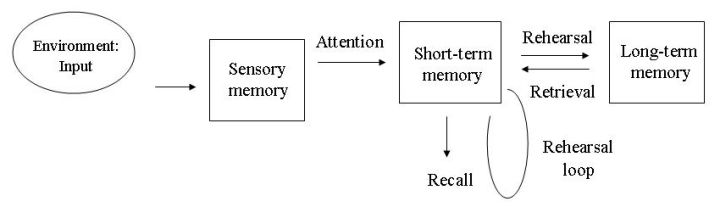

[青格乐](https://www.zhihu.com/people/sichagao)、[清响](https://www.zhihu.com/people/yu-yu-27-64)、[泉心](https://www.zhihu.com/people/songmeiluo)、[徐佳鑫](https://www.zhihu.com/people/xu-jia-xin-3)等 

敬告：以上所提到的方法大都经过各大院校及研究机构多年研究和实验。如果你照做了但发现“艾玛，骗人啊，没用啊。”那么有可能有四种原因。1. **操作不当。**（你看看下厨房菜谱底下按照原菜谱做出的菜真是什么都有就能知道什么叫“成功的菜都是一样的，不成功的菜各有各的丑。”）
\2. **先天因素。**（人艰不拆，不多说）。
\3. **实验限制。**（实验都是在一定条件下进行的，有解释和应用的范围，并不是万金油。）
\4. **以上实验在解释范围内均有问题，实验结果其实是错误的。**（如发现这一点，恭喜你，赶紧写一沓文章证伪他们！）
\5. 以上某个理论已被证伪。（欢迎纠正，请指出具体文章名和出处，及错误部分。）———————————————————————————————————————————

### 还是来从道和术说。

### **【道】**

回答这个问题我们需要先知道三个有关记忆的概念，来了解为什么我们遗忘，以及怎么防止遗忘，从而建立记忆。（对于其它记忆相关知识可以参考[心理学与生活 ](https://link.zhihu.com/?target=http%3A//book.douban.com/subject/1032501/)）**Atkinson-Shiffrin memory model**[多重记忆系统模型](https://link.zhihu.com/?target=http%3A//www.baidu.com/link%3Furl%3DJ59Z0LDzxXy_vcQY6b4d0Tp1BkBGRIiQhRtFvfDIqMvQbOpJ7Sg2779kthIFY2qzUDyGZSJWDgDiNqM2yERWzK)
有些一看到英语就被堵住的同学我再来张中文图吧。（那个长期记忆下方不是北京联盟啊。。是“忘记”）

请跟着我念：

##### **得不到注意的感觉记忆会丢失，得不到复习的短期记忆会遗忘。**

**所以让短期记忆变为长期记忆的唯一解是：不断复习。**题主所说“记了笔记”，如果不配合复习的话也并不会起到太大作用。**Forgetting curve**[艾宾浩斯遗忘曲线](https://link.zhihu.com/?target=http%3A//www.baidu.com/link%3Furl%3DXp3JZ5AkKHlcbaV0JzbS20oO0JL5-6vWiHgyAOhjH2ohVV8PPJCQZe0Eynt3gYC3)
艾宾浩斯用无意义音节作记忆的内容，用节省法计算保持在记忆中的数量。可以发现开始的时候遗忘的特别快，然后开始遗忘减少，但其实也留不下什么东西了。（这里注意的是，这个曲线是艾宾浩斯个人的测得结果，并不是每个人的，所以每个人的曲线都会因为各种因素不同，大致走势是这样的。）

##### **Fluid and crystallized intelligence (流体智力和晶体智力)**

**流体智力指的是**知觉、记忆、运算速度、推理能力等基础能力，这部分基础能力在25岁左右达到高峰，之后会衰退。这就是为什么很多人都会抱怨“老了健忘”，“老了学不进”也就是题主所说：“原来学生时代还是很好，现在上班了感觉越来越差了。”

### **【术】**

知道了这两个知识点后我们来看四个帮助你记忆的常识。

##### **精细复述深加工**

新记忆的信息很可能对于你来说是无组织的，这时候就需要让它们变得有组织，并且能够在你脑海中停留住。记笔记也是一种精细复述方式，但是很多人其实“不会”记笔记。这时候就要推荐：
[Cornell Notes Taking System](https://link.zhihu.com/?target=http%3A//winrr.info/cornell-notes/)
这个笔记对于读研读博搞学术研究的同学最有用，其它领域可能需要自己再根据具体情况改造一下了。还有老生常谈的脑图也是。[Mind Map Memory Maps](https://link.zhihu.com/?target=http%3A//www.usingmindmaps.com/mind-map-memory-maps.html)（翻不了墙的同学可以看[思维导图](https://link.zhihu.com/?target=http%3A//baike.baidu.com/view/30054.htm)）
Tony Buzan倒是不推荐看，真是又臭又长（可能比较适合有理解能力障碍的同学看）。关于深加工有个好例子是[英语词汇的奥秘](https://link.zhihu.com/?target=http%3A//book.douban.com/subject/1092251/)这本书让你了解到其实英语单词也有“偏旁”，当你赋予“偏旁”意义的时候，突然发现你记忆起来轻松多了，甚至没有见过的单词但是见过“偏旁”，都能大差不差猜出是什么意思（和中文一样）。

##### **设置复习时间表**

可以借鉴杨鹏的[17天搞定GRE单词](https://link.zhihu.com/?target=http%3A//book.douban.com/subject/1803504/)里的背单词时间表，将你要记住的东西也拆分成单元（比如说以一章为一单元），然后按照时间表来反复记忆。（我用了这个背词法后所有需要记忆的东西都用了这个方法记忆，效果卓越，考心理学研那会儿心理学导论整本书我都几乎倒背如流。）

##### **打破记忆位置**

老梗就是背单词永远都在背“abandon”，十年如一日。
在中间的内容总是容易被遗忘的，所以复习的时候多换换顺序复习，这也是为什么很多单词书出“乱序版”的原因。

##### **设置多个“记忆提取书签”**

有时候你会发现你在这本书上能记得某个知识点，怎么跑到试卷上就不认识了？
如果这种情况经常发生，那么在精细复述和深加工时请多换换记忆背景，比如说，举一反三一下举些例子，或者用两本或三本不同教材教辅，从不同角度练习。

### **【器】**

每个需要记忆的内容性质都不同，每个人特质也都不一样。以上也是一个思路，泛泛而谈，我们能做的是掌握精髓，举一反三，根据以上原则，在不同领域选择不同的器。
选择适合自己的书（我在[学霸们是如何高效率地学习、工作、生活的？ ](http://www.zhihu.com/question/26560512/answer/37222283?group_id=552229273570832384)中提过选对书的重要性。）
根据具体情况计划和实施上述记忆方法。坚持，坚持就是胜利。
附你们大概会喜欢的一个网站：
[Lifehacker - Tips and downloads for getting things done](https://link.zhihu.com/?target=http%3A//lifehacker.com/)
[进化论 - 知乎专栏](http://zhuanlan.zhihu.com/hibetterme)

学过的东西马上就忘了怎么办？ - 寺主人的回答 - 知乎
https://www.zhihu.com/question/27252044/answer/40175755