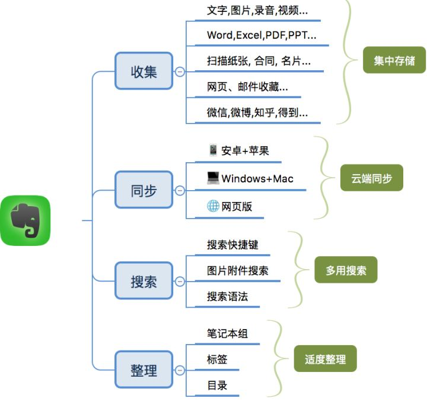
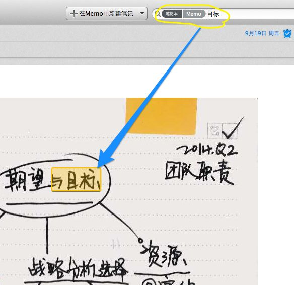
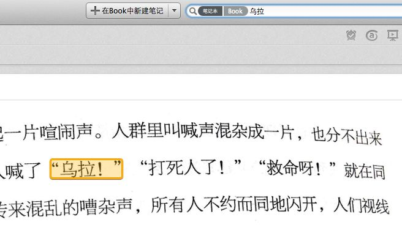
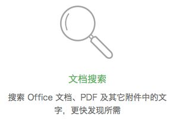
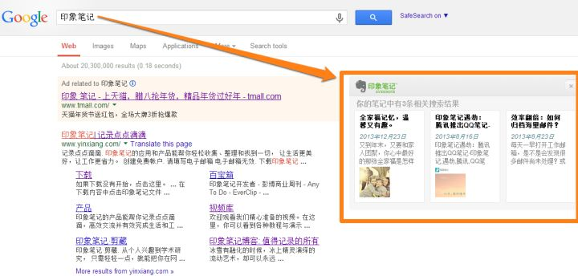
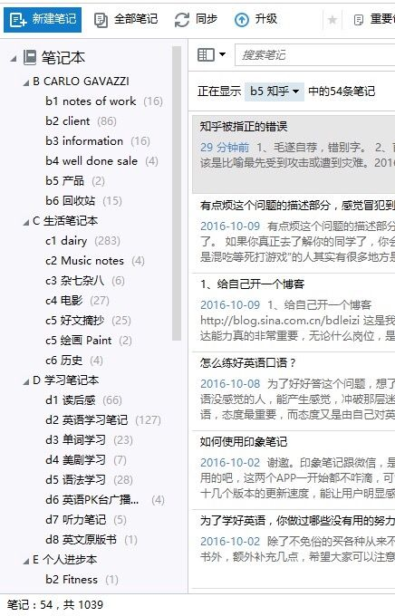

## 如何高效使用和整理印象笔记（Evernote）？ - 余知兮的回答 - 知乎

https://www.zhihu.com/question/25852838/answer/31669828

作者：余知兮

如果Google 是一座图书馆，印象笔记就是我自己的小书架和第二大脑。**关于如何高效使用印象笔记？****收集：将所有数据集中存储在一个地方：**
我几乎把所有需要记住和回顾的资料数据都存放在印象笔记里面，包括：
\* 随时随地的文字灵感记录
\* [图片，PDF和Office文档附件](http://www.zhihu.com/question/28069416)
\* 扫描的纸质资料和名片 
\* [浏览器剪藏保存的网页](http://www.zhihu.com/question/24402222)
\* [保存重要的邮件和日历提醒](http://www.zhihu.com/question/24455868)
\* [微信微博收藏和重要聊天记录](http://www.zhihu.com/question/20636154)
\* 其他支持分享保存到印象笔记的APP还有：知乎，得到，多看阅读，Xmind思维导图，Kinlde标注笔记，Pocket, 参考：[有哪些不错的软件支持保存到印象笔记 Evernote？ - 应用（软件）](http://www.zhihu.com/question/25721578)）**同步：在所有电子设备上安装同步印象笔记**
我在自己的手机，公司和家里电脑上都安装了印象笔记，保证我的所有数据不仅是集中存储，还是云端同步，这样我的第二大脑才能随时随地为我所用。
（印象笔记支持这些设备：安卓和苹果手机，iPad，Windows和Mac电脑，还有Apple Watch）12点了。。。明天接着写。。。。。**关于如何高效整理印象笔记？**多用搜索多用搜索，就跟你用微信一样，没有联系人分组，最多加几个常用标签。QQ联系人花时间细分了很多组，最后查找起来还是不如微信搜索快。即使在生活中你是个大mess,不是整理控，印象笔记最适合你不过了，凡是有用的东西就往里面存，想找的时候就搜索。我自己有1万多条笔记，笔记本二三十个，没有笔记本组，没有字母数字编号，也不是标签重度用户。习惯用搜索
多数人习惯打开笔记本列表，从上看到下，然后打开笔记本，从第一条滚动到最后一条。
**搜索笔记本的快捷键 Cmd+J （Mac），这个超级好用。补充windows电脑ctrl+Q**搜索范围
搜索单条笔记，就像你在word，pdf，excel用Ctrl+F一样
搜索单个笔记本，如同你同时打开180个Word，并同时搜索
搜索所有笔记本，如同你打开100个Word，又打开100个PDF...然后同时搜索
只搜索所有笔记的标题，在关键词前加上 intitle：就可以。后面还有更多搜索语法图片搜索
图片搜索，不是用图片来搜索，而是直接搜索图片中文字，包括印刷体，中英文手写，和大 Logo图案（免费帐户也可以使用的功能）。很少人知道Evernote在初创之前，是专门做图片内文字识别的，曾经也给苹果做过技术外包；看书的时候，用Evernote扫描摄像头拍的读书笔记，也可以搜索。

### 附件搜索

将PDF和word,excel 添加到笔记附件，在电脑客户端打开编辑后保存，可以和其他笔记一样同步到云端，同时附件文件里面的内容也可以被搜索到。（这个是[高级帐户功能](https://link.zhihu.com/?target=https%3A//www.yinxiang.com/premium/%3Futm_source%3Dzhihu%26utm_medium%3D25852838%26utm_campaign%3Dpremium)）

高级搜索语法我自己常用的，觉得比较有意思的几个搜索语法：created:day-30 筛选出最近一个月的笔记created:20131013 找到去年今天你记了什么笔记-tag:* 筛选出 所有未加标签的笔记参考
[印象笔记（Evernote）有哪些高级搜索语法？ ](http://www.zhihu.com/question/28069416) [印象笔记(Evernote) Windows客户端有哪些快捷键？ ](http://www.zhihu.com/question/28068935) 搜索引擎同步搜索在浏览器安装[下载印象笔记剪藏浏览器插件](http://www.zhihu.com/question/24402222)，在选项中勾选相关搜索，然后在百度 google搜索时，旁边就会同时展示你的印象笔记搜索结果。参考：[如何在使用百度和谷歌Google搜索的时候，同时搜索我的印象笔记里面的内容并显示？](http://www.zhihu.com/question/21463308/answer/21491237)
适度整理如果你是整理控，可以参考下面 [@姜小白](https://www.zhihu.com/people/fa14835a18c410298a67c7e3714f7f80)的笔记本列表 [印象笔记（Evernote）有哪些常见的用途？](https://www.zhihu.com/question/20418504/answer/126156092) 用编号就可以让笔记本和笔记本组一目了然。这样的分类已经足够细分了，再细分反而不方便搜索关于团队使用印象笔记做资料共享，推荐下面的命名方法，笔记本名称按部门或数字前缀来命名，然后不同的笔记本共享给不同部门的同事设置不同的编辑权限。参考：[【三】如何搭建团队笔记本结构？](https://link.zhihu.com/?target=https%3A//mp.weixin.qq.com/s%3F__biz%3DMjM5NzgxMzQ4MQ%3D%3D%26mid%3D503009142%26idx%3D1%26sn%3Dc893a49e63d511cd048b40ee82492f04%26scene%3D19%23wechat_redirect)还可以参考下面三篇文章：[绝对干货 | 南京先锋书店印象笔记线下沙龙精彩回顾 - 印象笔记博客](https://link.zhihu.com/?target=http%3A//blog.yinxiang.com/blog/2016/03/29/eb-nanjing-salon/)[如何协调印象笔记Evernote 的【标签】和【笔记本】功能来整理笔记？](http://www.zhihu.com/question/20094873)[骨灰级用户眼中的标题、笔记本、标签和搜索](https://link.zhihu.com/?target=http%3A//blog.yinxiang.com/blog/2014/01/22/tips-about-tags-notebooks-subjects-and-search-from-heavy-user-qizeyong/%3Futm_source%3Dzhihu%26utm_medium%3D25852838%26utm_campaign%3Dblog)（**如何创建笔记本组**：在印象笔记电脑客户端或网页版笔记本列表，鼠标拖动一个笔记本到另一个笔记本上面，就会自动创建一个笔记本组）
第二个tips: 如何置顶笔记 （添加笔记提醒，修改创建时间和添加快捷方式）添加笔记提醒，点击 闹钟按钮，不用设置具体的提醒时间，就可以置顶笔记修改创建时间，点击笔记右上角 信息按钮“i”，修改创建时间添加到快捷方式第三个Tips ：创建笔记本目录和笔记内部链接**笔记本目录：**在印象笔记电脑客户端和[网页版](https://link.zhihu.com/?target=https%3A//app.yinxiang.com/Login.action)，打开笔记本列表，按住Ctrl键多选笔记（Mac: Cmd键）或（Ctrl+A）全选笔记，然后选择右边的“创建目录”所选的笔记就会自动生成一条目录笔记，让整个笔记本一路了然。

**笔记内部链接：**还可以选择单条笔记，鼠标右键，选择“复制笔记链接”，粘贴到其他笔记中。这样可以实现不同笔记间的跳转。
最后欢迎大家关注我的知乎专栏: http://zhuanlan.zhihu.com/ericxixi （在这里我会分享更多 Evernote 使用技巧，读书笔记和随笔）[印象笔记从入门到精通：10个最常见用法](https://zhuanlan.zhihu.com/p/20698338?group_id=900337175445508096)

[编辑于 2017-10-08]()